# BRIEFING: Cross-Project Portfolio Reporting & Programme Management Strategy

## Epic 55: Federated Portfolio Reporting, Registry Health & Programme Analytics

| Field | Value |
|---|---|
| **Date** | 2026-03-04 |
| **Version** | 1.0.0 |
| **Status** | STRATEGY BRIEF — For Review & Approval |
| **Classification** | CONFIDENTIAL — Strategic Planning Asset |
| **Parent** | Epic 34: PF-Core Graph-Based Agentic Platform Strategy (#518) |
| **Dependencies** | Programme Distribution Strategy (Section 4), PE-PPM-ONT v4.0.0, EFS-ONT v2.0.0, EMC-ONT v5.2.0, Unified Registry, AZLAN-CI-CD workflows |
| **VSOM Alignment** | S2 (VE-Driven Everything) + S4 (Instance & Client Customisation) |
| **Ontology Alignment** | PPM-ONT (Portfolio/Programme/Project), EFS-ONT (Epic/Feature/Story hierarchy), KPI-ONT (Metrics), BSC-ONT (Scorecard), EMC-ONT (PFC→PFI cascade) |
| **Repos Governed** | `Azlan-EA-AAA` (hub), `AZLAN-CI-CD`, `azlan-github-workflow`, all 18 PFI triad repos, future CIC triads |

---

## Executive Summary

The PF-Core platform has **50 repositories**, **30 GitHub Projects**, **36 open epics**, and **855+ tracked items** across a hub-and-spoke architecture serving 6 PFI instances. Today, programme visibility requires manual navigation across multiple project boards, with no unified reporting, no rolling status summaries, and no portfolio-level analytics linking PF-Core strategic intent to PFI instance delivery.

**This briefing proposes Epic 55** — a VSOM-directed capability that delivers:

1. **Repeatable cross-project reports** (daily/weekly/month-to-date rolling) of epic, feature, and story status (DONE / INFLIGHT / NOT DONE) across all repos
2. **Portfolio management** aligned to PPM-ONT for backlog ideas, projects, initiatives, and enhancements
3. **PFC-to-PFI linkage reporting** with cross-referenced but non-editable PF-Core epics mirrored into PFI Dev instances
4. **Unified Registry health checks** on daily, weekly, monthly, and ad-hoc review cadences
5. **High-level roadmap summaries** (epics to instance, inflight + projected) emulating programme/PPM management
6. **Two-phase delivery**: first natively in GitHub (Kanban, custom views, `gh` CLI reports), then as a higher-level dashboard in the PF-Core workbench

The capability does **not** replace instance-specific tools but provides a common communication and status layer. All work is VSOM-directed, traces to strategy and goals, and integrates with the existing close-out skill for automatic status propagation.

---

## 1. Vision (VSOM-Directed)

> **Enable every stakeholder — from PF-Core architect to PFI instance lead to future CIC board member — to see a single, consistent, always-current picture of programme status, portfolio health, and strategic alignment, without duplicating effort, time, or cost across the federated estate.**

### 1.1 Strategic Alignment

| PF-Core Strategy | How This Epic Aligns |
|---|---|
| **S1** Graph-First Architecture | Reports are derived from GitHub API graph data + Unified Registry JSONB; no separate data store |
| **S2** VE-Driven Everything | Every report traces from BSC objectives → OKR targets → KPI metrics → epic/feature delivery status |
| **S4** Instance & Client Customisation | PFI Dev boards show mirrored PF-Core context (read-only); instance-specific reports customise within bounds |
| **S6** Integration & Enterprise Architecture | `gh` CLI as API layer; MCP tools for workbench; PPM-ONT/EFS-ONT as semantic backbone |

### 1.2 BSC Objective Traceability

| BSC Objective | Contribution |
|---|---|
| **OBJ-F1** 100 paying BAIV clients | Portfolio view shows BAIV delivery pipeline health |
| **OBJ-IP1** 85%+ test coverage | Registry health reports track validation confidence |
| **OBJ-C3** Client onboarding weeks → days | Instance readiness dashboard monitors onboarding blockers |
| **OBJ-LG1** OAA Registry v3.0 central governance | Registry review cadences ensure artifact health |
| **PD-K2** Transparent programme status | Single-URL programme dashboard |

---

## 2. Current State Assessment

### 2.1 What We Have

| Capability | Mechanism | Status |
|---|---|---|
| AZLAN-1 Programme Board (#28) | 855 items, 7 views (Backlog, Priority, Team, Roadmap, Epics View 6) | Operational |
| PFI Dev Boards | #36 (VHF), #39 (BAIV), #42 (AIRL), #45 (W4M), #48 (W4M-WWG), #51 (W4M-EOMS) | Operational |
| Custom fields on boards | Status, Priority, Size, Estimate, Start date, Target date | Operational |
| Epic naming convention | `Epic N` → `FN.x` → `SN.x.y` hierarchical numbering | Enforced |
| Labels | `type:epic`, `type:feature`, `type:story`, `domain:*`, `tier:*`, `phase:*` | Defined |
| `triad-board-sync.yml` | Story → epic rollup within triads | Operational |
| Close-out skill | Updates epic bodies on feature/story completion | Operational |
| Programme Distribution Strategy | Federated work orchestration (DRAFT) | Designed |
| PPM-ONT v4.0.0 | Organisation → Portfolio → Programme → Project → PBS/WBS hierarchy | Production |
| EFS-ONT v2.0.0 | BacklogItem → Epic → Feature → UserStory → Task, 12 modules | Production |
| EMC-ONT v5.2.0 | PFC→PFI cascade, InstanceConfiguration, GraphScopeRules | Production |
| Unified Registry (`ont-registry-index.json` v10.8.0) | 52 ontologies, 5 series, 5 PFI instances | Operational |

### 2.2 What's Missing

| Gap | Impact | Priority |
|---|---|---|
| **No cross-repo rolling reports** | Manual status gathering across 50 repos, stale by the time assembled | Critical |
| **No portfolio-level backlog management** | Ideas, initiatives, enhancements scattered across issues with no portfolio scoring | High |
| **No PFC→PFI epic mirroring** | PFI Dev teams cannot see impacting PF-Core epics without switching repos | High |
| **No Unified Registry review cadence** | Registry drift goes undetected; no daily/weekly/monthly health checks | High |
| **No DONE / INFLIGHT / NOT DONE summary** | Status requires opening each board and counting manually | High |
| **No roadmap rollup by instance** | Cannot project inflight + planned work per PFI instance | Medium |
| **No PPM-ONT integration for portfolio selection** | Three Voices (VoB/VoC/VoP) scoring framework exists in briefing but no reporting layer | Medium |
| **No workbench dashboard** | Phase 2 — higher-level analytics beyond what GitHub views can provide | Future |

---

## 3. Architecture

### 3.1 Two-Phase Delivery Model

```
Phase 1: GitHub-Native Reporting (Immediate — gh CLI + Project Views + Actions)
┌─────────────────────────────────────────────────────────────────────┐
│  AZLAN-1 (#28)                                                      │
│  ├── View 6: Epics Board (existing)                                 │
│  ├── View 8: Programme Dashboard (cross-repo, per Programme Dist.)  │
│  ├── View 9: Portfolio Backlog (scored by VoB/VoC/VoP)             │
│  ├── View 10: Rolling Status Report (DONE/INFLIGHT/NOT DONE)       │
│  └── View 11: Instance Roadmap (epics → PFI, inflight + projected) │
│                                                                      │
│  gh CLI Scripts (callable, repeatable, schedulable):                 │
│  ├── pfc-daily-standup.sh       → Daily status snapshot             │
│  ├── pfc-weekly-review.sh       → Weekly rolling report             │
│  ├── pfc-monthly-portfolio.sh   → Month-to-date portfolio report    │
│  ├── pfc-registry-health.sh     → Registry health check             │
│  ├── pfc-instance-status.sh     → Per-PFI instance report           │
│  └── pfc-adhoc-report.sh        → Ad-hoc filtered report            │
│                                                                      │
│  GitHub Actions (scheduled):                                         │
│  ├── daily-standup.yml          → Runs pfc-daily-standup at 08:00   │
│  ├── weekly-review.yml          → Runs pfc-weekly-review on Monday  │
│  ├── monthly-portfolio.yml      → Runs pfc-monthly-portfolio on 1st │
│  └── registry-health.yml        → Runs pfc-registry-health daily    │
└─────────────────────────────────────────────────────────────────────┘

Phase 2: PF-Core Workbench Dashboard (Post-Supabase MVP)
┌─────────────────────────────────────────────────────────────────────┐
│  Workbench Zone (Z-dashboard)                                        │
│  ├── Programme Heatmap (instances × epics × status)                 │
│  ├── Portfolio Scorecard (VoB/VoC/VoP weighted)                     │
│  ├── Registry Health Monitor (daily/weekly/monthly trends)          │
│  ├── BSC Cascade Tracker (strategy → objective → metric → delivery) │
│  ├── Instance Readiness Radar (maturity × ontology coverage)        │
│  └── Roadmap Timeline (Gantt-style, cross-instance)                 │
│                                                                      │
│  Data Sources:                                                       │
│  ├── GitHub API (issues, projects, milestones)                      │
│  ├── Supabase `pfc_registry` (unified registry)                     │
│  ├── Supabase `ontologies` (graph data)                             │
│  └── Supabase `composed_graphs` (PFI compositions)                  │
└─────────────────────────────────────────────────────────────────────┘
```

### 3.2 Report Taxonomy

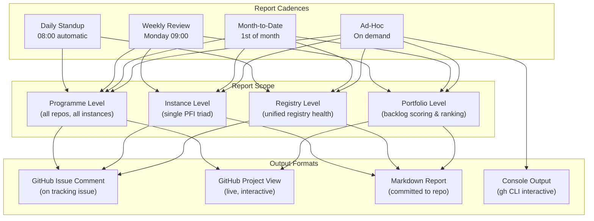

### 3.3 Cross-Repo Status Model

Every epic, feature, and story is classified into one of three states:

| State | Label/Criteria | Colour | Meaning |
|---|---|---|---|
| **DONE** | Issue closed | 🟢 | Completed, close-out skill has run, status propagated |
| **INFLIGHT** | Issue open + assigned + status = "In Progress" | 🟡 | Active work, currently being delivered |
| **NOT DONE** | Issue open + (status = "Backlog" OR "Ready" OR unassigned) | 🔴 | Not yet started, in backlog, or blocked |

### 3.4 PFC→PFI Epic Mirroring (Read-Only Cross-Reference)

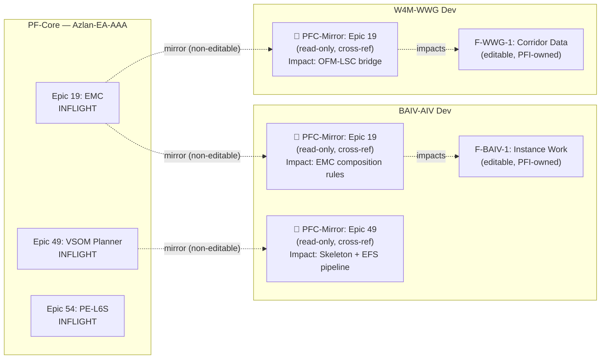

**Key design principle:** Mirrored PFC epics on PFI Dev boards are:
- **Non-editable** — status synced from PF-Core, PFI team cannot modify
- **Cross-referenced** — link back to parent issue on Azlan-EA-AAA
- **Impact-annotated** — brief description of why this PFC epic matters to this PFI instance
- **Avoids duplication** — no duplicated effort, time, or cost; PFI team sees context without owning delivery

---

## 4. Unified Registry Review Cadences

The Unified Registry (`ont-registry-index.json` → future `pfc_registry` table) requires structured review at multiple cadences to ensure artifact health, compliance, and currency.

### 4.1 Daily Registry Health Check (Automated)

| Check | What It Validates | Source | Action on Failure |
|---|---|---|---|
| **Schema compliance** | All ontologies pass OAA validation | `validate-ontology.yml` | Auto-raise issue, label `registry:schema-fail` |
| **Version drift** | No ontology has `pfcPin: "latest"` pointing to a removed version | `ont-registry-index.json` | Warning in daily report |
| **Instance coverage** | Every PFI instance has ≥ 1 required ontology per declared requirementScope | EMC instance configs | Warning in daily report |
| **Dependency integrity** | All transitive dependencies resolve | `DEPENDENCY_MAP` in `emc-composer.js` | Auto-raise issue, label `registry:dep-broken` |
| **Stale entries** | No ontology has `lastUpdated` older than 90 days without explicit freeze | Registry metadata | Advisory in weekly report |

**Output:** GitHub issue comment on `#REGISTRY-HEALTH-TRACKER` issue with traffic-light summary.

### 4.2 Weekly Registry Review (Manual + Automated)

| Activity | Who | What |
|---|---|---|
| **New artifact review** | Core architect | Review any ontologies, skills, or tokens added since last week |
| **PFI subscription audit** | Core architect | Verify each PFI's `ontologySeries` and `instanceOntologies` are correct |
| **Deprecation check** | Core architect | Review `status: deprecated` or `status: superseded` entries; confirm replacements exist |
| **Cross-series bridge validation** | Automated | Run EMC composition for each PFI instance; verify no missing bridges |
| **Instance readiness delta** | Automated | Compare this week's readiness scores to last week's; flag regressions |

**Output:** Weekly summary appended to rolling `REPORTS/registry-weekly-YYYY-WNN.md`.

### 4.3 Monthly Registry Portfolio Review

| Activity | Who | What |
|---|---|---|
| **Full portfolio audit** | Core architect + PFI leads | Review all 52+ ontologies against strategic roadmap |
| **Gap analysis refresh** | Core architect | Update gap list (GRAPH-CONFIG-ONT, AGENT-ONT, MARKET-ONT, SCENARIO-ONT) |
| **Series health scorecard** | Automated | Coverage %, validation confidence, instance adoption per series |
| **Maturity progression** | Core architect | Review PFI maturity levels; update if thresholds crossed (triggers feature gating changes via EMC rules) |
| **Three Voices (VoB/VoC/VoP) scoring** | Core architect | Score new initiative proposals against portfolio selection framework (PPM-ONT v5.0.0) |
| **Canonical snapshot review** | Core architect | Review frozen snapshots; assess if re-freeze needed |

**Output:** Monthly portfolio report committed to `REPORTS/portfolio-monthly-YYYY-MM.md`.

### 4.4 Ad-Hoc Registry Checks

| Trigger | Check | Output |
|---|---|---|
| New PFI instance onboarding | Full EMC composition validation for new instance | Instance readiness report |
| Ontology version bump | Dependency chain impact analysis across all consumers | Impact report on tracking issue |
| PFI promotion (dev → test) | Registry snapshot comparison (dev vs test) | Delta report |
| Security incident | GRC-FW-ONT compliance audit for affected instance | Compliance status report |
| Pre-release gate | Full validation suite + composed graph integrity | Release readiness report |

---

## 5. Report Specifications

### 5.1 Daily Standup Report (`pfc-daily-standup.sh`)

```
═══════════════════════════════════════════════════════════════
  PF-CORE DAILY STANDUP — 2026-03-04 (Tue)
═══════════════════════════════════════════════════════════════

  PROGRAMME STATUS (across all repos)
  ────────────────────────────────────
  Epics:    36 open  │  DONE: 33  │  INFLIGHT: 12  │  NOT DONE: 24
  Features: 142 open │  DONE: 87  │  INFLIGHT: 28  │  NOT DONE: 114
  Stories:  420 open │  DONE: 312 │  INFLIGHT: 45  │  NOT DONE: 375

  YESTERDAY'S COMPLETIONS
  ────────────────────────
  ✅ S49.9.3: W4M-WWG Pencil PoC                     [Epic 49]
  ✅ S54.1.2: Three Voices entity definitions          [Epic 54]

  TODAY'S INFLIGHT
  ─────────────────
  🔄 F49.9: Figma vs Pencil Design Tooling            [Epic 49]  @amandamoore
  🔄 F54.1: PPM Project Selection                      [Epic 54]  @amandamoore
  🔄 F19.2: EMC Composition Engine                     [Epic 19]  unassigned

  BLOCKERS
  ─────────
  ⚠️  F30.2: GRC-FW Hub Implementation — blocked by RCSG entity count
  ⚠️  F31.3: Promotion Pipeline — PROMOTION_PAT secret missing on 3 repos

  PFI INSTANCE PULSE
  ───────────────────
  BAIV-AIV:   2 inflight │ 0 blocked │ Readiness: 80%
  W4M-WWG:    3 inflight │ 0 blocked │ Readiness: 40%
  AIRL:       0 inflight │ 1 blocked │ Readiness: 60%
  W4M-EOMS:   0 inflight │ 0 blocked │ Readiness: 40%
  VHF:        0 inflight │ 0 blocked │ Readiness: 30%

  REGISTRY HEALTH: 🟢 All checks passed (52 ontologies, 5 series)
═══════════════════════════════════════════════════════════════
```

### 5.2 Weekly Review Report (`pfc-weekly-review.sh`)

Extends daily with:

| Section | Content |
|---|---|
| **Week Summary** | Total items moved to DONE, total items started, total items created |
| **Velocity** | Stories completed this week vs trailing 4-week average |
| **Epic Progress** | Per-epic completion % delta from last week |
| **Instance Breakdown** | Per-PFI triad: DONE/INFLIGHT/NOT DONE counts, week-over-week delta |
| **Cross-Instance Impact** | PFC epics with potential impact on ≥ 2 PFI instances |
| **Registry Weekly** | New artifacts, deprecations, version bumps, bridge validation results |
| **Portfolio Backlog** | Top 5 scored initiatives (VoB/VoC/VoP composite) awaiting commitment |
| **Reprioritisation Flags** | Any epic where INFLIGHT stories have been static for > 7 days |
| **Roadmap Projection** | Next 4 weeks: projected completions based on current velocity |

### 5.3 Monthly Portfolio Report (`pfc-monthly-portfolio.sh`)

Extends weekly with:

| Section | Content |
|---|---|
| **Month-to-Date Summary** | Cumulative DONE/INFLIGHT/NOT DONE with trend lines |
| **Portfolio Scorecard** | All initiatives scored by Three Voices (VoB 0.40, VoC 0.35, VoP 0.25) |
| **Programme Milestones** | Epic-level completion targets vs actuals |
| **PFI Instance Readiness** | Readiness scores with month-over-month delta |
| **BSC Health** | Each BSC objective: Achieved / On Track / At Risk / Behind |
| **Registry Full Audit** | 52-ontology health matrix (validation, coverage, adoption) |
| **Cost/Effort** | Estimated effort distribution across PFC vs PFI vs shared patterns |
| **Strategic Alignment** | Strategy S1-S6 coverage heat map by active epics |
| **Recommendations** | Reprioritisation, new initiative proposals, risk mitigations |

### 5.4 PFI Instance Report (`pfc-instance-status.sh <pfi-code>`)

Per-instance report showing:

| Section | Content |
|---|---|
| **Instance Identity** | PFI code, product, maturity level, requirementScopes, ontology count |
| **Triad Status** | Dev/Test/Prod: last promotion date, items in each environment |
| **Instance Epics** | Features delegated to this PFI from PFC epics (editable) |
| **PFC Epic Mirrors** | PF-Core epics impacting this instance (read-only cross-reference) |
| **EMC Composition** | Active categories, scope rules, composed graph spec version |
| **Registry Subscription** | Ontologies subscribed, version pins, last sync date |
| **Instance Readiness** | Readiness score breakdown, gap analysis, next maturity threshold |

---

## 6. PFC→PFI Epic Mirroring Mechanism

### 6.1 Mirror Creation Rules

A PFC epic is mirrored to a PFI Dev board when **any** of these conditions are true:

| Condition | Example |
|---|---|
| Epic modifies an ontology in the PFI's `instanceOntologies` list | Epic 19 (EMC) impacts all instances |
| Epic modifies a Foundation ontology | Epic 30 (GRC) impacts AIRL, BAIV (if COMPLIANCE scope) |
| Epic adds a new composition rule affecting the PFI's `requirementScopes` | Epic 45 added FULFILMENT scope for W4M-WWG |
| Epic modifies the promotion pipeline or CI/CD | Epic 31 (Hub-and-Spoke) impacts all triads |
| Epic explicitly declares PFI impact via `domain:*` label | Any epic with `domain:baiv` mirrors to BAIV |

### 6.2 Mirror Issue Format

```markdown
## 📌 PFC-Mirror: Epic 19 — EMC Composition Engine (Phases 3-4)

**Source:** ajrmooreuk/Azlan-EA-AAA#XXX
**Status:** INFLIGHT (synced from PF-Core — DO NOT EDIT)
**Last Sync:** 2026-03-04 08:00

### Impact on This Instance
- EMC composition rules govern which ontologies this PFI can compose
- New GraphScopeRule engine will enable dynamic data slicing
- FulfilmentBridge rule (v5.2.0) directly affects OFM-LSC pair

### PFC Epic Progress
- F19.1: ✅ Graph-Scope Rule Modelling (DONE)
- F19.2: 🔄 Composition Engine (INFLIGHT)
- F19.3: ⬜ Runtime Scope Rule Engine (NOT DONE)

### Related PFI Work
- Link to any delegated features or instance-specific stories here

---
*Auto-generated by pfc-mirror-sync.yml — do not edit manually*
```

### 6.3 Mirror Sync Mechanism

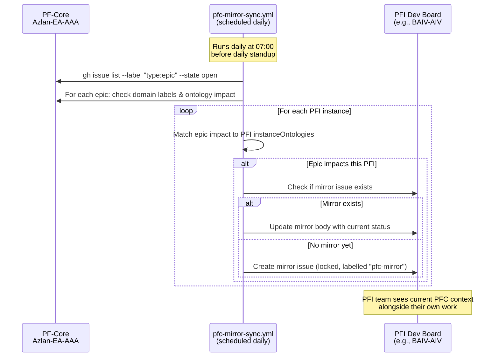

---

## 7. Portfolio Management Integration (PPM-ONT + Three Voices)

### 7.1 Portfolio Backlog as GitHub Project View

The Portfolio Backlog (View 9 on AZLAN-1) tracks all **candidate initiatives** — ideas, enhancements, new PFI instances, ontology proposals — scored and ranked using the Three Voices framework from PPM-ONT v5.0.0:

| Custom Field | Type | Source |
|---|---|---|
| `VoB Score` | Number (0-100) | Voice of Business: strategic alignment, financial impact, growth mandate |
| `VoC Score` | Number (0-100) | Voice of Customer: customer pain, Kano classification, ICP fit |
| `VoP Score` | Number (0-100) | Voice of Process: feasibility, ontology coverage, technical readiness |
| `Composite Score` | Number (0-100) | Weighted: VoB × 0.40 + VoC × 0.35 + VoP × 0.25 |
| `PPM Horizon` | Single select | Horizon 1 (Core), Horizon 2 (Growth), Horizon 3 (Transform) |
| `Initiative Type` | Single select | New PFI, New Ontology, Enhancement, Bug Fix, Infrastructure |

### 7.2 PFC→PFI Initiative Linkage

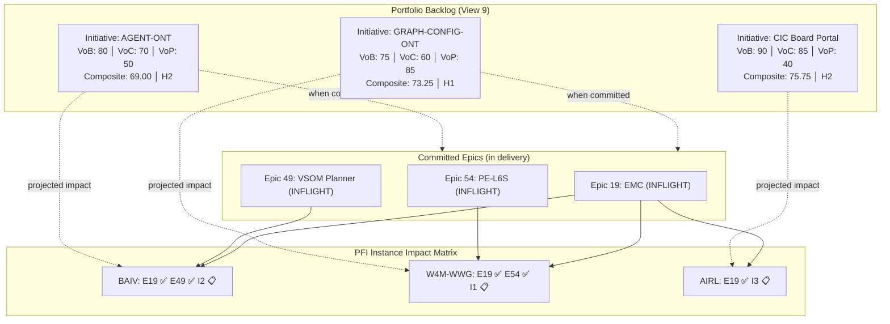

### 7.3 Roadmap Summary (Epics to Instance)

The Instance Roadmap (View 11 on AZLAN-1) provides a Gantt-style view:

```
═══════════════════════════════════════════════════════════════════════════
  PF-CORE ROADMAP — Epics by PFI Instance
═══════════════════════════════════════════════════════════════════════════

  PF-CORE (hub)     ════════════════════════════════════════════════════
  Epic 19 (EMC)     ██████████░░░░░░░░  F19.2 inflight    → Q2 2026
  Epic 49 (Planner) ████████░░░░░░░░░░  F49.9 inflight    → Q2 2026
  Epic 54 (L6S)     ██░░░░░░░░░░░░░░░░  F54.1 inflight    → Q3 2026
  Epic 55 (Reports) ░░░░░░░░░░░░░░░░░░  NEW               → Q2 2026

  PFI-BAIV          ════════════════════════════════════════════════════
  F19.2 (delegated) ░░░░░░░░░░░░░░░░░░  EMC impact        → Q2 2026
  F49.x (delegated) ░░░░░░░░░░░░░░░░░░  Skeleton pipeline → Q3 2026
  [📌 mirror: E19]  ▓▓▓▓▓▓▓▓▓▓░░░░░░░  read-only context

  PFI-W4M-WWG       ════════════════════════════════════════════════════
  F45.x (completed) ██████████████████  ✅ DONE
  F54.x (projected) ░░░░░░░░░░░░░░░░░░  L6S corridor work → Q3 2026
  [📌 mirror: E19]  ▓▓▓▓▓▓▓▓▓▓░░░░░░░  read-only context

  PFI-AIRL          ════════════════════════════════════════════════════
  [📌 mirror: E30]  ▓▓▓▓▓▓▓▓▓▓░░░░░░░  GRC-FW hub impact
  [📌 mirror: E19]  ▓▓▓▓▓▓▓▓▓▓░░░░░░░  EMC rules impact
═══════════════════════════════════════════════════════════════════════════
  Legend: ██ DONE  ░░ NOT DONE  ▓▓ PFC-Mirror (read-only)
```

---

## 8. Close-Out Integration

When any story, feature, or epic is closed via the existing close-out skill:

### 8.1 Status Propagation Chain

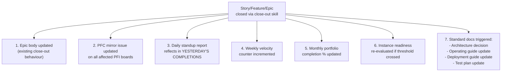

### 8.2 Standard Documents on Close-Out

| Document Type | When Generated/Updated | Format | Location |
|---|---|---|---|
| **Architecture** | Epic or Feature close | Markdown + Mermaid diagrams | `PBS/STRATEGY/ARCH-*` or `PBS/DOCS/` |
| **Operating Guide** | Feature close (if user-facing) | Markdown | `PBS/PFI-{instance}/OPERATING-GUIDE-*.md` |
| **Deployment Guide** | Feature close (if infrastructure) | Markdown | `PBS/DOCS/DEPLOYMENT-*.md` |
| **Test Plan** | Story close (if new test coverage) | Markdown | `PBS/DOCS/TEST-PLAN-*.md` |
| **Mermaid Diagrams** | Included in all above | Embedded in documents | Inline in parent document |

---

## 9. EMC Cascade Integration

The reporting layer respects the EMC (PFC→PFI→Product→App) cascade at every level:

### 9.1 Report Scoping by EMC Context

| Report Level | EMC Context | What's Visible |
|---|---|---|
| **Programme** | PFC (all) | All epics across all instances, all ontology series, all compositions |
| **Instance** | PFI (single) | Only epics impacting this instance, only subscribed ontologies, only declared requirementScopes |
| **Product** | Product (future) | Only product-specific features, product-level design tokens, product skeleton overrides |
| **Client** | Client (future) | Client-specific customisations only, read-only view of parent layers |

### 9.2 Architectural and Application Milestones

The reporting framework tracks milestones at two levels aligned to the cascade:

**Architectural Milestones** (PFC-level, tracked on AZLAN-1):
- Registry schema migrations (001-005)
- EMC composition engine versions
- CI/CD pipeline capabilities (pfc-release, promote, guard-core)
- Unified registry artifact type expansion

**Application Milestones** (PFI-level, tracked on PFI Dev boards):
- Instance data seeding completeness
- Composition validation passes
- Promotion pipeline validation (dev → test → prod)
- Instance readiness threshold crossings

---

## 10. Feature Breakdown

### F55.1: GitHub-Native Reporting Scripts (Phase 1A)

| Story | Description | Output |
|---|---|---|
| S55.1.1 | Create `pfc-daily-standup.sh` — cross-repo DONE/INFLIGHT/NOT DONE counts | Console + issue comment |
| S55.1.2 | Create `pfc-weekly-review.sh` — weekly rolling report with velocity + delta | Markdown report |
| S55.1.3 | Create `pfc-monthly-portfolio.sh` — month-to-date portfolio report | Markdown report |
| S55.1.4 | Create `pfc-instance-status.sh` — per-PFI instance report | Console + issue comment |
| S55.1.5 | Create `pfc-adhoc-report.sh` — filtered ad-hoc report (by epic, label, date range) | Console output |
| S55.1.6 | Create `pfc-registry-health.sh` — registry validation, dependency check, coverage audit | Console + issue comment |

### F55.2: GitHub Actions Automation (Phase 1B)

| Story | Description | Output |
|---|---|---|
| S55.2.1 | Create `daily-standup.yml` — scheduled 08:00, runs pfc-daily-standup.sh, posts to tracking issue | Automated daily report |
| S55.2.2 | Create `weekly-review.yml` — scheduled Monday 09:00, runs pfc-weekly-review.sh | Automated weekly report |
| S55.2.3 | Create `monthly-portfolio.yml` — scheduled 1st of month, runs pfc-monthly-portfolio.sh | Automated monthly report |
| S55.2.4 | Create `registry-health.yml` — scheduled daily 07:00, runs pfc-registry-health.sh | Automated registry check |

### F55.3: AZLAN-1 Custom Views (Phase 1C)

| Story | Description | Output |
|---|---|---|
| S55.3.1 | Create View 9: Portfolio Backlog with VoB/VoC/VoP scoring fields | GitHub Project view |
| S55.3.2 | Create View 10: Rolling Status Report (DONE/INFLIGHT/NOT DONE grouped by epic) | GitHub Project view |
| S55.3.3 | Create View 11: Instance Roadmap (Gantt-style, epics by PFI) | GitHub Project roadmap view |
| S55.3.4 | Add custom fields: VoB Score, VoC Score, VoP Score, Composite Score, PPM Horizon, Initiative Type | Project field definitions |

### F55.4: PFC→PFI Epic Mirroring (Phase 1D)

| Story | Description | Output |
|---|---|---|
| S55.4.1 | Create `pfc-mirror-sync.yml` — daily sync of PFC epics to affected PFI Dev boards | Automated mirror issues |
| S55.4.2 | Define impact mapping: PFC epic → PFI instance (via ontology + domain label matching) | Mapping configuration |
| S55.4.3 | Create mirror issue template (locked, labelled `pfc-mirror`, non-editable) | Issue template |
| S55.4.4 | Integrate mirror status into daily standup report | Report enhancement |

### F55.5: Registry Review Cadences (Phase 1E)

| Story | Description | Output |
|---|---|---|
| S55.5.1 | Implement daily registry health check (schema, version, dependency, coverage) | Automated check |
| S55.5.2 | Implement weekly registry review checklist (artifact review, subscription audit, deprecation check) | Checklist issue template |
| S55.5.3 | Implement monthly portfolio registry audit (full 52-ontology matrix, gap analysis, series scorecard) | Monthly report |
| S55.5.4 | Create ad-hoc registry check commands (pre-release gate, impact analysis, promotion comparison) | CLI tools |

### F55.6: Close-Out Integration (Phase 1F)

| Story | Description | Output |
|---|---|---|
| S55.6.1 | Extend close-out skill to update PFC mirror issues on affected PFI boards | Skill enhancement |
| S55.6.2 | Extend close-out skill to trigger report counter updates | Skill enhancement |
| S55.6.3 | Document standard close-out artefact expectations (architecture, operating guide, deployment, test plan) | Documentation |

### F55.7: Workbench Dashboard (Phase 2 — Post-Supabase)

| Story | Description | Output |
|---|---|---|
| S55.7.1 | Design dashboard zone layout (Z-dashboard) in skeleton | Skeleton extension |
| S55.7.2 | Programme heatmap component (instances × epics × status) | Workbench component |
| S55.7.3 | Portfolio scorecard component (VoB/VoC/VoP weighted view) | Workbench component |
| S55.7.4 | Registry health monitor component (trend charts) | Workbench component |
| S55.7.5 | BSC cascade tracker component (strategy → delivery lineage) | Workbench component |
| S55.7.6 | Instance readiness radar component (maturity × coverage) | Workbench component |
| S55.7.7 | Roadmap timeline component (Gantt-style, cross-instance) | Workbench component |

---

## 11. Implementation Plan

### 11.1 Phase 1: GitHub-Native (Weeks 1-4)

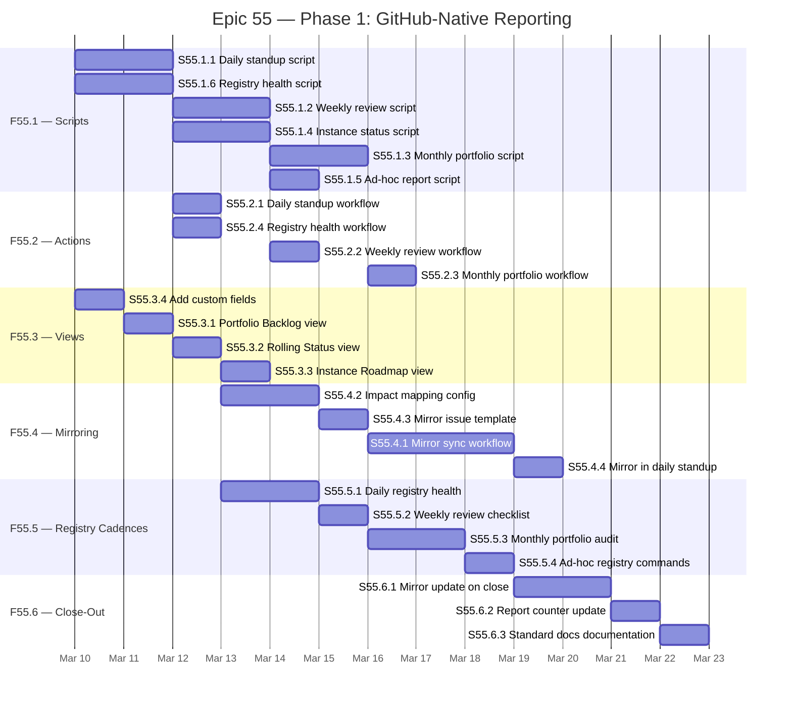

### 11.2 Phase 2: Workbench Dashboard (Post-Supabase MVP)

Phase 2 (F55.7) depends on:
- Supabase JSONB MVP operational (migrations 001-005 deployed)
- Workbench zone allocator (F49.5) complete
- GitHub API → Supabase sync pipeline established

Delivery timeline: Q3-Q4 2026, aligned to Epic 34 Expansion Phase.

---

## 12. Balanced Scorecard — Epic 55

### 12.1 Financial Perspective

| ID | Objective | Target | Leading Indicator |
|---|---|---|---|
| **R-F1** | Reduce programme management overhead | < 1 hr/day cross-project status gathering | Time spent on manual status compilation |
| **R-F2** | Avoid duplicated effort across PFC and PFI | Zero duplicated epics/features across repos | Duplicate detection in weekly report |

### 12.2 Customer Perspective (PFI Teams as Internal Customers)

| ID | Objective | Target | Leading Indicator |
|---|---|---|---|
| **R-C1** | PFI teams see impacting PFC work without context-switching | 100% of impacting PFC epics mirrored | Mirror coverage per PFI board |
| **R-C2** | Single source of truth for programme status | All stakeholders use same reports | Report access count, stakeholder satisfaction |
| **R-C3** | Review and reprioritise with data | Monthly portfolio review uses scored backlog | % of decisions informed by VoB/VoC/VoP scores |

### 12.3 Internal Process Perspective

| ID | Objective | Target | Leading Indicator |
|---|---|---|---|
| **R-P1** | Zero manual report generation | 100% automated daily/weekly/monthly reports | Manual report creation count per month |
| **R-P2** | Registry health never degrades silently | 100% daily health check coverage | Check pass rate, time-to-detect regressions |
| **R-P3** | Close-out propagates to all status layers | Every close-out updates mirrors + reports | Propagation success rate |

### 12.4 Learning & Growth Perspective

| ID | Objective | Target | Leading Indicator |
|---|---|---|---|
| **R-L1** | Codify reporting patterns as reusable skills | All report scripts are Claude-callable skills | Skill registration count |
| **R-L2** | PPM-ONT portfolio management operationalised | Three Voices scoring used in monthly review | Initiative scoring coverage |

### 12.5 Stakeholder Perspective

| ID | Objective | Target | Leading Indicator |
|---|---|---|---|
| **R-K1** | Full VSOM traceability in reports | Every report section traces to BSC objective | Traceability coverage % |
| **R-K2** | CIC-ready reporting structure | Reports extensible to CIC triads without redesign | Architecture review pass |

---

## 13. Cause-Effect Chains

### 13.1 Visibility → Efficiency → Scale

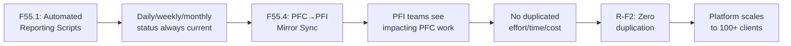

### 13.2 Registry Health → Confidence → Delivery

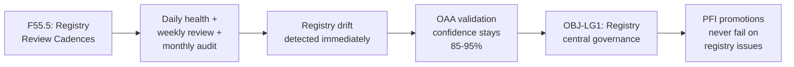

### 13.3 Portfolio Scoring → Strategic Focus → ROI

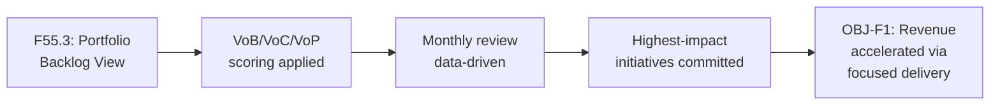

---

## 14. Traceability Matrix

| Feature | Strategy | BSC Objective | Leading Metric | Lagging Metric |
|---|---|---|---|---|
| **F55.1** Reporting Scripts | S2 (VE-Driven) | R-P1 (zero manual) | Script execution success rate | Time saved vs manual reporting |
| **F55.2** Actions Automation | S2 (VE-Driven) | R-P1 (zero manual) | Workflow run reliability | Report freshness (staleness < 5 min) |
| **F55.3** Custom Views | S4 (Instance Customisation) | R-C3 (data-driven review) | View usage frequency | % decisions using scored data |
| **F55.4** Epic Mirroring | S4 (Instance Customisation) | R-C1 (PFI visibility) | Mirror coverage % | Duplicate effort incidents |
| **F55.5** Registry Cadences | S2 (VE-Driven) | R-P2 (registry health) | Check pass rate | Registry regression count |
| **F55.6** Close-Out Integration | S2 (VE-Driven) | R-P3 (propagation) | Propagation success rate | Stale mirror count |
| **F55.7** Workbench Dashboard | S5 (UI/UX) | R-K1 (VSOM traceability) | Component completion % | Stakeholder satisfaction |

---

## 15. Risks & Mitigations

| Risk | Likelihood | Impact | Mitigation |
|---|---|---|---|
| GitHub API rate limits on cross-repo queries | Medium | High | Batch queries, cache results, use GraphQL API where possible |
| Mirror sync creates noise on PFI boards | Medium | Medium | Strict impact mapping rules; `pfc-mirror` label + filter |
| Portfolio scoring becomes bureaucratic | Low | High | Keep scoring lightweight; Three Voices composite is 3 numbers |
| Reports generate data but no action | Medium | High | Every report includes "Reprioritisation Flags" + "Recommendations" |
| Registry health false positives | Low | Medium | Tune thresholds based on first month's data |

---

## 16. Integration Map

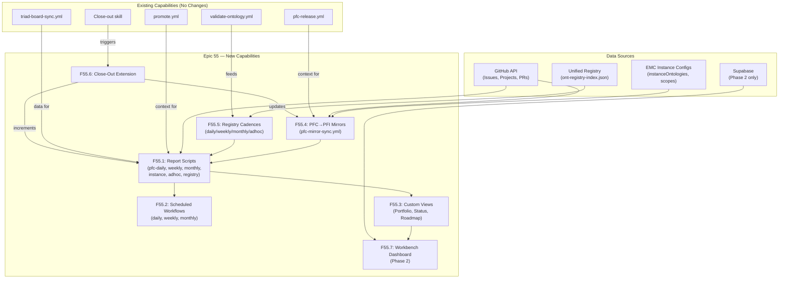

---

## 17. CIC & Future Triad Extensibility

The reporting framework is designed to be **triad-agnostic** — any new PFI instance or CIC (Community Interest Company) triad follows the same pattern:

### 17.1 Onboarding a New Triad

| Step | Action | Automated? |
|---|---|---|
| 1 | Create dev/test/prod repos from template | Semi-automated (azlan-github-workflow) |
| 2 | Create 3 project boards (dev/test/prod) | `gh project create` |
| 3 | Add to mirror impact mapping | Config update |
| 4 | Registry health checks auto-include | Automatic (reads registry) |
| 5 | Reports auto-include new instance | Automatic (queries all repos matching pattern) |
| 6 | Portfolio view auto-includes | Automatic (cross-repo project items) |

### 17.2 CIC-Specific Considerations

| Consideration | Approach |
|---|---|
| CIC governance reporting | Additional "Governance" section in monthly report |
| CIC board visibility | Read-only access to programme dashboard |
| CIC-specific KPIs | Custom fields on CIC project board, rolled up to programme level |
| Separation of concerns | CIC triads are PFI instances with `org_type: "cic"` in PPM-ONT |

---

## 18. Document Outputs & Standard Artefacts

As with all PF-Core epics, Epic 55 will produce the following standard documents upon completion:

| Document | Template | Location |
|---|---|---|
| **This Strategy Briefing** | Existing | `PBS/STRATEGY/BRIEFING-Epic55-*.md` |
| **Architecture Decision** | New | `PBS/DOCS/ARCH-Cross-Project-Reporting.md` |
| **Operating Guide** | New | `PBS/DOCS/OPERATING-GUIDE-Programme-Reports.md` |
| **Deployment Guide** | New | `PBS/DOCS/DEPLOYMENT-Report-Workflows.md` |
| **Test Plan** | New | `PBS/DOCS/TEST-PLAN-Report-Scripts.md` |

All documents will include Mermaid diagrams and link to GitHub-hosted versions as the source of truth.

---

## 19. Report Output Specification — Markdown with GitHub Links

### 19.1 Report as Committed Markdown

All reports (daily, weekly, monthly, instance, registry) produce **committed `.md` files** as their primary output. Console output is a convenience; the file is the record.

| Report | Output Path | Commit? | Retention |
|---|---|---|---|
| Daily standup | `REPORTS/daily/standup-YYYY-MM-DD.md` | Yes (automated) | Rolling 30 days, then archive |
| Weekly review | `REPORTS/weekly/review-YYYY-WNN.md` | Yes (automated) | Indefinite |
| Monthly portfolio | `REPORTS/monthly/portfolio-YYYY-MM.md` | Yes (automated) | Indefinite |
| Instance status | `REPORTS/instance/<pfi-code>/status-YYYY-MM-DD.md` | Yes (on demand) | Rolling 30 days |
| Registry health | `REPORTS/registry/health-YYYY-MM-DD.md` | Yes (automated) | Indefinite |
| Ad-hoc | `REPORTS/adhoc/report-YYYY-MM-DD-<slug>.md` | Optional | On demand |

### 19.2 GitHub Link Convention

Every item referenced in a report includes a **clickable GitHub link** in standard `gh` URL format:

```markdown
## Epic Status

| Epic | Status | Features | Link |
|---|---|---|---|
| Epic 19: EMC Composition | INFLIGHT | 2/7 done | [#XXX](https://github.com/ajrmooreuk/Azlan-EA-AAA/issues/XXX) |
| Epic 49: VSOM Planner | INFLIGHT | 4/9 done | [#747](https://github.com/ajrmooreuk/Azlan-EA-AAA/issues/747) |

## PFI Instance: W4M-WWG

| Item | Status | Link |
|---|---|---|
| F45.2: Instance Data | DONE | [pfi-w4m-wwg-dev#12](https://github.com/ajrmooreuk/pfi-w4m-wwg-dev/issues/12) |
| 📌 PFC-Mirror: Epic 19 | INFLIGHT | [pfi-w4m-wwg-dev#45](https://github.com/ajrmooreuk/pfi-w4m-wwg-dev/issues/45) → [source](https://github.com/ajrmooreuk/Azlan-EA-AAA/issues/XXX) |
```

**Link types in reports:**

| Reference | Link Format | Example |
|---|---|---|
| Hub issue | `[#NNN](https://github.com/ajrmooreuk/Azlan-EA-AAA/issues/NNN)` | [#747](https://github.com/ajrmooreuk/Azlan-EA-AAA/issues/747) |
| PFI issue | `[repo#NNN](https://github.com/ajrmooreuk/repo/issues/NNN)` | [pfi-baiv-aiv-dev#5](https://github.com/ajrmooreuk/pfi-baiv-aiv-dev/issues/5) |
| Project board | `[AZLAN-1](https://github.com/users/ajrmooreuk/projects/28)` | Direct link to board |
| Project view | `[View 9](https://github.com/users/ajrmooreuk/projects/28/views/9)` | Direct link to specific view |
| Strategy doc | `[BRIEFING-Epic55](PBS/STRATEGY/BRIEFING-Epic55-*.md)` | Relative repo path |
| Report archive | `[standup-2026-03-04](REPORTS/daily/standup-2026-03-04.md)` | Relative repo path |
| Workflow run | `[Run #NNN](https://github.com/ajrmooreuk/Azlan-EA-AAA/actions/runs/NNN)` | Actions run link |

### 19.3 PFI Dev Boards Use Same Views as Core

PFI Dev boards (#36, #39, #42, #45, #48, #51) **mirror the same view structure** as AZLAN-1 where applicable. This ensures any team member navigating between core and instance contexts sees a consistent layout.

| AZLAN-1 View | PFI Dev Board Equivalent | Customisation Allowed |
|---|---|---|
| View 1: Backlog | View 1: Backlog | Yes — PFI-specific columns/filters |
| View 2: Priority board | View 2: Priority board | Yes — PFI-specific priority labels |
| View 6: Epics | View 6: Epics (if PFI has epics) | Yes — may be empty for small PFIs |
| View 9: Portfolio Backlog | Not replicated | N/A — portfolio is programme-level |
| View 10: Rolling Status | View 10: Rolling Status | Yes — filtered to this PFI only |
| View 11: Instance Roadmap | Not replicated | N/A — roadmap is programme-level |
| N/A | View 8: PFC Mirrors | PFI-specific — shows mirrored PFC epics |

PFI teams can add custom views beyond those listed. The convention ensures that **Views 1, 2, 6, 10** have the same semantic meaning across all boards.

---

## 20. Change Control & Audit Trail

### 20.1 What Gets Tracked

Every change to the reporting and portfolio management infrastructure is tracked through a **four-layer audit model** aligned to the Unified Registry, EMC cascade, and RBAC governance.

```mermaid
flowchart TB
    subgraph LAYER1["Layer 1: GitHub-Native Audit (Automatic)"]
        GIT["Git commit history\n(who, what, when)"]
        ISSUES["Issue event timeline\n(opened, closed, labelled)"]
        PR["PR review trail\n(approval, merge, revert)"]
        ACTIONS["Actions run logs\n(workflow success/failure)"]
    end

    subgraph LAYER2["Layer 2: Report Audit (Committed Markdown)"]
        DAILY_LOG["Daily reports committed\nto REPORTS/daily/"]
        WEEKLY_LOG["Weekly reports committed\nto REPORTS/weekly/"]
        MONTHLY_LOG["Monthly reports committed\nto REPORTS/monthly/"]
        REG_LOG["Registry health committed\nto REPORTS/registry/"]
    end

    subgraph LAYER3["Layer 3: Registry Change Log (F55.5)"]
        REG_VER["Registry version bumps\n(ont-registry-index.json)"]
        ONT_VER["Ontology version changes\n(per-ontology CHANGELOG)"]
        EMC_VER["EMC config changes\n(instance configs)"]
        RBAC_VER["RBAC/access changes\n(CODEOWNERS, RLS policies)"]
    end

    subgraph LAYER4["Layer 4: Supabase Audit (Phase 2)"]
        AUDIT_TABLE["audit_log table\n(append-only, immutable)"]
        TRIGGER["Trigger-based capture\n(every mutation logged)"]
    end

    GIT --> DAILY_LOG
    ISSUES --> DAILY_LOG
    ACTIONS --> REG_LOG
    REG_VER --> REG_LOG
    ONT_VER --> WEEKLY_LOG
    EMC_VER --> MONTHLY_LOG
    AUDIT_TABLE --> MONTHLY_LOG
```

### 20.2 Change Control Matrix — What / When / Where / By Whom

| Change Type | What | When Detected | Where Tracked | By Whom | Report Visibility |
|---|---|---|---|---|---|
| **Epic/Feature/Story state change** | Status transition (NOT DONE → INFLIGHT → DONE) | Real-time (GitHub event) | Issue timeline + daily report | Assignee / close-out skill | Daily, Weekly, Monthly |
| **Registry artifact added/removed** | New ontology, skill, or token registered | Daily health check | `REPORTS/registry/health-*.md` | Core architect | Daily, Monthly |
| **Registry version bump** | Ontology version incremented (e.g., VP-ONT v1.2.3 → v1.3.0) | Daily health check | Git commit + registry health report | Ontology author | Daily, Weekly |
| **EMC instance config change** | `instanceOntologies` or `requirementScopes` modified | Weekly review | `REPORTS/weekly/review-*.md` | Core architect | Weekly, Monthly |
| **EMC composition rule change** | New/modified GraphScopeRule, ScopeCondition, ScopeAction | Weekly review | EMC-ONT CHANGELOG + weekly report | Core architect | Weekly, Monthly |
| **PFI subscription change** | PFI `ontologySeries` updated in registry | Daily health check | Registry health report | Core architect | Daily, Instance |
| **RBAC policy change** | CODEOWNERS, guard-core.yml, RLS policy modified | PR review | PR trail + weekly report | Core architect + reviewer | Weekly |
| **PFC→PFI mirror created/updated** | Mirror issue created or status synced | Daily (pfc-mirror-sync.yml) | PFI Dev board + daily report | Automated | Daily, Instance |
| **Portfolio initiative scored** | VoB/VoC/VoP scores assigned or changed | Monthly review | Portfolio view + monthly report | Core architect | Monthly |
| **Promotion event** | Content promoted dev → test or test → prod | On event (promote.yml) | Workflow log + instance report | PFI admin | Instance, Weekly |
| **Workflow configuration change** | `.yml` workflow file modified | PR review | Git commit + PR trail | DevOps | Weekly |
| **Report template change** | Report script (`.sh`) modified | PR review | Git commit + PR trail | DevOps | Weekly |

### 20.3 Unified Registry Change Tracking

The Unified Registry is the single most critical artifact for change control. Every registry mutation is tracked at three levels:

#### Level 1: File-Level (Current — Git-based)

```text
ont-registry-index.json v10.8.0 → v10.9.0
  Commit: abc123
  Author: amandamoore
  Date: 2026-03-04
  Changes:
    + Added: GRAPH-CONFIG-ONT v0.1.0 (proposal)
    ~ Modified: BAIV instanceOntologies (added GRAPH-CONFIG)
    - Deprecated: CA-ONT (superseded by INDUSTRY-ONT)
```

**Level 2: Semantic-Level (New — Registry Health Report)**
```
Registry Change Summary — 2026-W10:
  Ontologies: 52 → 53 (+1 proposal)
  Series: 5 (unchanged)
  PFI Instances: 5 (BAIV config updated)
  Validation: 39/53 compliant (1 new proposal exempt)
  Dependency chains: All resolved ✅
  Cross-series bridges: 12/12 valid ✅
```

**Level 3: Database-Level (Phase 2 — Supabase `audit_log`)**
```sql
-- Every mutation to pfc_registry is captured:
INSERT INTO audit_log (actor_id, action, resource_type, resource_id, detail)
VALUES (
  auth.uid(),
  'update',
  'registry_artifact',
  'baiv-instance-config',
  '{"field": "instanceOntologies", "added": ["GRAPH-CONFIG-ONT"]}'::jsonb
);
```

### 20.4 EMC Cascade Change Tracking

EMC configuration changes have cross-cutting impact and receive special tracking:

| EMC Change | Impact Scope | Detection | Propagation |
|---|---|---|---|
| New `ContextLevel` | All PFIs at that level | Weekly review | Monthly report + all affected PFI mirrors |
| New `RequirementCategory` | PFIs whose `requirementScopes` include it | Daily health | Daily report + affected PFI instance reports |
| `GraphScopeRule` added/modified | PFIs matching rule's scope conditions | Weekly review | Weekly report + composition validation |
| `instanceOntologies` changed | Single PFI | Daily health | Daily report + specific PFI instance report |
| `ComposedGraphSpec` version bump | PFI using that spec | Daily health | Registry health report |

### 20.5 RBAC & Access Change Tracking

| RBAC Change | What Happens | Audit Record |
|---|---|---|
| `CODEOWNERS` file modified | PR required with core-team approval | Git commit + PR review trail |
| `guard-core.yml` updated | CI check logic changed | Git commit + PR review trail + weekly report |
| New PFI triad repos created | Private repos, PROMOTION_PAT configured | Weekly report "New Infrastructure" section |
| Supabase RLS policy changed | Access boundary modified for PFI data | Migration commit + weekly report + monthly audit |
| API key issued/revoked | Third-party integration access changed | Supabase audit_log + monthly report |
| MCP PFI_SCOPE changed | Agent boundary modified | Deployment config + monthly report |

---

## 21. Strategy Paper Consolidation Recommendations

The current `PBS/STRATEGY/` directory contains **70+ documents** across multiple themes (see [Catalogue v1.1.0](CATALOGUE-Strategy-Briefings-Architecture.md)). Several documents have significant overlap or have been superseded by subsequent briefings. This section recommends consolidations to reduce navigation burden and ensure the strategy library remains actionable.

### 21.1 Consolidation Candidates

| # | Current Documents | Proposed Consolidation | Rationale |
|---|---|---|---|
| **C1** | `VSOM-Programme-Distribution-Strategy.md` (Section 4.3) + This briefing (Epic 55) Sections 3-8 | **Retain both; cross-reference** | Programme Distribution is the "work flow" strategy; Epic 55 is the "reporting & visibility" layer. They are complementary, not overlapping. Add explicit cross-refs in both documents. |
| **C2** | `PLAN-Supabase-JSONB-MVP-Platform-Phase.md` (5.1) + `BRIEFING-GraphQL-Supabase-JSONB-MVP.md` (5.2) + `PROPOSAL-Supabase-Secure-Connections-API-MCP-v1.0.0.md` (5.3) | **Merge into single `ARCH-Supabase-Platform-Architecture.md`** | Three documents describe the same system (Supabase data platform) from delivery plan, transport layer, and security perspectives. A single architecture document with three sections is more navigable. Retain originals as `_archive/` references. |
| **C3** | 10 Neo4j Strategy Archive documents (6.7.1–6.7.10) | **Already archived.** Add deprecation header to index. | ADR-2026-001 ruled Supabase. These are reference-only. Add `⚠️ ARCHIVED — See PLAN-Supabase-JSONB-MVP` header to each. |
| **C4** | `BRIEFING-KANO-ONT-Satisfaction-Classification-Strategy.md` (2.5.2) + `BRIEFING-Kano-Analysis-Strategy.md` (2.5.3) | **Merge into single `BRIEFING-KANO-ONT-Strategy.md`** | Two documents cover the same ontology (KANO-ONT). One is the classification model, the other is the analysis methodology. A single document with two sections is clearer. |
| **C5** | `VSOM-Strategic-Toolkit-Plan-v1.0.1.md` (6.4.1) + `VSOM-FloodGraph-AI-FRA.md` (6.4.2) | **Retain both; toolkit is generic, FloodGraph is worked example** | Different purposes. Add cross-ref from toolkit to FloodGraph as "worked example." |
| **C6** | `DESIGN-DIRECTOR-TOOLKIT-Graphing-Workbench-Decision-Tree.md` (6.5.1) + `INTERACTION-LOGIC-TREE.md` (6.5.2) + `PFC-PFI-STRATEGY-GRAPH-MAPPING.md` (6.5.3) + `BRIEFING-Design-Director-Cascading-Design-Governance-Strategy.md` (6.5.4) | **Merge 6.5.1 + 6.5.2 into `ARCH-Workbench-Interaction-Design.md`; retain 6.5.3 and 6.5.4 separately** | Decision tree and interaction logic are two views of the same system. Design governance (6.5.4) is distinct (DS-ONT cascading rules). Graph mapping (6.5.3) is distinct (PFC↔PFI context). |
| **C7** | `PLAN-F40.17-PFI-Lifecycle-Workbench.md` + `PLAN-F40.18-Skeleton-Inspector-Panel.md` + `PLAN-F40.19-Skeleton-Editor.md` | **Merge into single `PLAN-F40-Workbench-Features.md`** | Three plans for three features in the same epic (40). A single plan with three sections reduces navigation. Features are sequential (F40.17 → F40.18 → F40.19). |

### 21.2 Proposed Document Lifecycle States

To prevent future accumulation without governance, all strategy documents should carry a lifecycle state:

| State | Meaning | Visual Indicator |
|---|---|---|
| **DRAFT** | In development, not yet reviewed | `⚪ DRAFT` badge in header |
| **ACTIVE** | Approved and governing current work | `🟢 ACTIVE` badge in header |
| **SUPERSEDED** | Replaced by a newer document | `🟡 SUPERSEDED — See [replacement]` badge in header |
| **ARCHIVED** | Retained for reference only, no longer governing | `🔴 ARCHIVED` badge in header |
| **CONSOLIDATED** | Merged into another document | `🔵 CONSOLIDATED — See [target]` badge in header |

### 21.3 Catalogue Maintenance Rule

The [Strategy Briefings Catalogue](CATALOGUE-Strategy-Briefings-Architecture.md) should be updated as part of every epic close-out:
1. New documents added during the epic are registered in the catalogue
2. Superseded or consolidated documents are marked with lifecycle state
3. Cross-references are validated (no broken links)
4. Document count and size statistics are refreshed

This becomes a checklist item in the close-out skill.

### 21.4 Consolidation Implementation

| Phase | Action | Effort |
|---|---|---|
| **Immediate** | Add `⚠️ ARCHIVED` headers to Neo4j docs (C3) | 10 min |
| **Week 1** | Merge Kano briefings (C4); merge Workbench plans (C7) | 1 hr |
| **Week 2** | Merge Supabase docs (C2); merge Interaction docs (C6) | 2 hrs |
| **Week 3** | Add lifecycle state badges to all 70+ documents | 2 hrs |
| **Ongoing** | Catalogue update as part of close-out skill | 5 min per close-out |

---

## Appendix A: Script Interface Specification

### A.1 `pfc-daily-standup.sh`

```bash
# Usage:
pfc-daily-standup.sh [--post-to-issue <issue-number>] [--format md|console]

# Options:
#   --post-to-issue   Post output as comment on specified tracking issue
#   --format          Output format (default: console)
#   --since           Override "yesterday" date (default: previous working day)
```

### A.2 `pfc-weekly-review.sh`

```bash
# Usage:
pfc-weekly-review.sh [--week <YYYY-WNN>] [--format md|console] [--commit]

# Options:
#   --week      Specific ISO week (default: current)
#   --commit    Commit report to REPORTS/ directory
#   --include   Comma-separated instance codes (default: all)
```

### A.3 `pfc-monthly-portfolio.sh`

```bash
# Usage:
pfc-monthly-portfolio.sh [--month <YYYY-MM>] [--format md|console] [--commit]

# Options:
#   --month     Specific month (default: current)
#   --commit    Commit report to REPORTS/ directory
#   --scoring   Include VoB/VoC/VoP portfolio scoring (default: true)
```

### A.4 `pfc-instance-status.sh`

```bash
# Usage:
pfc-instance-status.sh <pfi-code> [--format md|console] [--include-mirrors]

# Arguments:
#   pfi-code        Instance code: baiv, w4m-wwg, airl, w4m-eoms, vhf
# Options:
#   --include-mirrors  Include PFC mirror status in report
```

### A.5 `pfc-registry-health.sh`

```bash
# Usage:
pfc-registry-health.sh [--check daily|weekly|monthly|full] [--post-to-issue <issue-number>]

# Options:
#   --check           Cadence-specific check depth (default: daily)
#   --post-to-issue   Post results to tracking issue
#   --instance        Check specific PFI instance subscription
```

### A.6 `pfc-adhoc-report.sh`

```bash
# Usage:
pfc-adhoc-report.sh [--epic <number>] [--label <label>] [--since <date>] [--until <date>]
                     [--repo <repo>] [--instance <pfi-code>] [--format md|console]

# All filters are optional and combinable. At least one filter must be specified.
```

---

## Appendix B: Glossary

| Term | Definition |
|---|---|
| **DONE** | Issue closed, close-out complete, status propagated to all reporting layers |
| **INFLIGHT** | Issue open, assigned, status = "In Progress" — active work |
| **NOT DONE** | Issue open, status = "Backlog" or "Ready" or unassigned — not yet started |
| **PFC Mirror** | Read-only issue on a PFI Dev board reflecting a PF-Core epic's status and impact |
| **Three Voices** | VoB (Voice of Business), VoC (Voice of Customer), VoP (Voice of Process) — PPM portfolio scoring |
| **Composite Score** | Weighted: VoB × 0.40 + VoC × 0.35 + VoP × 0.25 |
| **Registry Health** | Aggregate metric covering schema validation, dependency integrity, instance coverage, version currency |
| **Rolling Report** | Report that uses a sliding window (daily = 1 day, weekly = 7 days, monthly = calendar month to date) |
| **Impact Mapping** | Configuration that determines which PFC epics are mirrored to which PFI Dev boards |
| **Triad** | The three-repo structure (dev/test/prod) for each PFI instance |

---

*Document Status: STRATEGY BRIEF — For Review & Approval*
*VSOM Alignment: S2 (VE-Driven Everything) + S4 (Instance & Client Customisation)*
*Next Action: Review, approve, and create Epic 55 GitHub issue with F55.1-F55.7 features*
