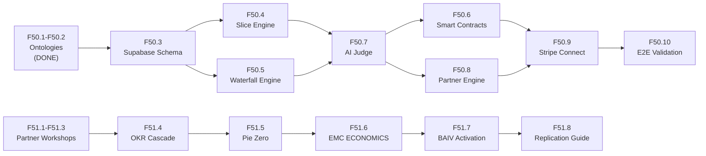

# BRIEFING: FairSlice -- Strategy & Implementation Proposals

## The Economic Layer of PF-Core: Equitable Value Distribution at Platform Scale

| Field | Value |
|---|---|
| **Date** | 2026-03-04 |
| **Version** | 1.0.0 |
| **Status** | STRATEGY BRIEF -- For Review & Approval |
| **Classification** | CONFIDENTIAL -- Strategic Planning Asset |
| **Parent** | Epic 34: PF-Core Graph-Based Agentic Platform Strategy (#518) |
| **Epics Governed** | Epic 50: FairSlice Platform Economics (#754), Epic 51: FairSlice VE Skill Chain Collaboration (#754) |
| **VSOM Alignment** | S1 (Graph-First), S2 (VE-Driven Everything), S3 (Agentic Orchestration), S4 (Instance Customisation), S6 (Integration) |
| **Ontology Alignment** | FAIRSLICE-ONT v1.0.0, PARTNER-ONT v1.0.0, RRR-ONT, PE-ONT, GRC-FW-ONT, EMC-ONT, VSOM-ONT, VP-ONT, KPI-ONT, BSC-ONT, ORG-ONT |
| **VP-RRR Convention** | Maintained throughout -- Problem=Risk, Solution=Requirement, Benefit=Result |
| **Downstream** | All PFI instances (BAIV, W4M, AIRL, VHF), Unified Registry, Agent Manager, Supabase JSONB MVP |

---

## Executive Summary

FairSlice is the **economic foundation** of PF-Core -- the layer that automates how value (equity, revenue, commissions) flows between every participant in the ecosystem: builders, salespeople, module creators, and channel partners. It is not a separate product but the **first full implementation of the PFC graph architecture**, proving every pattern (JSONB config cascade, RLS isolation, audit trail, graph traversal, AI-verified claims) that transfers directly to VE, PE, GRC, and every other PFC domain.

This master briefing consolidates the full FairSlice strategy across **four subordinate documents** and **two epics** (50 + 51), providing a single entry point for strategic review, investment decisions, and implementation planning.

### Why FairSlice, Why Now

Three forces converge:

1. **BAIV is approaching 100 clients** (OBJ-F1). Partner conversations are already happening. Without a formal model, early deals set ad-hoc precedents that are expensive to unpick later.
2. **Epic 34 has two unresolved BSC objectives** -- OBJ-SH2 (10+ partners with digital contracts) and OBJ-F4 (GBP 100K partner revenue). Neither has an implementation path today.
3. **The JSONB Graph PoC (F34.5) and FairSlice schema are the same thing.** Building FairSlice IS building the graph storage layer -- two deliverables for one effort.

### The FairSlice Principle

> **Every contributor to a PF-Core venture receives a fair, transparent, automatically calculated share of the value they create -- governed by the same ontology cascade that powers the entire platform.**

---

## 1. Document Map & Reading Order

This briefing is the **lead document** for FairSlice strategy. The full knowledge base is structured as follows:

### 1.1 Document Index

| # | Document | Type | Purpose | Epic |
|---|----------|------|---------|------|
| **This** | [BRIEFING-FairSlice-Strategy-Implementation-Proposals.md](BRIEFING-FairSlice-Strategy-Implementation-Proposals.md) | Strategy Lead | Master consolidation, reading guide, strategic summary | 50 + 51 |
| **2.4.1** | [BRIEFING-Epic50-FairSlice-Platform-Economics.md](BRIEFING-Epic50-FairSlice-Platform-Economics.md) | Epic Briefing | Full platform economics: ontology model, waterfall engine, AI Judge, partner channel, Stripe Connect, BSC cascade. 10 features, 33 stories. | 50 |
| **2.4.2** | [CONVERGENCE-FairSlice-JSONB-Graph-Patterns.md](CONVERGENCE-FairSlice-JSONB-Graph-Patterns.md) | Technical | Schema convergence proving FairSlice tables = PFC JSONB graph patterns. Table-by-table mapping, `resolve_cascaded_config()` shared function. | 50 |
| **2.4.3** | [DISCUSSION-FairSlice-Proposals-Overview.md](DISCUSSION-FairSlice-Proposals-Overview.md) | Discussion | One-page proposal, VSOM cascade, value propositions (3 segments), 5 open decisions, risk register, commercial model options. | 50 + 51 |
| **2.4.4** | [BRIEFING-Epic51-FairSlice-VE-Skill-Chain-Collaboration-Strategy.md](BRIEFING-Epic51-FairSlice-VE-Skill-Chain-Collaboration-Strategy.md) | Epic Briefing | VE Skill Chain methodology: dual-loop architecture, party model (ORG + PARTNER + RRR), PFC-PFI cascade governance, Pie Zero self-referential build. 8 features, 27 stories. | 51 |

### 1.2 Recommended Reading Order

| Step | Document | Time | What You Learn |
|------|----------|------|---------------|
| 1 | **This document** (you are here) | 10 min | Strategic overview, three revenue loops, key decisions, implementation roadmap |
| 2 | [DISCUSSION-FairSlice-Proposals-Overview.md](DISCUSSION-FairSlice-Proposals-Overview.md) | 8 min | One-page pitch, VSOM cascade, 5 open decisions needing resolution |
| 3 | [BRIEFING-Epic50-FairSlice-Platform-Economics.md](BRIEFING-Epic50-FairSlice-Platform-Economics.md) | 20 min | Full technical model: ontologies, waterfall, AI Judge, Stripe, BSC, feature breakdown |
| 4 | [CONVERGENCE-FairSlice-JSONB-Graph-Patterns.md](CONVERGENCE-FairSlice-JSONB-Graph-Patterns.md) | 10 min | Why FairSlice tables ARE the F34.5 JSONB PoC (schema convergence proof) |
| 5 | [BRIEFING-Epic51-FairSlice-VE-Skill-Chain-Collaboration-Strategy.md](BRIEFING-Epic51-FairSlice-VE-Skill-Chain-Collaboration-Strategy.md) | 15 min | How to bring partners into the elaboration, governance gates, Pie Zero validation |

---

## 2. Strategic Architecture

### 2.1 The Triple-Loop Revenue Engine

FairSlice operates three interlocking revenue loops:

```
INNER LOOP (SaaS)
  Founders/startups pay for the tool (equity automation, revenue sharing)
  Revenue: Platform subscription fees
  Target: GBP 50K ARR (OBJ-FS-F1)

MIDDLE LOOP (Marketplace)
  Architects publish smart contracts (validation rules, commission triggers)
  Revenue: License fees, royalty payments
  Target: GBP 25K ARR (OBJ-FS-F3)

OUTER LOOP (Channel)
  Agencies manage client pies, affiliates refer startups
  Revenue: Management fees, referral commissions
  Target: GBP 100K/year partner-originated (OBJ-FS-F2)

COMBINED: GBP 175K ARR at scale
```

### 2.2 Four Personas, Four Incentives

| Persona | Role | Incentive | FairSlice Mechanism |
|---------|------|-----------|-------------------|
| **The Builder** | Engineer | 2x Slice multiplier (equity) | Automated credit via AI-verified claims |
| **The Rainmaker** | Sales | Cash/equity commission | Dynamic payouts based on revenue events |
| **The Architect** | Module Creator | Royalties per install | Smart contracts as Unified Registry artifacts |
| **The Partner** | Agency/Affiliate | Management fee / referral % | Immutable attribution, tiered programme |

### 2.3 Revenue Waterfall Engine

Every revenue event flows through a **7-step priority waterfall**:

```
Revenue Event ($100)
  1. Platform Fee       →  PF-Core         (5% = $5)
  2. Affiliate Payout   →  Referrer         (10% of fee = $0.50)
  3. Agency Retainer     →  Managing Agency   (5% = $5)
  4. Architect Royalty   →  Module Creator    (license fee = $2)
  5. OpEx Recovery       →  Operating costs   ($0)
  6. Tax Reserve         →  HMRC reserve      ($0)
  7. Dividend Pool       →  Pie Members       (by ownership % = $87.50)
```

The waterfall is **graph-traversable** -- processing it IS a graph traversal (follow edges in priority order, extract value at each step, remainder flows to the final node). This directly validates Epic 34 S1 (Graph-First Architecture).

### 2.4 FairSlice within the PFC Graph Hierarchy

```
PF-CORE
  ├── FAIRSLICE-ONT v1.0.0 (Orchestration Series) -- 9 entities, 19 relationships, 12 rules
  ├── PARTNER-ONT v1.0.0 (Foundation Series) -- 6 entities, 10 relationships, 7 rules
  └── Unified Registry -- smart contracts as artifacts
        │
        ├── PFI-BAIV override (content architect 2x, AI visibility, agency 5%)
        ├── PFI-W4M override (VE consultant equity, MVP builder 2x, channel agency)
        ├── PFI-AIRL override (CAF assessor equity, compliance architect royalty)
        └── PFI-VHF override (nutritionist 2x, B2C referrer affiliate)
              │
              └── Pie (venture) -- members, slices, claims, waterfall, distributions
```

**Cascade resolution:** `resolve_cascaded_config('pie', pie_id, instance_id)` merges Core + Instance + Pie using the same `deepMerge` semantics as `resolve_artifact_config()` from the Unified Registry. One function, two consumers.

---

## 3. Five FairSlice Strategies (VSOM)

| # | Strategy | Epic 34 Alignment | Key Deliverable |
|---|----------|-------------------|-----------------|
| **FS-S1** | Waterfall-First Revenue Engine | S1 (Graph-First) | Revenue events flow through priority-ordered rules. All distributions are graph-traversable, auditable, reconcilable. |
| **FS-S2** | Contribution-Based Equity | S2 (VE-Driven) | Every slice traces to a verified claim. Ownership is dynamic and earned, not static cap table entries. |
| **FS-S3** | AI-Verified Claims | S3 (Agentic) | Claude Judge evaluates claims against smart contract rules. Three-tier cost model (Local/Haiku/Sonnet) keeps per-claim cost under $0.05. |
| **FS-S4** | Channel Economics at Scale | S4 (Instance Customisation) | Partners/agencies/affiliates inherit PFC base rules, override per PFI, customise per pie. Quasi-OO cascade. |
| **FS-S5** | Smart Contract Marketplace | S6 (Integration) | Architects publish reusable validation logic. Pies subscribe. Unified Registry treats contracts as artifacts. |

---

## 4. Ontology Foundation

### 4.1 Ontology Summary

| Ontology | Series | Entities | Relationships | Rules | Enums | Status |
|----------|--------|:--------:|:-------------:|:-----:|:-----:|--------|
| **FAIRSLICE-ONT** v1.0.0 | Orchestration | 9 | 19 (13 internal + 6 cross) | 12 | 8 | Complete -- OAA 8/8 |
| **PARTNER-ONT** v1.0.0 | Foundation | 6 | 10 (5 internal + 5 cross) | 7 | 5 | Complete -- OAA 8/8 |

### 4.2 Cross-Ontology Bridges

| Bridge | From | To | Purpose |
|--------|------|----|---------|
| JP-FS-001 | fs:Pie | emc:InstanceConfiguration | Pie inherits PFI config |
| JP-FS-002 | fs:PieMember | rrr:FunctionalRole | Member has RACI assignment |
| JP-FS-003 | fs:WaterfallRule | partner:CommissionRule | Waterfall triggers partner payout |
| JP-FS-004 | fs:Claim | pe:Process | Claim follows PE process lifecycle |
| JP-FS-005 | fs:Pie | vsom:Strategy | Pie traces to strategic intent |
| JP-FS-006 | fs:License | fs:SmartContract | Pie subscribes to contract |
| JP-FS-007 | fs:Distribution | grc-fw:AuditEntry | Every distribution is audited |
| JP-PARTNER-001 | partner:Partner | org:Organization | Partner has org identity |

### 4.3 VP-RRR Alignment (Standing Convention)

| VP Concept | RRR Concept | FairSlice Application |
|-----------|-------------|----------------------|
| **Problem** | **Risk** | Contributors under-rewarded is a risk to retention and ecosystem growth |
| **Solution** | **Requirement** | Transparent ledger + AI verification is the requirement to build |
| **Benefit** | **Result** | Equitable returns attract partners at scale -- measured by Channel Velocity |

---

## 5. Schema Convergence: FairSlice = F34.5 JSONB PoC

**The core thesis:** FairSlice's database schema and PF-Core's JSONB graph storage are **the same thing**. Building one builds the other.

| FairSlice Schema | PFC JSONB Graph Pattern | Same Pattern? |
|-----------------|------------------------|:-------------:|
| `pies.ontology_config` | `pfc_registry.configuration` | YES -- JSONB business rules |
| `smart_contracts` | `pfc_registry` (artifactType) | YES -- registry artifacts |
| `partners` + `referrals` | `pfc_registry` (scope=instance) | YES -- cascade inheritance |
| `pie_members` | `graph_nodes` (entity type) | YES -- nodes with relationships |
| `waterfall_rules` | `graph_edges` (ordered) | YES -- priority-ordered edges |
| `audit_logs` | `grc_audit_trail` | YES -- GRC-FW audit pattern |

**Recommended approach:** Hybrid (Option C from Convergence document)
- Phase 1: Build FairSlice tables with graph-compatible JSONB patterns
- Phase 2: Refactor into graph tables once patterns are proven
- Phase 3: Add graph query layer (Supabase Functions or Neo4j sync)

**Full technical detail:** [CONVERGENCE-FairSlice-JSONB-Graph-Patterns.md](CONVERGENCE-FairSlice-JSONB-Graph-Patterns.md)

---

## 6. Balanced Scorecard (5 Perspectives, 17 Objectives)

### 6.1 Financial

| ID | Objective | Target | Traces To |
|----|-----------|--------|-----------|
| OBJ-FS-F1 | FairSlice SaaS revenue (platform fees) | GBP 50K ARR | Epic 34 OBJ-F2 |
| OBJ-FS-F2 | Partner-originated revenue | GBP 100K/year | Epic 34 OBJ-F4 |
| OBJ-FS-F3 | Smart contract marketplace revenue | GBP 25K ARR | New |
| OBJ-FS-F4 | Platform fee + commission operating margin > 60% | Ongoing | Epic 34 OBJ-F3 |

### 6.2 Customer

| ID | Objective | Target | Traces To |
|----|-----------|--------|-----------|
| OBJ-FS-C1 | Pie creation to first distribution < 7 days | Q3 2026 | Epic 34 OBJ-C3 |
| OBJ-FS-C2 | Contributor NPS >= 65 (fairness perception) | Ongoing | Epic 34 OBJ-C2 |
| OBJ-FS-C3 | 80% of claims auto-verified by AI Judge | Q4 2026 | New |

### 6.3 Internal Process

| ID | Objective | Target | Traces To |
|----|-----------|--------|-----------|
| OBJ-FS-IP1 | Revenue waterfall processes in < 500ms | Ongoing | Epic 34 OBJ-IP3 |
| OBJ-FS-IP2 | Smart contract publish-to-install < 1 hour | Q3 2026 | Epic 34 OBJ-IP2 |
| OBJ-FS-IP3 | 100% distribution audit trail coverage | Ongoing | Epic 34 OBJ-IP1 |
| OBJ-FS-IP4 | AI Judge cost < $0.05 per claim (three-tier) | Ongoing | Epic 34 OBJ-IP5 |

### 6.4 Learning & Growth

| ID | Objective | Target | Traces To |
|----|-----------|--------|-----------|
| OBJ-FS-LG1 | FAIRSLICE-ONT + PARTNER-ONT in registry | DONE | Epic 34 OBJ-LG1 |
| OBJ-FS-LG2 | 5+ reusable smart contracts in marketplace | Q3 2026 | New |
| OBJ-FS-LG3 | FairSlice pattern documented for PFI replication | Q2 2026 | Epic 34 OBJ-LG2 |

### 6.5 Stakeholder

| ID | Objective | Target | Traces To |
|----|-----------|--------|-----------|
| OBJ-FS-SH1 | 10+ Fair Slice partners with digital contract governance | Q4 2026 | Epic 34 OBJ-SH2 |
| OBJ-FS-SH2 | Channel Velocity > 1.5 Pies/Agency/Month | Q4 2026 | New |
| OBJ-FS-SH3 | Multi-jurisdictional compliance (UK, EU) for payouts | Q1 2027 | Epic 34 OBJ-SH1 |

---

## 7. Cause-Effect Chains

### Chain 1: Ontology Foundation to Platform Revenue

```
[LG: FAIRSLICE-ONT + PARTNER-ONT in Registry (DONE)]
    → [IP: Revenue waterfall < 500ms, 100% audit trail]
    → [C: Pie creation to distribution < 7 days]
    → [F: GBP 50K ARR platform fees]
```

### Chain 2: Smart Contract Marketplace to Architect Economy

```
[LG: 5+ reusable smart contracts published]
    → [IP: Publish-to-install < 1 hour]
    → [C: 80% claims auto-verified]
    → [F: GBP 25K marketplace revenue]
```

### Chain 3: Partner Ecosystem to Channel Revenue (Epic 34 Chain 3)

```
[LG: FairSlice pattern documented for replication]
    → [IP: AI Judge < $0.05/claim]
    → [SH: 10+ partners, Channel Velocity > 1.5]
    → [F: GBP 100K partner-originated revenue]
```

---

## 8. Key Metrics Dashboard

### 8.1 Leading Indicators

| ID | KPI | Target | Predicts |
|----|-----|--------|----------|
| M-FS-L1 | Active Pies | 50+ | Platform fee revenue |
| M-FS-L2 | Channel Velocity | > 1.5 Pies/Agency/Month | Partner programme PMF |
| M-FS-L3 | Smart Contract Installs/Month | 20+ | Marketplace revenue |
| M-FS-L4 | Claim Approval Rate | > 85% | AI Judge accuracy |
| M-FS-L5 | Partner Pipeline | 25+ applications | Partner growth |

### 8.2 Lagging Indicators

| ID | KPI | Target | Confirms |
|----|-----|--------|----------|
| M-FS-G1 | Platform Fee Revenue | GBP 50K ARR | SaaS model viability |
| M-FS-G2 | Partner-Originated Revenue | GBP 100K/year | Channel model viability |
| M-FS-G3 | Distribution Audit Coverage | 100% | Compliance readiness |
| M-FS-G4 | Contributor NPS | >= 65 | Fairness perception |
| M-FS-G5 | Active Partners | 10+ | Ecosystem growth |

---

## 9. Open Decisions (From Discussion Paper)

These decisions shape the next phase. See [DISCUSSION-FairSlice-Proposals-Overview.md](DISCUSSION-FairSlice-Proposals-Overview.md) for full analysis.

| # | Decision | Recommendation | Status |
|---|----------|---------------|--------|
| D1 | **Build sequence** -- standalone SaaS vs. embedded in BAIV vs. pure PFC capability vs. hybrid | **Option D: Hybrid** -- PFC owns ontology; BAIV provides proving ground | Proposed |
| D2 | **Smart contracts -- real or modelled?** -- Full Stripe Connect vs. ledger-only | **Ledger-first** (Phase 1-2), Stripe (Phase 4) | Proposed |
| D3 | **AI Judge scope** -- claims verification only vs. disputes vs. contract generation | **Claims verification** (Phase 2), disputes (Phase 3) | Proposed |
| D4 | **Partner tier thresholds** -- Bronze/Silver/Gold/Platinum | Bronze 1-5, Silver 6-15, Gold 16-30, Platinum 31+ | Proposed |
| D5 | **Equity vs. cash split** -- builder-heavy vs. rainmaker-heavy vs. configurable | **Configurable per pie** (quasi-OO cascade) | Proposed |

---

## 10. Combined Epic Scope

### 10.1 Epic 50: FairSlice Platform Economics

**Full detail:** [BRIEFING-Epic50-FairSlice-Platform-Economics.md](BRIEFING-Epic50-FairSlice-Platform-Economics.md)

| Feature | Title | Stories | Status |
|---------|-------|:-------:|--------|
| **F50.1** | FAIRSLICE-ONT v1.0.0 -- Ontology Specification | 3 | Done |
| **F50.2** | PARTNER-ONT v1.0.0 -- Ontology Specification | 3 | Done |
| **F50.3** | Supabase Schema -- Core Tables + RLS | 4 | Backlog |
| **F50.4** | Dynamic Equity Ledger -- Slice Engine | 3 | Backlog |
| **F50.5** | Revenue Waterfall Engine | 4 | Backlog |
| **F50.6** | Smart Contract Registry -- Publish + License + Install | 4 | Backlog |
| **F50.7** | AI Judge Agent -- Claim Verification | 3 | Backlog |
| **F50.8** | Partner & Agency Engine -- Attribution + Dashboard | 4 | Backlog |
| **F50.9** | Stripe Connect Integration -- Split Payments | 3 | Backlog |
| **F50.10** | E2E Validation -- BAIV Worked Example | 2 | Backlog |

**Totals: 10 features, 33 stories (6 done, 27 backlog)**

### 10.2 Epic 51: FairSlice VE Skill Chain Collaboration

**Full detail:** [BRIEFING-Epic51-FairSlice-VE-Skill-Chain-Collaboration-Strategy.md](BRIEFING-Epic51-FairSlice-VE-Skill-Chain-Collaboration-Strategy.md)

| Feature | Title | Stories | Phase |
|---------|-------|:-------:|:-----:|
| **F51.1** | Partner Identification & VoB/VoC/VoP Assessment | 4 | 1 |
| **F51.2** | VSOM Strategy Workshop -- 5 FS Strategies Elaborated | 5 | 1 |
| **F51.3** | VP Validation with Partner Segments | 3 | 1 |
| **F51.4** | OKR Cascade -- Q2 2026 Key Results | 3 | 2 |
| **F51.5** | Pie Zero -- Self-Referential Build | 4 | 2 |
| **F51.6** | EMC ECONOMICS Category + Registry Artifacts | 3 | 2 |
| **F51.7** | BAIV PFI Instance Activation | 3 | 3 |
| **F51.8** | VE Skill Chain Replication Guide | 2 | 3 |

**Totals: 8 features, 27 stories (all backlog)**

### 10.3 Combined Totals

| Metric | Epic 50 | Epic 51 | Combined |
|--------|:-------:|:-------:|:--------:|
| Features | 10 | 8 | **18** |
| Stories | 33 | 27 | **60** |
| Stories Done | 6 | 0 | **6** |
| Stories Backlog | 27 | 27 | **54** |
| Ontologies Produced | 2 | 0 | **2** |
| Supabase Tables | 16 | 0 | **16** |
| Smart Contracts (template) | 3+ | 3+ | **3+** |
| AI Agents | 1 (AI Judge) | 0 | **1** |

---

## 11. Implementation Roadmap

### 11.1 Four-Phase Delivery

```
PHASE 1: FOUNDATION (Complete + Weeks 1-4)
━━━━━━━━━━━━━━━━━━━━━━━━━━━━━━━━━━━━━━━━
  ✓ FAIRSLICE-ONT v1.0.0 (F50.1) -- DONE
  ✓ PARTNER-ONT v1.0.0 (F50.2) -- DONE
  ✓ Registry updated to v10.9.1
  ✓ Schema convergence map validated
  ✓ Epic briefings complete (Epic 50 + 51)
  → F51.1: Partner identification & Three Voices assessment
  → F51.2: VSOM strategy workshops (5 sessions)
  → F51.3: VP validation with partner segments
  → F50.3: Supabase schema + RLS

PHASE 2: CORE ENGINE (Weeks 5-12)
━━━━━━━━━━━━━━━━━━━━━━━━━━━━━━━
  → F50.4: Dynamic equity ledger (slice engine)
  → F50.5: Revenue waterfall engine
  → F50.7: AI Judge agent (three-tier)
  → F51.4: OKR cascade (Q2 2026 key results)
  → F51.5: Pie Zero (self-referential build)
  → F51.6: EMC ECONOMICS category + registry artifacts

PHASE 3: MARKETPLACE + CHANNEL (Weeks 13-24)
━━━━━━━━━━━━━━━━━━━━━━━━━━━━━━━━━━━━━━━━━━
  → F50.6: Smart contract registry
  → F50.8: Partner & agency engine
  → F51.7: BAIV PFI instance activation
  → F51.8: VE Skill Chain replication guide

PHASE 4: PAYMENTS + VALIDATION (Weeks 25-32)
━━━━━━━━━━━━━━━━━━━━━━━━━━━━━━━━━━━━━━━━━━
  → F50.9: Stripe Connect integration
  → F50.10: E2E validation (BAIV worked example)
  → PFI expansion: W4M-WWG (Month 6), AIRL (Month 8), VHF (Month 10)
```

### 11.2 Critical Path Dependencies



---

## 12. AI Judge Architecture

### 12.1 Three-Tier Cost Model

| Tier | Model | Used For | Estimated Cost |
|------|-------|----------|:-------------:|
| Tier 1 (Local) | Schema validation | Claim format check, slice math, waterfall sum validation | Free |
| Tier 2 (Haiku) | Standard verification | Routine claims (code shipped, time logged), simple commission triggers | ~$0.01/claim |
| Tier 3 (Sonnet) | Complex arbitration | Disputed claims, multi-factor IP contributions, edge cases | ~$0.08/claim |

**Target:** < $0.05 average per claim (OBJ-FS-IP4). 80% Tier 1/2, 20% Tier 3.

### 12.2 Claim Verification Flow

```
Builder submits Claim (proof: git commits)
  → FairSlice API fetches active contracts for this pie
  → AI Judge evaluates claim against contract rules
    System prompt from smart contract
    + Pie ontology_config
    + Claim proof data
  → Approved: 10 base units * 2.0 multiplier = 20 slices
  → Audit log: prompt, input, reasoning, output (immutable)
```

---

## 13. VE Skill Chain: Self-Referential Validation

The core insight from Epic 51: **FairSlice is both the product AND the method by which it is built.** The team building FairSlice becomes the first Pie ("Pie Zero").

### 13.1 Dual-Loop Architecture

```
OUTER LOOP: FairSlice as PFC Capability (Strategic)
  VSOM Vision → 5 Strategies (FS-S1 to FS-S5) → 17 BSC Objectives
  → OKR Cascade → KPI Tracking → VP Validation → RRR Accountability

INNER LOOP: Each Pie Instance (Operational)
  Pie Created → Members Added → Claims Submitted → AI Judge Verifies
  → Slices Allocated → Revenue Events → Waterfall Distributes
  → KPI Feedback → Strategy Adjustment
```

### 13.2 Pie Zero: The Self-Referential Test

```
PIE: "FairSlice Platform Build"
  Instance: PFC-Core (platform itself)
  Members:
    AJM           → Founder/Builder  (2.0x, equity)
    [Builder 2]   → Builder          (2.0x, equity)
    [Rainmaker]   → Rainmaker        (1.0x, commission)
    [Partner A]   → Architect        (1.5x, royalties)
    [Advisor]     → Advisor          (0.5x, equity)

  Validation: If the model is fair, the team building it
  should be willing to use it on themselves. If not, the
  model needs adjustment before external launch.
```

---

## 14. PFI Instance Expansion Sequence

| Instance | Timeline | instanceOntologies Addition | Domain Customisation |
|----------|----------|---------------------------|---------------------|
| **PFI-BAIV** | Month 4 | + FAIRSLICE, PARTNER | AI Visibility roles, content delivery smart contracts |
| **PFI-W4M-WWG** | Month 6 | + FAIRSLICE, PARTNER | Supply chain roles, fulfilment milestone contracts |
| **PFI-AIRL** | Month 8 | + FAIRSLICE, PARTNER | CAF assessor roles, maturity score contracts |
| **PFI-VHF** | Month 10 | + FAIRSLICE, PARTNER | B2C roles, recipe module contracts |

Each instance follows the same VE Skill Chain stages (1-7) but scoped to their domain context via EMC composition rules.

---

## 15. Commercial Model (Proposed)

| Revenue Stream | Model | Notes |
|---------------|-------|-------|
| **Platform fee** | 5% of revenue through waterfall OR flat monthly subscription | % aligns incentives; compliance implications being assessed |
| **Smart contract license** | Per-install fee set by architect (marketplace take: 20%) | Marketplace commission funds curation |
| **Agency management** | Monthly per-pie retainer (agency sets price, platform takes 5%) | Low take-rate to attract agencies early |
| **Affiliate referral** | 10% of platform fee for 12 months (attribution window) | Standard SaaS affiliate model |

---

## 16. Risk Register (Consolidated)

| Risk | Likelihood | Impact | Mitigation | Source |
|------|-----------|--------|-----------|--------|
| FCA regulation on equity distribution | Medium | High | Legal review before launch. Start with revenue-only (no equity tokenisation). | Epic 50 |
| AI Judge makes wrong call on a claim | Medium | Medium | Human appeal process. Audit trail. Three-tier escalation (Local→Haiku→Sonnet→Human). | Epic 50 |
| Partner channel cannibalises direct sales | Low | Medium | Attribution window limits. Direct sales excluded from partner commission. | Epic 50 |
| Smart contract IP disputes | Low | High | Immutable-after-publish. Version history. Clear licensing terms. | Epic 50 |
| Schema convergence breaks F34.5 PoC | Low | High | Convergence map already validated. Same `resolve_cascaded_config()` pattern. | Convergence |
| Partners unwilling to use FairSlice's own model | Medium | High | Pie Zero proves internal willingness first. Only invite partners after validation. | Epic 51 |
| EMC ECONOMICS category creates ontology bloat | Low | Medium | Strict composition rules. Only activate for PFIs declaring FAIRSLICE. | Epic 51 |
| FairSlice elaboration becomes circular dependency | Low | Low | Pie Zero uses manual claim processing initially. Automated AI Judge only after F50.7. | Epic 51 |

---

## 17. Quality Gates

| Gate | Feature | Validates |
|------|---------|-----------|
| G1 | F50.1/F50.2 | Ontology OAA v7.0.0 compliance, all 8 gates pass (DONE) |
| G2 | F50.3 | RLS isolation: pie members cannot see other pies, agencies only see referral pies |
| G3 | F50.4 | Slice math: ownership % always sums to 100%, multipliers applied correctly |
| G4 | F50.5 | Waterfall completeness: all rules execute, netToPie = amount - SUM(distributions) |
| G5 | F50.6 | Smart contracts immutable after publish, licenses required for use |
| G6 | F50.7 | AI Judge audit trail: every decision has stored prompt + reasoning + output |
| G7 | F50.8 | Attribution integrity: referral codes immutable, agency RLS enforced |
| G8 | F50.9 | Payment reconciliation: every Distribution maps to a Stripe transfer or equity entry |
| G9 | F51.5 | Pie Zero: self-referential validation passes full claim-to-distribution cycle |
| G10 | F51.7 | BAIV: first PFI consumer with domain-specific overrides operational |

---

## 18. Cross-References

| Related | Relationship |
|---------|-------------|
| **Epic 34** (#518) | Grandparent strategy -- OBJ-SH2, OBJ-F4, BSC Chain 3, S1-S6 |
| **Epic 34 F34.5** | JSONB Graph Storage PoC -- FairSlice tables converge with this |
| **Epic 34 F34.3** | Agent Architecture -- AI Judge follows Agent Template v6.0.0 |
| **Epic 30** (#370) | GRC Series -- audit trail governance via GRC-FW |
| **Epic 40** (#577) | Workbench -- FairSlice dashboard as workbench zone (future) |
| **Epic 49** (#747) | Application Planner -- FairSlice as target application for planner pipeline |
| **Epic 55** | Portfolio Reporting -- Three Voices scoring, registry cadences, close-out integration |
| **Unified Registry** | Smart contracts as registry artifacts (quasi-OO cascade) |
| **Supabase JSONB MVP** | `resolve_cascaded_config()` shared function, RLS patterns |
| **VP-RRR Convention** | Standing alignment maintained throughout all FairSlice documents |

---

## Appendix A: Technical Stack

| Layer | Technology | Rationale |
|-------|-----------|-----------|
| **Frontend** | Next.js 14 (App Router) + shadcn/ui + Tailwind | Epic 34 S5 alignment, Figma Make pipeline |
| **Backend** | Supabase (Postgres, Auth, Realtime, Edge Functions) | JSONB graph storage (S1), RLS tenant isolation |
| **AI** | Anthropic Claude (Haiku + Sonnet) | AI Judge, three-tier cost model (S3) |
| **Payments** | Stripe Connect (Split Payments) | Automated multi-party revenue distribution |
| **Ontologies** | FAIRSLICE-ONT + PARTNER-ONT (OAA v7.0.0) | Same governance as all PFC ontologies |
| **Registry** | Unified Registry (Quasi-OO cascade) | Smart contracts as registry artifacts |

---

## Appendix B: Glossary

| Term | Definition |
|------|-----------|
| **Pie** | A venture/startup whose value is being shared among contributors |
| **Slice** | A unit of contribution -- the base currency of FairSlice |
| **Multiplier** | Role-based factor applied to base contributions (e.g., Builder = 2x) |
| **Waterfall** | Priority-ordered revenue distribution chain (7 steps) |
| **Smart Contract** | Packaged business logic -- system prompts and validation rules for the AI Judge (not blockchain) |
| **AI Judge** | Claude-powered agent that verifies contribution claims against smart contracts |
| **Channel Velocity** | Pies added per Agency per Month -- key PMF metric (target: > 1.5) |
| **Triple-Loop** | SaaS (Inner) + Marketplace (Middle) + Channel (Outer) revenue engine |
| **Attribution Window** | Time period during which a referral earns commission (default: 90 days) |
| **Pie Zero** | The first pie -- the FairSlice build team using FairSlice on themselves (self-referential validation) |
| **Commission Hijacking** | Fraudulent reassignment of referral attribution -- prevented by BR-FS-005 / BR-PARTNER-001 |

---

*Document Status: STRATEGY BRIEF -- consolidates Epic 50, Epic 51, and all FairSlice subordinate documents.*
*VSOM Alignment: S1 (Graph-First) + S2 (VE-Driven) + S3 (Agentic) + S4 (Instance Customisation) + S6 (Integration).*
*Next Action: Review, approve, and initiate Phase 1 partner workshops.*
