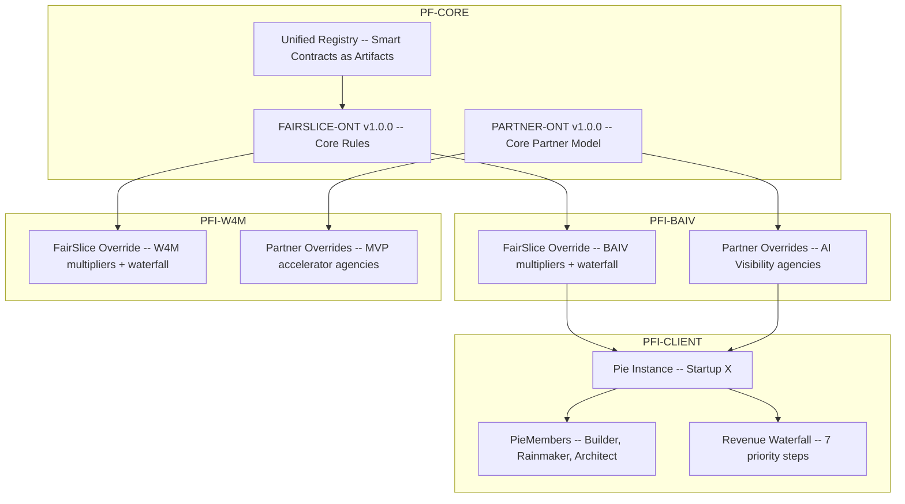
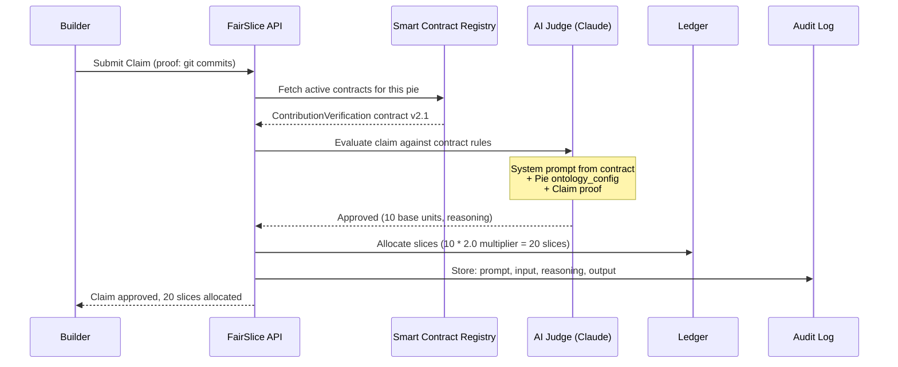

# BRIEFING: FairSlice Platform Economics & Partner Ecosystem

## Epic 50: FairSlice — Platform Economics & Partner Ecosystem

| Field | Value |
|---|---|
| **Date** | 2026-03-04 |
| **Version** | 1.1.0 |
| **Status** | PROPOSAL — For Review & Approval |
| **Classification** | CONFIDENTIAL — Strategic Planning Asset |
| **Priority** | HIGH |
| **Milestone** | MS 0.3 Platform Monetisation & Partner Growth |
| **Parent** | Epic 34: PF-Core Graph-Based Agentic Platform Strategy (#518) |
| **Lead Document** | [BRIEFING-FairSlice-Strategy-Implementation-Proposals.md](BRIEFING-FairSlice-Strategy-Implementation-Proposals.md) |
| **VSOM Alignment** | S1 (Graph-First), S2 (VE-Driven), S3 (Agentic), S4 (Instance Customisation), S6 (Integration) |
| **Ontology Alignment** | FAIRSLICE-ONT v1.0.0, PARTNER-ONT v1.0.0, RRR, PE, GRC-FW, EMC, VSOM, ORG |
| **VP-RRR Convention** | Maintained throughout — Problem=Risk, Solution=Requirement, Benefit=Result |
| **Downstream** | All PFI instances (BAIV, W4M, AIRL, VHF), Unified Registry, Agent Manager |

---

## 1. Problem Statement

Epic 34 established the PF-Core platform strategy with six strategies, BSC objectives, and a graph-based architecture. Two critical objectives remain unaddressed:

- **OBJ-SH2:** "10+ Fair Slice partners with digital contract governance" (Q4 2026)
- **OBJ-F4:** "GBP 100K+ annual partner-originated revenue" (Q4 2027)

BSC Chain 3 (Knowledge Graph to Cost Efficiency to Self-Service to **Partner Revenue**) has no implementation path. The existing architecture has:

1. **No equity/revenue sharing model** — contributors have no formal mechanism for tracking ownership or receiving distributions
2. **No partner channel** — agencies and affiliates cannot monetise referrals or management services
3. **No smart contract registry** — business logic is hardcoded, not licensable or composable
4. **No AI-verified claims** — contribution verification is manual and subjective
5. **No revenue waterfall** — no automated priority-based distribution when revenue arrives

Meanwhile, deals and prospects are accelerating. BAIV is approaching 100 clients (OBJ-F1). Partner conversations are happening. The platform needs an economic layer **now** — before partnerships calcify into ad-hoc arrangements that are harder to formalise later.

**Epic 50 builds the economic foundation that turns PF-Core from a tool into an ecosystem.**

---

## 2. Vision

> **Automate equitable value distribution across every role in the PF-Core ecosystem — builders, rainmakers, architects, and partners — through transparent, auditable, AI-verified smart contracts governed by the same ontology cascade that powers everything else.**

### The FairSlice Principle

Every contributor gets a fair slice of the mutual pie. Not fixated. Not ad-hoc. Programmatic, transparent, and governed.

### The Triple-Loop Engine

```
INNER LOOP (SaaS)
  Founders/startups pay for the tool (equity automation, revenue sharing)
  Revenue: Platform subscription fees

MIDDLE LOOP (Marketplace)
  Architects publish smart contracts (validation rules, commission triggers)
  Revenue: License fees, royalty payments

OUTER LOOP (Channel)
  Agencies manage client pies, affiliates refer startups
  Revenue: Management fees, referral commissions
```

### Four Personas, Four Incentives

| Persona | Role | Incentive | Platform Goal |
|---------|------|-----------|---------------|
| **The Builder** | Engineer | 2x Slice multiplier | Automated credit for code shipped |
| **The Rainmaker** | Sales | Cash / Equity commission | Dynamic payouts based on cash availability |
| **The Architect** | Module Creator | Royalties | License smart contracts to multiple startups |
| **The Partner** | Agency / Affiliate | Override / RevShare | Agencies: management fee. Affiliates: % of platform fee. |

---

## 3. Architecture

### 3.1 FairSlice within the PFC Graph Hierarchy



### 3.2 Revenue Waterfall Engine


### 3.3 AI Judge Claim Verification Flow



### 3.4 Data Flow Contract

```
{working_dir}/fairslice-output/
  fairslice-ont-v1.0.0.json          -- Ontology spec (Orchestration series)
  partner-ont-v1.0.0.json            -- Ontology spec (Foundation series)
  Entry-ONT-FAIRSLICE-001.json       -- Registry entry
  Entry-ONT-PARTNER-001.json         -- Registry entry

Supabase Tables:
  profiles                            -- User identity (Supabase Auth)
  pies                                -- Venture/startup tenants (JSONB ontology_config)
  pie_members                         -- Membership join table (role, multiplier)
  slices                              -- Contribution allocations (type, base, multiplied)
  claims                              -- Contribution claims (proof, status, reasoning)
  waterfall_rules                     -- Revenue distribution priority steps
  revenue_events                      -- Incoming revenue/transactions
  distributions                       -- Calculated payouts per waterfall step
  smart_contracts                     -- Packaged business logic (system prompts, rules)
  licenses                            -- Contract subscriptions per pie
  partners                            -- Agency/affiliate entities
  referrals                           -- Partner-to-pie attribution
  commission_rules                    -- Partner commission definitions
  partner_payouts                     -- Aggregated partner payouts
  ledger_transactions                 -- Financial ledger (revenue/cost/equity)
  audit_logs                          -- Immutable audit trail (input/reasoning/output)
```

---

## 4. Ontology Model Summary

### 4.1 FAIRSLICE-ONT v1.0.0 (Orchestration Series)

| Metric | Count |
|--------|-------|
| Entities | 9 (Pie, PieMember, Slice, Claim, WaterfallRule, RevenueEvent, Distribution, SmartContract, License) |
| Relationships | 19 (13 internal + 6 cross-ontology) |
| Business Rules | 12 (all mandatory severity:error) |
| Enumerations | 8 (PieStatus, MemberRole, SliceType, ClaimStatus, WaterfallStepType, ContractCategory, DistributionType, ClaimType) |
| Join Patterns | 7 (JP-FS-001 through JP-FS-007) |
| Cross-Ontology Bridges | RRR (roles), PE (processes), GRC-FW (audit), EMC (instances), VSOM (strategy), PARTNER (channel) |

### 4.2 PARTNER-ONT v1.0.0 (Foundation Series)

| Metric | Count |
|--------|-------|
| Entities | 6 (Partner, Agency, Affiliate, Referral, CommissionRule, PartnerPayout) |
| Relationships | 10 (5 internal + 5 cross-ontology) |
| Business Rules | 7 (6 error + 1 warning) |
| Enumerations | 5 (PartnerType, PartnerTier, AttributionType, PayoutStatus, ReferralStatus) |
| Join Patterns | 5 (JP-PARTNER-001 through JP-PARTNER-005) |
| Cross-Ontology Bridges | ORG (identity), FAIRSLICE (revenue), GRC-FW (governance), EMC (instances) |

### 4.3 VP-RRR Alignment (Standing Convention)

| VP Concept | RRR Concept | FairSlice Application |
|-----------|-------------|----------------------|
| **Problem** | **Risk** | Contributors under-rewarded is a risk to retention and ecosystem growth |
| **Solution** | **Requirement** | Transparent ledger + AI verification is the requirement to build |
| **Benefit** | **Result** | Equitable returns attract partners at scale — measured by Channel Velocity |

---

## 5. PFI Instance Applications

### 5.1 Quasi-OO Cascade for FairSlice

```
FAIRSLICE-ONT (PFC-Core)
  Defines: base multipliers, default waterfall, core smart contracts
    |
    |-- PFI-BAIV override
    |     Roles: ContentArchitect(2x), AIVisibilitySales(commission), AgencyPartner(5%)
    |     Waterfall: Platform -> Affiliate -> Agency -> Royalty -> OpEx -> Dividend
    |     Contracts: AI content delivery verification, mention-rate commission triggers
    |
    |-- PFI-W4M override
    |     Roles: VEConsultant(equity), MVPBuilder(2x), ChannelAgency(retainer)
    |     Waterfall: Platform -> Agency -> Architect royalty -> OpEx -> Dividend
    |     Contracts: PMF validation triggers, milestone-based equity vesting
    |
    |-- PFI-AIRL override
    |     Roles: CAFAssessor(equity), ComplianceArchitect(royalty), Affiliate(%)
    |     Waterfall: Platform -> Affiliate -> OpEx -> Dividend
    |     Contracts: CAF deliverable verification, maturity score triggers
    |
    +-- PFI-VHF override (PoC)
          Roles: NutritionistBuilder(2x), B2CReferrer(affiliate)
          Waterfall: Platform -> Affiliate -> Dividend
          Contracts: Recipe module verification, content delivery
```

### 5.2 BAIV Worked Example

**Scenario:** Agency "MarTech Pro" manages 3 BAIV client pies. Builder ships AI content module. Rainmaker closes enterprise deal.

```
Claim 1: Builder ships content-authority-agent v2.0
  Proof: git commits abc123, def456 (47 files changed)
  Smart Contract: contribution-verification-code-v1.0
  AI Judge: Approved (significant feature, 40 base units)
  Allocation: 40 * 2.0 (Builder multiplier) = 80 slices

Claim 2: Rainmaker closes GBP 5,000/month Enterprise deal
  Proof: CRM Deal ID #1234, signed contract
  Smart Contract: commission-trigger-sales-v1.0
  AI Judge: Approved (verified against CRM, 10% commission)
  Distribution: Revenue Event GBP 5,000
    1. Platform Fee: GBP 250 (5%)
    2. Affiliate (if referral): GBP 25 (10% of platform fee)
    3. Agency "MarTech Pro": GBP 250 (5% management fee)
    4. Architect Royalty: GBP 100 (license fee for content-authority module)
    5. OpEx Recovery: GBP 0
    6. Tax Reserve: GBP 0
    7. Dividend Pool: GBP 4,375 (distributed by ownership %)

Rainmaker commission: 10% of GBP 5,000 = GBP 500 (from dividend pool or separate commission rule)
```

---

## 6. Balanced Scorecard Objectives (5 Perspectives)

### 6.1 Financial

| ID | Objective | Target | Priority | Traces To |
|----|-----------|--------|----------|-----------|
| OBJ-FS-F1 | FairSlice SaaS revenue (platform fees) | GBP 50K ARR | High | Epic 34 OBJ-F2 |
| OBJ-FS-F2 | Partner-originated revenue | GBP 100K/year | High | Epic 34 OBJ-F4 |
| OBJ-FS-F3 | Smart contract marketplace revenue | GBP 25K ARR | Medium | New |
| OBJ-FS-F4 | Platform fee + commission operating margin > 60% | Ongoing | Medium | Epic 34 OBJ-F3 |

### 6.2 Customer

| ID | Objective | Target | Priority | Traces To |
|----|-----------|--------|----------|-----------|
| OBJ-FS-C1 | Pie creation to first distribution < 7 days | Q3 2026 | High | Epic 34 OBJ-C3 |
| OBJ-FS-C2 | Contributor NPS >= 65 (fairness perception) | Ongoing | High | Epic 34 OBJ-C2 |
| OBJ-FS-C3 | 80% of claims auto-verified by AI Judge | Q4 2026 | Medium | New |

### 6.3 Internal Process

| ID | Objective | Target | Priority | Traces To |
|----|-----------|--------|----------|-----------|
| OBJ-FS-IP1 | Revenue waterfall processes in < 500ms | Ongoing | High | Epic 34 OBJ-IP3 |
| OBJ-FS-IP2 | Smart contract publish-to-install < 1 hour | Q3 2026 | Medium | Epic 34 OBJ-IP2 |
| OBJ-FS-IP3 | 100% distribution audit trail coverage | Ongoing | Critical | Epic 34 OBJ-IP1 |
| OBJ-FS-IP4 | AI Judge cost < $0.05 per claim (three-tier) | Ongoing | High | Epic 34 OBJ-IP5 |

### 6.4 Learning & Growth

| ID | Objective | Target | Priority | Traces To |
|----|-----------|--------|----------|-----------|
| OBJ-FS-LG1 | FAIRSLICE-ONT + PARTNER-ONT in registry | Q1 2026 | Critical | Epic 34 OBJ-LG1 |
| OBJ-FS-LG2 | 5+ reusable smart contracts in marketplace | Q3 2026 | Medium | New |
| OBJ-FS-LG3 | FairSlice pattern documented for PFI replication | Q2 2026 | High | Epic 34 OBJ-LG2 |

### 6.5 Stakeholder

| ID | Objective | Target | Priority | Traces To |
|----|-----------|--------|----------|-----------|
| OBJ-FS-SH1 | 10+ Fair Slice partners with digital contract governance | Q4 2026 | High | Epic 34 OBJ-SH2 |
| OBJ-FS-SH2 | Channel Velocity > 1.5 Pies/Agency/Month | Q4 2026 | High | New |
| OBJ-FS-SH3 | Multi-jurisdictional compliance (UK, EU) for payouts | Q1 2027 | Medium | Epic 34 OBJ-SH1 |

---

## 7. Metrics Dashboard

### 7.1 Key Leading Indicators

| ID | KPI | Target | Predicts |
|----|-----|--------|----------|
| M-FS-L1 | Active Pies | 50+ | OBJ-FS-F1 (platform revenue) |
| M-FS-L2 | Channel Velocity | > 1.5 Pies/Agency/Month | OBJ-FS-SH2 (partner growth) |
| M-FS-L3 | Smart Contract Installs/Month | 20+ | OBJ-FS-F3 (marketplace revenue) |
| M-FS-L4 | Claim Approval Rate | > 85% | OBJ-FS-C3 (AI Judge accuracy) |
| M-FS-L5 | Partner Pipeline | 25+ applications | OBJ-FS-SH1 (10 partners) |

### 7.2 Key Lagging Indicators

| ID | KPI | Target | Confirms |
|----|-----|--------|----------|
| M-FS-G1 | Platform Fee Revenue | GBP 50K ARR | OBJ-FS-F1 |
| M-FS-G2 | Partner-Originated Revenue | GBP 100K/year | OBJ-FS-F2 |
| M-FS-G3 | Distribution Audit Coverage | 100% | OBJ-FS-IP3 |
| M-FS-G4 | Contributor NPS | >= 65 | OBJ-FS-C2 |
| M-FS-G5 | Active Partners | 10+ | OBJ-FS-SH1 |

---

## 8. Cause-Effect Chains (BSC Cascades)

### Chain 1: Ontology Foundation to Platform Revenue

```
[LG: FAIRSLICE-ONT + PARTNER-ONT in Registry (OBJ-FS-LG1)]
    -> [IP: Revenue waterfall < 500ms, 100% audit trail (OBJ-FS-IP1, IP3)]
    -> [C: Pie creation to distribution < 7 days (OBJ-FS-C1)]
    -> [F: GBP 50K ARR platform fees (OBJ-FS-F1)]
```

### Chain 2: Smart Contract Marketplace to Architect Economy

```
[LG: 5+ reusable smart contracts published (OBJ-FS-LG2)]
    -> [IP: Publish-to-install < 1 hour (OBJ-FS-IP2)]
    -> [C: 80% claims auto-verified (OBJ-FS-C3)]
    -> [F: GBP 25K marketplace revenue (OBJ-FS-F3)]
```

### Chain 3: Partner Ecosystem to Channel Revenue (Epic 34 Chain 3)

```
[LG: FairSlice pattern documented (OBJ-FS-LG3)]
    -> [IP: AI Judge < $0.05/claim (OBJ-FS-IP4)]
    -> [SH: 10+ partners, Channel Velocity > 1.5 (OBJ-FS-SH1, SH2)]
    -> [F: GBP 100K partner-originated revenue (OBJ-FS-F2)]
```

---

## 9. Features and Stories

### Feature Summary

| Feature | Title | Stories | Status |
|---------|-------|:-------:|--------|
| **F50.1** | FAIRSLICE-ONT v1.0.0 — Ontology Specification | 3 | Done |
| **F50.2** | PARTNER-ONT v1.0.0 — Ontology Specification | 3 | Done |
| **F50.3** | Supabase Schema — Core Tables + RLS | 4 | Backlog |
| **F50.4** | Dynamic Equity Ledger — Slice Engine | 3 | Backlog |
| **F50.5** | Revenue Waterfall Engine | 4 | Backlog |
| **F50.6** | Smart Contract Registry — Publish + License + Install | 4 | Backlog |
| **F50.7** | AI Judge Agent — Claim Verification | 3 | Backlog |
| **F50.8** | Partner & Agency Engine — Attribution + Dashboard | 4 | Backlog |
| **F50.9** | Stripe Connect Integration — Split Payments | 3 | Backlog |
| **F50.10** | E2E Validation — BAIV Worked Example | 2 | Backlog |

**Totals: 10 features, 33 stories**

---

### F50.1: FAIRSLICE-ONT v1.0.0 — Ontology Specification

Defines the 9 entities, 19 relationships, 12 business rules, 8 enumerations, and 7 join patterns for platform economics. OAA v7.0.0 compliant. Orchestration series.

**Stories:**
- [x] S50.1.1: Create fairslice-ont-v1.0.0.json with full entity model, relationships, rules, enums
- [x] S50.1.2: Create Entry-ONT-FAIRSLICE-001.json registry entry with compliance gates
- [x] S50.1.3: Update ont-registry-index.json with FAIRSLICE-ONT entry + namespace

---

### F50.2: PARTNER-ONT v1.0.0 — Ontology Specification

Defines the 6 entities, 10 relationships, 7 business rules, 5 enumerations, and 5 join patterns for channel economics. OAA v7.0.0 compliant. Foundation series.

**Stories:**
- [x] S50.2.1: Create partner-ont-v1.0.0.json with full entity model, relationships, rules, enums
- [x] S50.2.2: Create Entry-ONT-PARTNER-001.json registry entry with compliance gates
- [x] S50.2.3: Update ont-registry-index.json with PARTNER-ONT entry + namespace

---

### F50.3: Supabase Schema — Core Tables + RLS

Create the database schema implementing FAIRSLICE-ONT and PARTNER-ONT entities as Supabase tables with JSONB ontology_config, Row Level Security, and audit trail. Converges with Epic 34 F34.5 (JSONB Graph Storage PoC).

**Stories:**
- [ ] S50.3.1: Create core tables: profiles, pies (with JSONB ontology_config), pie_members, slices, claims
- [ ] S50.3.2: Create waterfall tables: waterfall_rules, revenue_events, distributions
- [ ] S50.3.3: Create channel tables: partners, referrals, commission_rules, partner_payouts
- [ ] S50.3.4: RLS policies: tenant isolation (pie_members), agency access (partners to referrals to pies), audit immutability

---

### F50.4: Dynamic Equity Ledger — Slice Engine

Real-time calculation of ownership percentages based on SUM(slices). Multiplier application per role. Vesting schedule support. Optimistic UI for immediate feedback.

**Stories:**
- [ ] S50.4.1: Slice allocation engine — baseUnits * multiplier = totalSlices, ownership % recalculation
- [ ] S50.4.2: Ledger transaction recording — every slice allocation creates a ledger entry
- [ ] S50.4.3: Vesting schedule engine — cliff, duration, acceleration triggers per PieMember

---

### F50.5: Revenue Waterfall Engine

Priority-based revenue distribution. When a RevenueEvent arrives, execute WaterfallRules in priority order creating Distribution records. Platform fee always first. Remainder to dividend pool.

**Stories:**
- [ ] S50.5.1: Waterfall executor — process WaterfallRules in priority order, create Distribution records
- [ ] S50.5.2: Partner-aware waterfall — check for active referral_id, trigger affiliate and agency splits
- [ ] S50.5.3: Dividend distribution — calculate ownership-weighted payouts from remainder pool
- [ ] S50.5.4: Revenue event reconciliation — netToPie = amount - SUM(distributions), status transition

---

### F50.6: Smart Contract Registry — Publish + License + Install

Extend the Unified Registry with artifactType "smart-contract". Architects publish validation rules with licensing terms. Pies subscribe via one-click install. Smart contracts define the system prompt for the AI Judge.

**Stories:**
- [ ] S50.6.1: Smart contract CRUD — create, version, publish, deprecate (immutable after publish)
- [ ] S50.6.2: Licensing engine — cash/equity/free terms, billing cycle, activation/expiration
- [ ] S50.6.3: One-click install — pie subscribes to contract, License record created, waterfall rule auto-injected for architect royalty
- [ ] S50.6.4: Registry integration — smart contracts as pfc:RegistryArtifact entries with quasi-OO cascade

---

### F50.7: AI Judge Agent — Claim Verification

Claude-powered claim processing agent following Agent Template v6.0.0. Three-tier cost model: Local validation (free) to Haiku claim check to Sonnet complex arbitration.

**Stories:**
- [ ] S50.7.1: Judge agent implementation — fetch contract, build system prompt, evaluate claim, return reasoning
- [ ] S50.7.2: Three-tier cost routing — Local (schema validation) to Haiku (standard claims) to Sonnet (disputes, complex)
- [ ] S50.7.3: Audit trail persistence — store exact input prompt, claim data, contract rules, and output reasoning

---

### F50.8: Partner & Agency Engine — Attribution + Dashboard

Multi-tier attribution tracking, agency super-admin dashboard, commission rule management, partner payout aggregation.

**Stories:**
- [ ] S50.8.1: Partner onboarding — registration, KYC check, tier assignment, Stripe Connect linking
- [ ] S50.8.2: Referral attribution — immutable referral codes, attribution window enforcement, multi-tier tracking
- [ ] S50.8.3: Agency dashboard — super-admin view to toggle between client pies, inject management fee contracts
- [ ] S50.8.4: Commission aggregation — period-based payout calculation, approval workflow, payment dispatch

---

### F50.9: Stripe Connect Integration — Split Payments

Automated payment processing via Stripe Connect split payments. Platform fee extraction, partner commission routing, pie member payouts.

**Stories:**
- [ ] S50.9.1: Stripe Connect setup — connected accounts for partners and pie members
- [ ] S50.9.2: Split payment routing — waterfall steps map to Stripe transfers
- [ ] S50.9.3: Payout reconciliation — match Stripe transfer IDs to Distribution records, handle failures

---

### F50.10: E2E Validation — BAIV Worked Example

End-to-end validation: create a BAIV pie with builder + rainmaker + agency partner, process claims, execute waterfall, verify distributions.

**Stories:**
- [ ] S50.10.1: Seed BAIV test pie with 3 members (Builder 2x, Rainmaker 1x, Advisor 0.5x) + Agency partner + 2 smart contracts
- [ ] S50.10.2: Execute full cycle: Builder claim to AI Judge to slice allocation to revenue event to waterfall to distributions to partner payout

---

## 10. Quality Gates

| Gate | Feature | Validates |
|------|---------|-----------|
| G1 | F50.1/F50.2 | Ontology OAA v7.0.0 compliance, all 8 gates pass |
| G2 | F50.3 | RLS isolation: pie members cannot see other pies, agencies only see referral pies |
| G3 | F50.4 | Slice math: ownership % always sums to 100%, multipliers applied correctly |
| G4 | F50.5 | Waterfall completeness: all rules execute, netToPie = amount - SUM(distributions) |
| G5 | F50.6 | Smart contracts immutable after publish, licenses required for use |
| G6 | F50.7 | AI Judge audit trail: every decision has stored prompt + reasoning + output |
| G7 | F50.8 | Attribution integrity: referral codes immutable, agency RLS enforced |
| G8 | F50.9 | Payment reconciliation: every Distribution maps to a Stripe transfer or equity entry |

---

## 11. Three-Tier Cost Model

| Tier | Model | Used For | Est. |
|------|-------|----------|------|
| Tier 1 (Local) | Schema validation | Claim format check, slice math, waterfall sum validation | Free |
| Tier 2 (Haiku) | Standard verification | Routine claims (code shipped, time logged), simple commission triggers | ~$0.01/claim |
| Tier 3 (Sonnet) | Complex arbitration | Disputed claims, multi-factor IP contributions, edge cases | ~$0.08/claim |

**Target:** < $0.05 average per claim (OBJ-FS-IP4). 80% Tier 1/2, 20% Tier 3.

---

## 12. Implementation Sequence

```
Phase 1: Ontology + Schema (Current)
  F50.1 -- FAIRSLICE-ONT v1.0.0 (DONE)
  F50.2 -- PARTNER-ONT v1.0.0 (DONE)
  F50.3 -- Supabase schema + RLS

Phase 2: Core Engine
  F50.4 -- Dynamic equity ledger
  F50.5 -- Revenue waterfall engine
  F50.7 -- AI Judge agent

Phase 3: Marketplace + Channel
  F50.6 -- Smart contract registry
  F50.8 -- Partner and agency engine

Phase 4: Payments + Validation
  F50.9 -- Stripe Connect integration
  F50.10 -- E2E validation (BAIV worked example)
```

---

## 13. Technical Stack

| Layer | Technology | Rationale |
|-------|-----------|-----------|
| **Frontend** | Next.js 14 (App Router) + shadcn/ui + Tailwind | Epic 34 S5 alignment, Figma Make pipeline |
| **Backend** | Supabase (Postgres, Auth, Realtime, Edge Functions) | JSONB graph storage (S1), RLS tenant isolation |
| **AI** | Anthropic Claude (Haiku + Sonnet) | AI Judge, three-tier cost model (S3) |
| **Payments** | Stripe Connect (Split Payments) | Automated multi-party revenue distribution |
| **Ontologies** | FAIRSLICE-ONT + PARTNER-ONT (OAA v7.0.0) | Same governance as all PFC ontologies |
| **Registry** | Unified Registry (Quasi-OO cascade) | Smart contracts as registry artifacts |

---

## 14. Schema Convergence with Epic 34 JSONB PoC

FairSlice tables ARE the JSONB graph storage PoC (F34.5). The `pies.ontology_config` column is the same pattern as `pfc_registry.configuration`. The `smart_contracts` table extends the Unified Registry with licensable business logic. See `CONVERGENCE-FairSlice-JSONB-Graph-Patterns.md` for the full mapping.

---

## 15. Acceptance Criteria

- [ ] FAIRSLICE-ONT v1.0.0 passes all 8 OAA gates
- [ ] PARTNER-ONT v1.0.0 passes all 8 OAA gates
- [ ] Both ontologies registered in ont-registry-index.json
- [ ] Supabase schema implements all 15 entities across both ontologies
- [ ] RLS: tenant isolation (pie_members), agency isolation (referral-based)
- [ ] Slice engine: ownership % always correct, multipliers applied per role
- [ ] Waterfall: 7-step priority distribution with netToPie reconciliation
- [ ] AI Judge: claim verified against smart contract, reasoning stored in audit log
- [ ] Smart contracts: immutable after publish, licensable, one-click install
- [ ] Partner attribution: immutable referral codes, attribution window enforcement
- [ ] Agency dashboard: toggle between client pies, inject management fee
- [ ] Stripe Connect: automated split payments for waterfall distributions
- [ ] E2E: BAIV worked example passes full cycle (claim to distribution to payout)
- [ ] VP-RRR alignment maintained throughout

---

## 16. Cross-References

| Related | Relationship |
|---------|-------------|
| Epic 34 (#518) | Parent strategy — OBJ-SH2, OBJ-F4, BSC Chain 3, S4 Instance Customisation |
| Epic 34 F34.5 | JSONB Graph Storage PoC — FairSlice tables converge with this |
| Epic 34 F34.3 | Agent Architecture — AI Judge follows Agent Template v6.0.0 |
| Epic 30 (#370) | GRC Series — audit trail governance via GRC-FW |
| Epic 40 (#577) | Workbench — FairSlice dashboard as workbench zone (future) |
| Epic 49 | Application Planner — FairSlice as target application for the planner pipeline |
| Unified Registry | Smart contracts as registry artifacts (quasi-OO cascade) |
| RRR-ONT | Role alignment: Builder=Engineer, Rainmaker=Sales, Architect=ModuleCreator |
| PE-ONT | Claim lifecycle follows PE process pattern |
| EMC-ONT | Pie maps to InstanceConfiguration |
| VP-ONT | VP-RRR alignment convention maintained |

---

## Appendix A: Glossary

| Term | Definition |
|------|-----------|
| Pie | A venture/startup whose value is being shared among contributors |
| Slice | A unit of contribution — the base currency of FairSlice |
| Multiplier | Role-based factor applied to base contributions (e.g., Builder = 2x) |
| Waterfall | Priority-ordered revenue distribution chain (7 steps) |
| Smart Contract | Packaged business logic — system prompts and validation rules for the AI Judge |
| AI Judge | Claude-powered agent that verifies contribution claims against smart contracts |
| Channel Velocity | Pies added per Agency per Month — key PMF metric (target: > 1.5) |
| Triple-Loop | SaaS (Inner) + Marketplace (Middle) + Channel (Outer) revenue engine |
| Attribution Window | Time period during which a referral earns commission (default: 90 days) |
| Commission Hijacking | Fraudulent reassignment of referral attribution — prevented by BR-FS-005 / BR-PARTNER-001 |

## Appendix B: Ontology Coverage Matrix

| Ontology | F50.1 Ontology | F50.3 Schema | F50.4 Ledger | F50.5 Waterfall | F50.6 Registry | F50.7 Judge | F50.8 Partner |
|----------|:-:|:-:|:-:|:-:|:-:|:-:|:-:|
| FAIRSLICE-ONT | **P** | **P** | **P** | **P** | **P** | R | R |
| PARTNER-ONT | **P** | **P** | | R | | | **P** |
| RRR-ONT | R | R | R | | | | |
| PE-ONT | R | | | | | R | |
| GRC-FW-ONT | R | R | R | R | | R | R |
| EMC-ONT | R | R | | | R | | |
| VSOM-ONT | R | | | R | | | |
| ORG-ONT | | R | | | | | R |

**P** = Primary producer | **R** = Referenced/consumed

---

*End of briefing. Ready for Epic 50 GitHub issue creation upon approval.*
