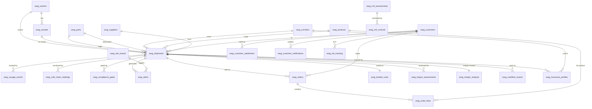

# PFI-WWG-ARCH-Database-Integration-v1.0.0

**Version:** 1.0.0 | **Status:** Verified | **Date:** 31 March 2026
**Instance:** pfi-w4m-wwg | **Product:** LSC (Logistics Supply Chain)
**Supabase Project:** pfc-pfi (`jhlugiprdwgzshxctbdj`) — ajrmooreuk's Org
**Migration:** [001_wwg_schema_and_seed.sql](https://github.com/ajrmooreuk/pfi-w4m-wwg-dev/blob/main/supabase/migrations/001_wwg_schema_and_seed.sql)

---

## 1. Overview

Database MVP for the W4M-WWG MeatTrackAI LSC product. Formalises the shipping tracker simulation data into Supabase PostgreSQL, adding financial impact assessment, RAID/RMF risk management, creditor/insurance analysis, 4Voices predictive analytics, CAST contextual assistant, and Farsight insight engine.

**Key design principle:** JSONB for complex/flexible data (findings, evidence, recommendations, audit snapshots). Lightweight `ont_ref TEXT` for ontology cross-references. No separate ontology tables — ontologies live in `instance-data/ontologies/` as JSON files per PFC pattern.

---

## 2. Schema Architecture — 33 Tables in 10 Groups

| Group | Tables | Purpose |
|-------|--------|---------|
| 1. Foundation | 1 | `wwg_db_config` singleton |
| 2. Reference | 7 | Corridors, carriers, vessels, ports, products, customers, suppliers |
| 3. Operational | 6 | Shipments, voyage events, risk events, compliance gates, cold-chain readings, alerts |
| 4. Financial Impact | 7 | Orders, order lines, FX rates, landed costs, impact assessments, margin analysis, cashflow events |
| 5. Creditors & Insurance | 2 | Creditor accounts, insurance profiles |
| 6. Customer & Satisfaction | 3 | Notifications, CSAT scores, SLA tracking |
| 7. RAID + RMF | 3 | RAID log, RMF assessments, RMF controls |
| 8. 4Voices Analytics | 1 | Insights (macro/industry/corridor/operational, SWOT, predictions) |
| 9. Intelligence | 2 | CAST interactions, Farsight threads |
| 10. Audit & Control | 2 | Audit log (immutable), control checks |

---

## 3. Entity Relationship Diagram



---

## 4. Ontology Cross-References

Ontology references are stored as `ont_ref TEXT` columns — lightweight pointers, not FK relationships. The full ontology definitions live in `instance-data/ontologies/` as JSON files.

| Table | ont_ref Value | Ontology |
|-------|--------------|----------|
| wwg_shipments | `LSC-ONT:Shipment` | LSC-ONT v1.2.0 |
| wwg_voyage_events | `LSC-ONT:ShipmentLeg` | LSC-ONT v1.2.0 |
| wwg_risk_events | `LSC-ONT:Incident` | LSC-ONT v1.2.0 |
| wwg_compliance_gates | `LSC-ONT:ComplianceGate` | LSC-ONT v1.2.0 |
| wwg_cold_chain_readings | `LSC-ONT:ColdChainEvent` | LSC-ONT v1.2.0 |
| wwg_impact_assessments | `LSC-ONT:ImpactAssessment` | LSC-ONT v1.2.0 |
| wwg_orders | `OFM-ONT:SalesOrder` | OFM-ONT v1.1.0 |
| wwg_order_lines | `OFM-ONT:OrderLine` | OFM-ONT v1.1.0 |
| wwg_landed_costs | `OFM-ONT:LandedCost` | OFM-ONT v1.1.0 |
| wwg_margin_analysis | `OFM-ONT:MarginAnalysis` | OFM-ONT v1.1.0 |
| wwg_customer_satisfaction | `OFM-ONT:CustomerSatisfaction` | OFM-ONT v1.1.0 |
| wwg_raid_log | `RAID-ONT:RAIDLog` | RAID-ONT v1.0.0 |
| wwg_rmf_assessments | `RMF-IS27005-ONT:RiskAssessment` | RMF-IS27005-ONT v1.0.0 |
| wwg_rmf_controls | `RMF-IS27005-ONT:Control` | RMF-IS27005-ONT v1.0.0 |
| wwg_insights | `VP-ONT:Hypothesis` | VP-ONT v1.2.3 |

---

## 5. Impact Assessment Value Chain

The core value demonstration: **shipping event → financial consequence → customer impact**.

```
TRIGGER EVENT (risk_events / voyage_events)
  │
  ├─► ETA CHANGE (shipments.current_eta, current_delay_days)
  │     ├─► ALERT generated (wwg_alerts)
  │     ├─► COMPLIANCE deadline shift (wwg_compliance_gates)
  │     └─► SHELF LIFE recalc (wwg_cold_chain_readings)
  │
  ├─► FINANCIAL CASCADE (wwg_impact_assessments)
  │     ├─► Spoilage:   temp_breach → £15k + delay*£3k
  │     ├─► Demurrage:  delay > 0 → delay * £800/day
  │     └─► SLA Penalty: delay > 5d → delay * £500/day
  │
  ├─► LANDED COST UPDATE (demurrage_gbp added to total)
  │
  ├─► MARGIN EROSION (wwg_margin_analysis)
  │     actual_cost = planned_cost + spoilage + demurrage + penalty
  │     margin_erosion = planned_margin - actual_margin
  │
  ├─► CASHFLOW IMPACT (new outflows; delayed settlement)
  │
  ├─► CREDITOR IMPACT (wwg_creditor_accounts)
  │     days_past_due > payment_terms → blocked = true
  │     blocked → backlog_offer generated
  │
  ├─► INSURANCE TRIGGER (wwg_insurance_profiles)
  │     total_impact > excess → claim_status = 'submitted'
  │     NOT insured → full exposure on margin
  │
  ├─► CUSTOMER IMPACT (wwg_customer_satisfaction)
  │     delivery_delta → on_time_score inverse correlation
  │     repeat_business_probability drops with delays
  │
  └─► 4VOICES INSIGHT (wwg_insights)
        Macro / Industry / Corridor / Operational perspectives
```

---

## 6. Demo Scenarios

| Container | Scenario | Delay | Impact £ | Margin | CSAT | Insured | Creditor |
|-----------|----------|-------|----------|--------|------|---------|----------|
| HLXU9901234 | TEMP_BREACH | +6d | £34,800 | 18%→-14% | 2.5 | Yes (claim £29.8k) | Supplier blocked |
| MRKU4821073 | CAPE_REROUTE | +8d | £17,500 | 15%→-7% | 4.5 | Yes | Carrier overdue |
| MSCU3345678 | SUEZ_THEN_CAPE | +10d | £10,500 | 16%→8% | — | Yes | OK |
| CSNU2234567 | HORMUZ_DIVERT | +5d | £12,750 | 12%→3% | 4.0 | **NOT insured** | OK |
| MRKU7734901 | NORMAL | 0d | £0 | 16%→16% | 9.2 | Yes | OK |
| EVRU8821100 | CEASEFIRE_BENEFIT | -2d | £0 (saved) | 14%→15% | 9.5 | Yes | OK |

---

## 7. JSONB Usage Pattern

Flexible/complex data uses JSONB (not separate tables):

| Table | JSONB Column | Content |
|-------|-------------|---------|
| wwg_farsight_threads | findings | Structured insight payload |
| wwg_farsight_threads | recommendations | Action items array |
| wwg_insights | evidence | Supporting data points |
| wwg_audit_log | before_value | Full row state pre-change |
| wwg_audit_log | after_value | Full row state post-change |

Array columns (`TEXT[]`):
- `wwg_impact_assessments.risk_factors`, `reasoning`
- `wwg_insurance_profiles.exclusions`
- `wwg_farsight_threads.data_sources`
- `wwg_insights.data_sources`

---

## 8. Naming Conventions

| Convention | Pattern | Example |
|-----------|---------|---------|
| Table prefix | `wwg_` | `wwg_shipments` |
| Standard PK | `id UUID DEFAULT gen_random_uuid()` | All tables |
| Timestamps | `created_at`, `updated_at` | All mutable tables |
| Soft delete | `archived_at`, `archived_by` | Reference + RAID tables |
| Origin tracking | `origin_db TEXT DEFAULT 'wwg-seed'` | All tables |
| Index naming | `idx_wwg_{table}_{column}` | `idx_wwg_shipments_status` |
| Trigger naming | `wwg_{table}_updated_at` | `wwg_shipments_updated_at` |
| Audit trigger | `wwg_{table}_audit` | `wwg_shipments_audit` |

---

## 9. Data Types

| Use Case | Type |
|----------|------|
| Monetary totals | `NUMERIC(14,2)` |
| Per-unit prices | `NUMERIC(14,4)` |
| FX rates | `NUMERIC(18,8)` |
| Coordinates | `NUMERIC(9,6)` |
| Confidence/probability | `NUMERIC(3,2)` |
| Risk scores | `NUMERIC(3,1)` |
| Enums | `TEXT CHECK (...)` inline |
| Ontology refs | `TEXT` (`ont_ref`) |
| Flexible data | `JSONB` |
| Multi-value | `TEXT[]` |

---

## 10. Trigger Architecture

**`set_updated_at()`** — shared function, `BEFORE UPDATE` on all mutable tables (20 tables).

**`wwg_audit_trigger()`** — auto-logs INSERT/UPDATE to `wwg_audit_log`. Applied to 6 transactional tables:
- `wwg_shipments`
- `wwg_orders`
- `wwg_order_lines`
- `wwg_alerts`
- `wwg_impact_assessments`
- `wwg_compliance_gates`

---

## 11. RLS Strategy

**MVP (current):** RLS enabled on all 33 tables. Permissive `allow_all_{table}` policy per table.

**Phase 2 (planned):**

| Role | Shipments | Orders | Creditors | Audit | CAST |
|------|-----------|--------|-----------|-------|------|
| trader | Own customer | Own customer | No access | No access | Own sessions |
| admin | All | All | Read/write | Read all | All |
| pf-owner | All (cross-PFI) | All | All | All | All |

---

## 12. Control Checks (Audit & Control View)

| Check | Name | Category | Status |
|-------|------|----------|--------|
| CC-001 | Audit Trail Completeness | data-quality | PASS |
| CC-002 | Cold-Chain Temp Compliance | compliance | WARNING |
| CC-003 | BTOM/IPAFFS Gate Coverage | compliance | WARNING |
| CC-004 | FX Rate Currency | financial | PASS |
| CC-005 | Insurance Coverage | financial | WARNING |
| CC-006 | Creditor Overdue Exposure | financial | WARNING |
| CC-007 | SLA Compliance Rate | operational | FAIL |
| CC-008 | Halal Certification Coverage | compliance | PASS |
| CC-009 | Data Residency | security | WARNING |
| CC-010 | RLS Policy Enforcement | security | INFO |

---

## 13. Seed Data Manifest

| Table | Rows | Source |
|-------|------|--------|
| wwg_corridors | 2 | Tracker route config |
| wwg_carriers | 7 | Tracker carrier list |
| wwg_vessels | 12 | Tracker vessel names |
| wwg_ports | 7 | Tracker port codes |
| wwg_products | 12 | Tracker product types |
| wwg_customers | 6 | Anonymised |
| wwg_suppliers | 5 | Anonymised |
| wwg_risk_events | 6 | Tracker RISK_EVENTS |
| wwg_shipments | 12 | Tracker CONTAINER_DEFS |
| wwg_voyage_events | 28 | Key milestones from simulation |
| wwg_alerts | 10 | Tracker alert scenarios |
| wwg_compliance_gates | 12 | BTOM/IPAFFS per shipment |
| wwg_cold_chain_readings | 10 | Temp monitoring + breach |
| wwg_orders | 12 | 1 per shipment |
| wwg_order_lines | 12 | 1 per order |
| wwg_fx_rates | 10 | AUD/GBP, AUD/USD, USD/GBP |
| wwg_landed_costs | 12 | Full cost breakdown |
| wwg_impact_assessments | 12 | QVF per shipment |
| wwg_margin_analysis | 12 | Planned vs actual |
| wwg_cashflow_events | 18 | Key payment milestones |
| wwg_creditor_accounts | 10 | Suppliers + carriers + agents |
| wwg_insurance_profiles | 12 | Per shipment (1 uninsured) |
| wwg_customer_satisfaction | 8 | Correlated with delivery |
| wwg_customer_notifications | 8 | ETA + breach + delivery |
| wwg_sla_tracking | 6 | Q1 2026 per customer |
| wwg_raid_log | 16 | 4R + 4A + 3I + 3D + 2REQ |
| wwg_rmf_assessments | 3 | AIS, IoT, data residency |
| wwg_rmf_controls | 5 | Linked to assessments |
| wwg_insights | 12 | 4 perspectives, SWOT, predictions |
| wwg_cast_interactions | 3 | Contextual assistant demo |
| wwg_farsight_threads | 3 | Financial + cold-chain + creditor |
| wwg_control_checks | 10 | CC-001 to CC-010 |
| wwg_audit_log | 12 | Key lifecycle events |
| **Total** | **~340** | |

---

## 14. Links

- **Repo:** https://github.com/ajrmooreuk/pfi-w4m-wwg-dev
- **Live Tracker:** https://ajrmooreuk.github.io/pfi-w4m-wwg-dev/PBS/LSC-DEMOS/lsc-shipping-tracker.html
- **Migration SQL:** https://github.com/ajrmooreuk/pfi-w4m-wwg-dev/blob/main/supabase/migrations/001_wwg_schema_and_seed.sql
- **Supabase Dashboard:** https://supabase.com/dashboard/project/jhlugiprdwgzshxctbdj/editor
- **Epic 90:** https://github.com/ajrmooreuk/pfi-w4m-wwg-dev/issues/39
- **Epic 91:** https://github.com/ajrmooreuk/pfi-w4m-wwg-dev/issues/51

---

## 15. Migration History

| Version | Date | Description |
|---------|------|-------------|
| 1.0.0-wwg-mvp | 2026-03-31 | Initial schema — 33 tables, ~340 rows seed data |
