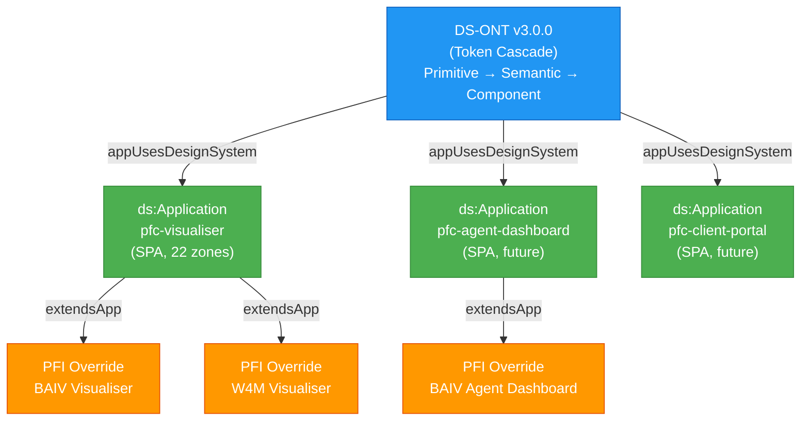
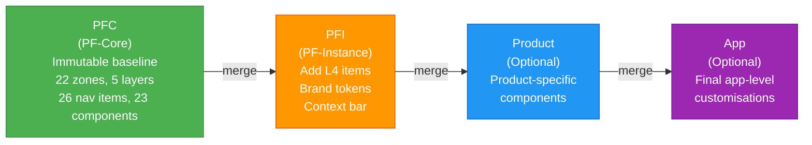
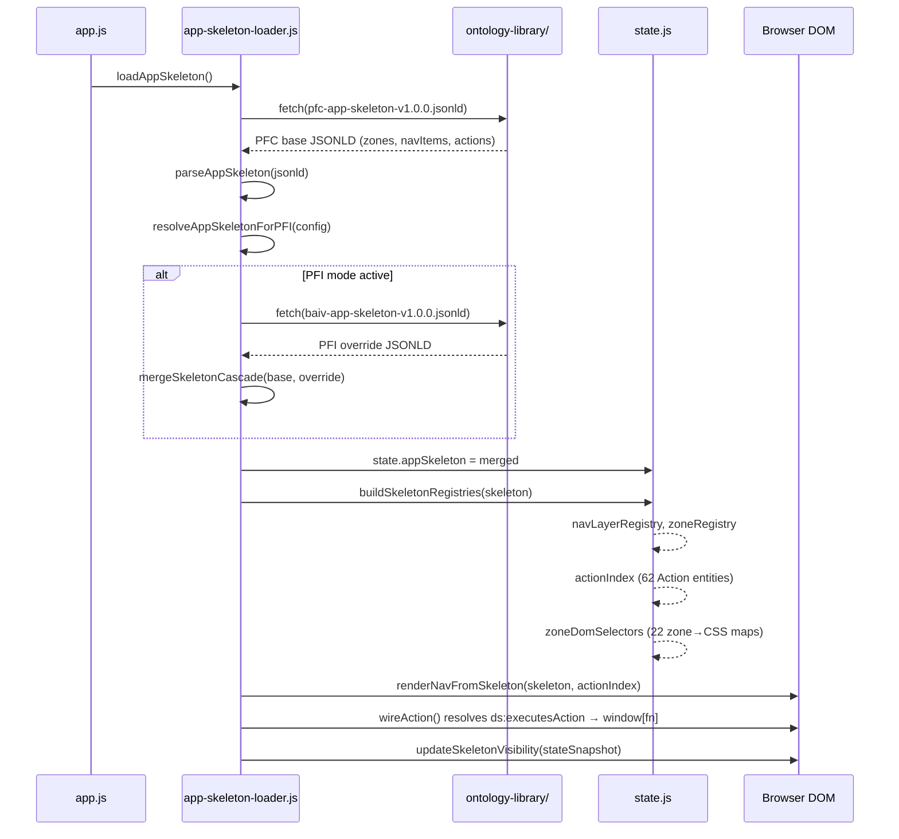
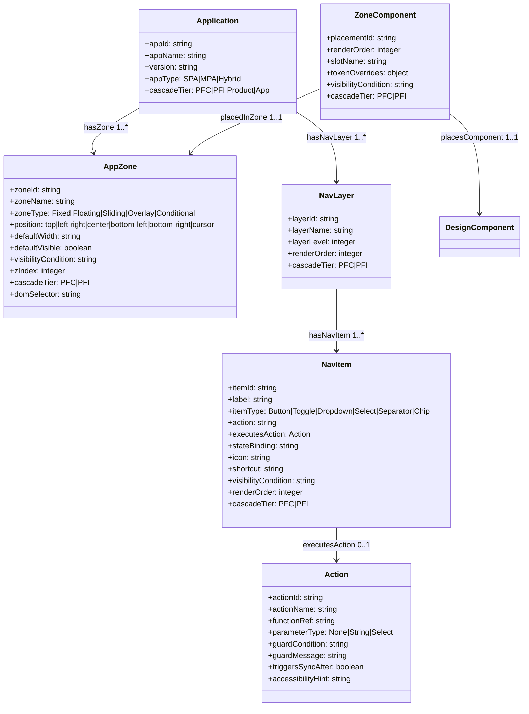
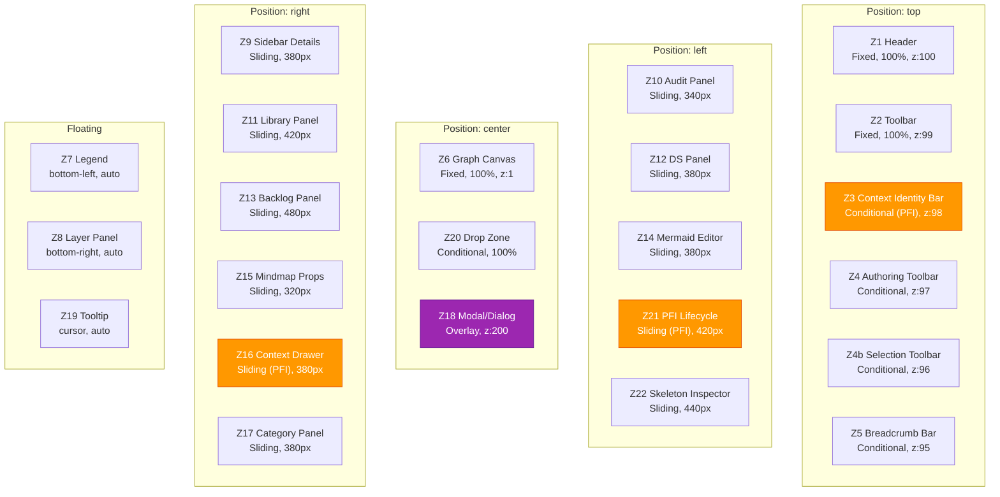
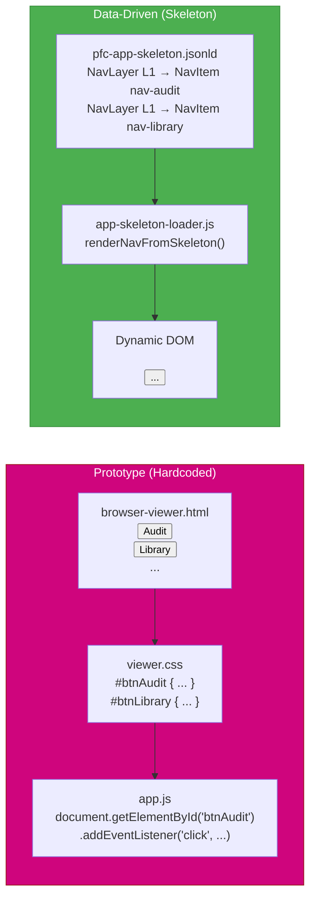
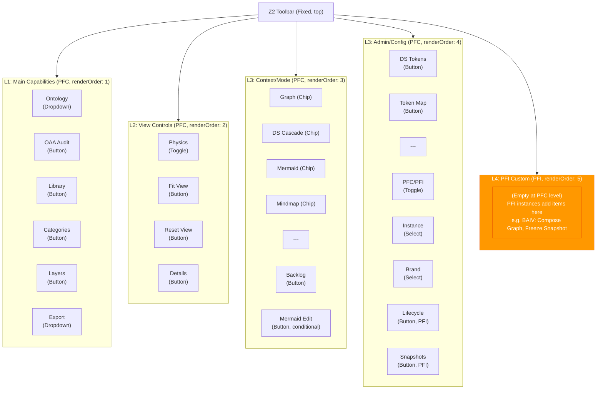
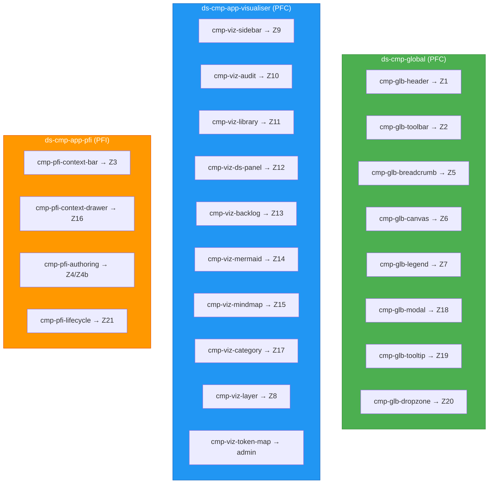
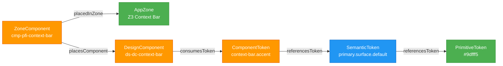

> **Read-only copy** distributed from [PF-Core source repo](https://github.com/ajrmooreuk/Azlan-EA-AAA). Do not edit directly — changes will be overwritten on next PFC release.

---

# Application Skeleton Architecture & Management Guide

**Version:** 1.2.0
**Date:** 2026-02-24
**DS-ONT:** v3.0.0
**Epic:** 40 (Graphing Workbench Evolution) / F40.13 + F40.20
**Audience:** Design Directors, engineering, PFI instance owners, AI agents

---

## 1. Overview

The **Application Skeleton** is a JSONLD-encoded structural definition of an application's UI — its zones, navigation layers, nav items, and component placements. Instead of hardcoding toolbar buttons and panel layouts in HTML, the app reads skeleton instance data at runtime and dynamically constructs its interface.

**Key principles:**
- DS-ONT is a proper OAA-compliant ontology — the skeleton is **instance data**, not a config format
- The PF-Core (PFC) skeleton is the **immutable baseline** — any PFI instance can extend it
- The EMC 4-tier cascade (PFC → PFI → Product → App) controls what each tier can add or override
- Multiple applications can share the same DS-ONT token system with different skeleton configurations
- Zero build step — pure ES modules, loaded via `fetch()`

---

## 2. Architecture

### 2.1 Multi-App Branching Model

DS-ONT v3.0.0 supports **multiple applications** branching from the same design system. Each app is a superset of components arranged in a zone/nav tree. All apps share the DS-ONT token cascade (primitives → semantics → component tokens) but define their own skeleton structure.



**No version bump needed** for multi-app — `ds:Application` is a class, not a singleton. Create a new skeleton JSONLD for each app.

### 2.2 EMC 4-Tier Cascade

The skeleton follows the same cascade pattern as all EMC-governed ontology data:



**Cascade rules:**
| Tier | Can Add | Can Override | Cannot Modify |
|------|---------|-------------|---------------|
| PFC | Everything | N/A (is the base) | N/A |
| PFI | New zones, new L4 nav items, new components | PFI-tier items by `@id` | PFC-tier items (BR-DS-013) |
| Product | New zones, new nav items, new components | PFI/Product-tier items | PFC-tier items |
| App | New zones, new nav items, new components | All non-PFC items | PFC-tier items |

**BR-DS-013 CascadeImmutability:** If a higher tier attempts to modify a PFC-tier entity (matching by `@id`), the merge is **silently blocked** with a `console.warn`. The PFC item remains unchanged.

### 2.3 Data Flow



---

## 3. Entity Model

### 3.1 Six DS-ONT Entities

DS-ONT v3.0.0 defines six entities for the skeleton architecture (five from v2.0.0 + Action from v3.0.0):



### 3.2 Enumerations

| Enum | Values |
|------|--------|
| `ds:ZoneType` | Fixed, Floating, Sliding, Overlay, Conditional |
| `ds:CascadeTier` | PFC, PFI, Product, App |
| `ds:NavItemType` | Button, Toggle, Dropdown, Select, Separator, Chip |
| `ds:AppType` | SPA, MPA, Hybrid |
| `ds:ActionParameterType` | None, String, Select |

### 3.3 Business Rules

| Rule | Condition | Action | Severity |
|------|-----------|--------|----------|
| BR-DS-013 | Higher tier overrides PFC entity | Block modification, log warning | error |
| BR-DS-014 | AppZone exists | `zoneType` and `defaultVisible` MUST be set | error |
| BR-DS-015 | NavItem exists | `action` function name MUST be non-empty | error |
| BR-DS-016 | Action exists | `functionRef` MUST be non-empty | error |
| BR-DS-017 | Non-Separator NavItem exists | MUST have `ds:executesAction` relationship | error |

---

## 4. Zone Layout

### 4.1 Spatial Map

The 22 zones form the spatial structure of the application UI:



Orange zones (Z3, Z16, Z21) are PFI-tier — only visible when a PFI instance is active.

### 4.2 Zone Types

| Type | Behaviour | Examples |
|------|-----------|----------|
| **Fixed** | Always in DOM flow, visible by default | Z1 Header, Z2 Toolbar, Z6 Canvas |
| **Floating** | Positioned absolutely over content | Z7 Legend, Z8 Layer Panel |
| **Sliding** | Slides in/out from edge, overlaps content | Z9 Sidebar, Z10 Audit, Z11 Library |
| **Overlay** | Modal/dialog above all content | Z18 Modal, Z19 Tooltip |
| **Conditional** | Only rendered when condition is true | Z3 Context Bar, Z4 Authoring, Z20 Drop |

### 4.3 Visibility Conditions

Each zone has a `defaultVisible` flag and optional `visibilityCondition` expression:

| Zone | Default Visible | Condition | When Visible |
|------|----------------|-----------|--------------|
| Z1 Header | true | — | Always |
| Z2 Toolbar | true | — | Always |
| Z3 Context Bar | false | `state.isPFIMode === true` | PFI instance active |
| Z4 Authoring | false | `state.isAuthoringMode === true` | Authoring mode on |
| Z6 Canvas | true | — | Always |
| Z7 Legend | false | `state.legendOpen === true` | User opens legend |
| Z9 Sidebar | false | `state.selectedNode !== null` | Node selected |
| Z18 Modal | false | `state.modalOpen === true` | Modal triggered |
| Z21 Lifecycle | false | `state.isPFIMode === true` | PFI instance active |
| Z22 Skeleton Inspector | false | — | User clicks Skeleton button |

---

## 5. Navigation Architecture

### 5.1 From Prototype to Data-Driven

**Before (prototype):** Navigation was hardcoded in `browser-viewer.html` as static HTML buttons. Adding a button required editing HTML, CSS, and wiring event listeners manually. PFI instances had no way to inject custom navigation.

**After (data-driven):** Navigation is defined as structured data in JSONLD. The runtime loader reads nav layers and items, builds the DOM dynamically, and evaluates visibility conditions per state snapshot.



**Benefits:**
- PFI instances add L4 navigation without touching HTML
- Visibility conditions evaluated at runtime per state
- Navigation structure documented as ontology instance data
- Multiple apps share the same navigation framework

### 5.2 Navigation Layer Hierarchy

Five navigation layers are hosted in Z2 (Toolbar), ordered by `renderOrder`:



### 5.3 NavItem Types

| Type | DOM Element | Example | Interaction |
|------|-------------|---------|-------------|
| **Button** | `<button>` | OAA Audit, Library | Click → `data-action` handler |
| **Toggle** | `<button aria-pressed>` | Physics, PFC/PFI | Click toggles state |
| **Dropdown** | `<button aria-haspopup>` | Ontology, Export | Click opens menu |
| **Select** | `<select>` | Instance, Brand | Change event → handler |
| **Chip** | `<button class="nav-chip">` | Graph, Mermaid | Click switches view tab |
| **Separator** | `<span class="nav-separator">` | --- | Visual divider, no interaction |

### 5.4 PFI Custom Navigation (L4)

When a PFI instance is active, L4 items appear in the toolbar. Current BAIV items:

| Item | Type | Action | Condition |
|------|------|--------|-----------|
| Campaigns | Button | `toggleBAIVCampaigns` | `state.activeInstanceId === 'PFI-BAIV'` |
| AI Agents | Button | `toggleBAIVAgents` | `state.activeInstanceId === 'PFI-BAIV'` |
| Visibility Score | Button | `toggleBAIVVisibility` | `state.activeInstanceId === 'PFI-BAIV'` |
| Compose Graph | Button | `composeBAIVGraph` | `state.activeInstanceId === 'PFI-BAIV'` |
| Freeze Snapshot | Button | `freezeBAIVSnapshot` | `state.activeInstanceId === 'PFI-BAIV' && state.composedPFIGraph` |

**L3-admin lifecycle items** (PFC-tier, visible in PFI mode):

| Item | Type | Action | Condition |
|------|------|--------|-----------|
| Lifecycle | Button | `togglePFILifecyclePanel` | `state.isPFIMode === true` |
| Snapshots | Button | `showSnapshotManager` | `state.isPFIMode === true` |

Each PFI override skeleton adds its own L4 items. The items carry `visibilityCondition` expressions so they only show when that PFI is active — multiple PFI overrides can coexist without collision.

---

## 6. Component Tree

### 6.1 Global vs App vs PFI Components

Components are placed into zones via `ds:ZoneComponent`. Three cascadeTier groups:



**Global components** are shared across all apps (header, toolbar, modal, tooltip). **App components** are specific to the visualiser. **PFI components** appear when an instance is active.

### 6.2 Component–Token Bridge

Components connect to the DS-ONT token cascade via `ds:placesComponent`:



PFI overrides can also include `tokenOverrides` on ZoneComponent to inject brand-specific CSS vars:

```json
"ds:tokenOverrides": {
  "--viz-accent": "var(--viz-baiv-accent, #4CAF50)",
  "--viz-accent-active": "var(--viz-baiv-accent-active, #2E7D32)"
}
```

---

## 7. Runtime Loader API

### 7.1 Module: `app-skeleton-loader.js`

| Function | Signature | Purpose |
|----------|-----------|---------|
| `parseAppSkeleton` | `(jsonld) → { application, zones[], navLayers[], navItems[], actions[], zoneComponents[] }` | Extract typed entities from `@graph` (incl. Action entities) |
| `mergeSkeletonCascade` | `(base, override) → mergedSkeleton` | Merge with BR-DS-013 enforcement |
| `resolveAppSkeletonForPFI` | `(config?) → Promise<{ skeleton, source }>` | Load PFC base + optional overrides |
| `buildSkeletonRegistries` | `(skeleton) → void` | Populate `state.navLayerRegistry`, `state.zoneRegistry`, `state.actionIndex`, and `state.zoneDomSelectors` |
| `renderNavFromSkeleton` | `(skeleton, toolbarContainer) → void` | Build toolbar DOM from nav data |
| `updateSkeletonVisibility` | `(stateSnapshot) → void` | Re-evaluate all visibility conditions |
| `getVisibleZones` | `(viewMode, stateSnapshot) → Map<string, Object>` | Get currently visible zones |

### 7.2 State Extension

```javascript
// In state.js
appSkeleton: null,                   // Merged skeleton after EMC cascade
appSkeletonBase: null,               // PFC base skeleton (immutable ref)
navLayerRegistry: new Map(),         // layerId → { layer, items[] }
zoneRegistry: new Map(),             // zoneId → { zone, components[] }
actionIndex: null,                   // Map<@id, Action entity> — ontology-driven action resolution
zoneDomSelectors: null,              // Map<zoneId, cssSelector> — from ds:domSelector on zones
skeletonSource: null,                // 'registry' | 'file' | null
```

### 7.3 Integration Flow

The skeleton loads **non-blocking** after the ontology registry. If no skeleton is found, the existing static HTML toolbar remains (backward compatible fallback).

```javascript
// In app.js — after registry/DS load
loadAppSkeleton().catch(err =>
  console.warn('[Skeleton] Non-blocking failure:', err.message)
);
```

---

## 8. Management & Maintenance

### 8.1 Adding a New Zone

1. **Edit the PFC skeleton** (`pfc-app-skeleton-v1.0.0.jsonld`). Example — Z21 (PFI Lifecycle Panel, delivered in F40.17):
   ```json
   {
     "@id": "ds:zone-Z21",
     "@type": "ds:AppZone",
     "ds:zoneId": "Z21",
     "ds:zoneName": "PFI Lifecycle Panel",
     "ds:zoneType": "Sliding",
     "ds:position": "left",
     "ds:defaultWidth": "420px",
     "ds:defaultVisible": false,
     "ds:visibilityCondition": "state.isPFIMode === true",
     "ds:zIndex": 60,
     "ds:cascadeTier": "PFC"
   }
   ```
2. **Add a ZoneComponent** to place content in the zone
3. **Add a NavItem** (if the zone needs a toolbar trigger)
4. **Implement** the zone's DOM container and CSS in the app
5. **Wire** the action handler for the nav item (if applicable)

### 8.2 Adding a New Nav Item to an Existing Layer

DS-ONT v3.0.0 models every action as a first-class `ds:Action` entity. Adding a button requires two JSONLD entities + one `window` export — zero registry edits.

1. **Add a `ds:Action` entity** to the skeleton JSONLD:
   ```json
   {
     "@id": "ds:action-toggleMyFeature",
     "@type": "ds:Action",
     "ds:actionId": "action-toggleMyFeature",
     "ds:actionName": "Toggle My Feature",
     "ds:functionRef": "toggleMyFeature",
     "ds:parameterType": "None",
     "ds:triggersSyncAfter": false,
     "ds:accessibilityHint": "Toggle the my feature panel"
   }
   ```
2. **Add the `ds:NavItem`** linked to the Action via `ds:executesAction`:
   ```json
   {
     "@id": "ds:nav-L2-my-button",
     "@type": "ds:NavItem",
     "ds:itemId": "nav-my-button",
     "ds:label": "My Feature",
     "ds:itemType": "Button",
     "ds:action": "toggleMyFeature",
     "ds:executesAction": { "@id": "ds:action-toggleMyFeature" },
     "ds:icon": "star",
     "ds:shortcut": "Ctrl+M",
     "ds:visibilityCondition": null,
     "ds:renderOrder": 5,
     "ds:cascadeTier": "PFC",
     "ds:belongsToLayer": { "@id": "ds:navlayer-L2" }
   }
   ```
3. **Export the function** to `window` in `app.js`:
   ```javascript
   window.toggleMyFeature = toggleMyFeature;
   ```

**Optional Action properties:**
- `guardCondition` + `guardMessage` — blocks action with alert when condition is false (e.g. `"state.currentData != null"`)
- `triggersSyncAfter: true` — auto-calls `syncDynamicNavState()` after execution (for toggles, chips)
- `stateBinding` on NavItem — for Toggles: state path for `aria-pressed`; for Chips: view mode value for `.active` class; for Buttons: condition for `disabled`

### 8.3 Creating a New PFI Override Skeleton

1. **Create** a new JSONLD file in `PE-Series/DS-ONT/instance-data/`:
   ```json
   {
     "@context": {
       "@vocab": "https://schema.org/",
       "ds": "https://platformcore.io/ontology/ds/",
       "emc": "https://platformcore.io/ontology/emc/"
     },
     "@id": "ds:w4m-app-skeleton-v1.0.0",
     "@type": "ds:AppSkeletonInstance",
     "name": "W4M PFI Application Skeleton Override",
     "version": "1.0.0",
     "ds:cascadeTier": "PFI",
     "ds:extendsApp": { "@id": "ds:pfc-app-skeleton-v1.0.0" },
     "ds:configuredByApp": { "@id": "emc:InstanceConfiguration-W4M" },
     "@graph": [
       // Add L4 nav items, zone components, etc.
     ]
   }
   ```
2. **Add L4 nav items** with `visibilityCondition: "state.activeInstanceId === 'PFI-W4M'"`
3. **Add component overrides** for Z3 (context bar) with brand token overrides
4. **Register** in EMC-ONT `appSkeletonConfig.pfiOverrides`:
   ```json
   "appSkeletonConfig": {
     "baseApp": "pfc-visualiser",
     "pfiOverrides": "PE-Series/DS-ONT/instance-data/w4m-app-skeleton-v1.0.0.jsonld"
   }
   ```
5. **Test** by switching to the W4M instance — L4 items should appear

### 8.4 Creating a New App Skeleton

For a completely different application (not extending pfc-visualiser):

1. **Create** a new PFC base skeleton JSONLD defining its own zones and nav
2. **Set** `ds:appId` to a new unique identifier
3. **Define** the app's zone layout, nav layers, and component placements
4. **Create** a new runtime loader entry point or reuse `app-skeleton-loader.js`
5. **Register** in the DS-ONT registry entry if it should be discoverable

### 8.5 Reordering Navigation Items

**Option A: Manual JSONLD Edit** — Change `ds:renderOrder` values in the skeleton JSONLD. Items are sorted by `renderOrder` within each layer at load time. To move "Library" before "OAA Audit" in L1:

```json
// Change nav-library from renderOrder: 3 to renderOrder: 1
// Change nav-audit from renderOrder: 2 to renderOrder: 3
```

No code changes needed — the loader sorts by `renderOrder` automatically.

**Option B: Interactive Editor (F40.19)** — Use the built-in Skeleton Editor in the workbench:

1. Open the **Skeleton** panel (click Skeleton button in toolbar)
2. Click **Edit** to enter edit mode
3. Switch to the **Nav Layers** tab
4. Use **▲**/**▼** arrows to reorder items, or drag the **☰** handle to drag-to-reorder
5. Use the **Layer** dropdown to move items between layers
6. Click **Save to Library** to write changes directly to `PE-Series/DS-ONT/instance-data/`
7. Click **Done** to exit edit mode

The editor also supports reordering and moving zone-components via the **Functions** tab. All changes are snapshot-undo-capable and cached to `localStorage` for session resilience.

### 8.7 Skeleton Editor — Runtime Mutation (F40.19)

The Skeleton Editor (`app-skeleton-editor.js`) provides in-place mutation of the PFC skeleton at runtime. Changes apply in-memory and can be persisted via three channels:

| Channel | Method | When |
|---------|--------|------|
| **Save to Library** | File System Access API (`showDirectoryPicker`) | Chrome/Edge — writes directly to ontology-library |
| **Export** | Browser download | Any browser — manual file replacement |
| **localStorage** | Auto-cached on every mutation | Session resilience — auto-restored on next load |

**Mutation operations:**

| Operation | Function | Effect |
|-----------|----------|--------|
| Reorder nav item | `reorderNavItem(itemId, direction)` | Swaps `renderOrder` with adjacent sibling |
| Move nav item | `moveNavItemToLayer(itemId, targetLayerId)` | Changes `ds:belongsToLayer`, appends at end |
| Reorder component | `reorderZoneComponent(placementId, direction)` | Swaps `renderOrder` with adjacent sibling |
| Move component | `moveZoneComponentToZone(placementId, targetZoneId)` | Changes `ds:placedInZone`, appends at end |

**Undo/redo:** Snapshot-based (full `JSON.stringify`/`parse` at each mutation). Follows `ontology-author.js` pattern.

**Change control:** `serializeSkeletonJsonld(newVersion)` stamps `ds:dateModified` on the Application entity and optionally bumps the version. `getSkeletonEditSummary()` returns a diff of all renderOrder changes and layer/zone moves since edit mode was entered.

**State fields:** `skeletonEditMode`, `skeletonDirty`, `skeletonUndoStack`, `skeletonRedoStack`, `skeletonBaselineSnapshot`.

### 8.6 Conditional Visibility

Use `ds:visibilityCondition` for state-dependent visibility:

```json
"ds:visibilityCondition": "state.currentView === 'mermaid'"
```

**Supported expressions:**
- `state.prop === 'value'` — equality check
- `state.prop !== 'value'` — inequality check
- `state.prop === true` / `state.prop === false` — boolean check
- `state.prop > 0` — numeric comparison

**Note:** Conditions are evaluated via a safe subset that only reads `state.*` properties. Complex logic should be handled in the action handler, not the condition expression.

---

## 9. File Reference

### 9.1 Instance Data Files

| File | Purpose | Cascade Tier |
|------|---------|--------------|
| `PE-Series/DS-ONT/instance-data/pfc-app-skeleton-v1.0.0.jsonld` | PFC base skeleton — 22 zones, 5 layers, 26 items, 23 components | PFC |
| `PE-Series/DS-ONT/instance-data/baiv-app-skeleton-v1.0.0.jsonld` | BAIV PFI override — 5 L4 items, 1 component override | PFI |

### 9.2 Runtime Files

| File | Purpose |
|------|---------|
| `js/app-skeleton-loader.js` | Parse, merge, resolve, render skeleton data |
| `js/app-skeleton-panel.js` | Skeleton Inspector panel (Z22) with edit controls (F40.18/F40.19) |
| `js/app-skeleton-editor.js` | Skeleton Editor — mutations, undo/redo, save-to-library, localStorage persistence (F40.19) |
| `js/state.js` | Skeleton state properties (`appSkeleton`, `navLayerRegistry`, `zoneRegistry`, edit mode) |
| `js/app.js` | Integration — `loadAppSkeleton()` call in init flows, editor window bindings |
| `js/pfi-lifecycle-ui.js` | PFI lifecycle panel, snapshot manager, binding inspector (F40.17) |

### 9.3 Schema & Registry

| File | Purpose |
|------|---------|
| `PE-Series/DS-ONT/ds-v2.0.0-oaa-v6.json` | DS-ONT v3.0.0 schema with skeleton entities |
| `PE-Series/DS-ONT/Entry-ONT-DS-001.json` | Registry entry — v2.0.0, skeleton instance refs |
| `ont-registry-index.json` | Master index — DS-ONT version reference |
| `Orchestration/EMC-ONT/pf-EMC-ONT-v4.0.0.jsonld` | `appSkeletonConfig` on InstanceConfiguration |

### 9.4 Tests

| File | Coverage |
|------|----------|
| `tests/app-skeleton-loader.test.js` | 17 tests: parse (4), merge (5), registries (5), visibility (2), tier counts (1) |
| `tests/app-skeleton-panel.test.js` | 17 tests: toggle (3), tab switch (3), spatial diagram (3), zones tab (3), nav tab (3), edit toolbar (2) |
| `tests/app-skeleton-editor.test.js` | 42 tests: edit mode (5), reorder nav (6), move nav (4), reorder component (2), move component (3), undo/redo (5), export (4), serialize (3), change summary (3), localStorage persistence (4), pending edits (2), save-to-library (1) |
| `tests/pfi-lifecycle-ui.test.js` | 33 tests: lifecycle panel (8), step updates (3), snapshot manager (6), binding inspector (6), compose (3), bindings (2), freeze (2), integration (3) |

---

## 10. Migration: Prototype → Data-Driven

### 10.1 What Changed

| Aspect | Prototype | Data-Driven |
|--------|-----------|-------------|
| **Toolbar buttons** | Hardcoded `<button>` in HTML | Generated from NavItem JSONLD by `renderNavFromSkeleton()` |
| **Panel toggle logic** | Manual `getElementById()` + event listeners | `data-action` attribute + centralised handler |
| **PFI navigation** | Not possible without HTML editing | L4 items injected via skeleton override |
| **View tab switching** | Hardcoded tab bar | Chip-type NavItems with `setViewMode` action |
| **Conditional UI** | Manual `display:none` in JS | `visibilityCondition` on NavItem/Zone, evaluated by `updateSkeletonVisibility()` |
| **Brand tokens in UI** | Static CSS | `tokenOverrides` on ZoneComponent |
| **Adding a new button** | Edit HTML + CSS + JS | Add NavItem to skeleton JSONLD |

### 10.2 Backward Compatibility

The skeleton loader is **non-blocking**. If the skeleton JSONLD fails to load (e.g. 404, network error), the app falls back to whatever static HTML exists. This means:

- Existing deployments without skeleton files continue to work
- The transition can be gradual — skeleton renders alongside static HTML
- Future: static HTML can be removed once skeleton rendering is verified

### 10.3 What Still Needs Migration

The current implementation loads and parses the skeleton, builds registries, and can render nav DOM. The following are not yet wired:

| Capability | Status | Next Step |
|------------|--------|-----------|
| Skeleton loading + parsing | Done | — |
| Nav DOM rendering | Done | Wire action handlers |
| Zone visibility from registry | Done (getVisibleZones) | Wire into setViewMode() |
| Replace static HTML toolbar | Planned (S4.2) | Remove hardcoded buttons, use skeleton DOM |
| Zone container DOM generation | Planned | renderZonesFromSkeleton() |
| PFI override hot-swap | Planned | Re-merge on instance switch |

---

## 11. Troubleshooting

| Symptom | Cause | Resolution |
|---------|-------|------------|
| No skeleton loads | PFC JSONLD not found at registry path | Check `REGISTRY_BASE_PATH` + `PE-Series/DS-ONT/instance-data/pfc-app-skeleton-v1.0.0.jsonld` |
| L4 items not appearing | PFI override not configured in EMC `appSkeletonConfig` | Add `pfiOverrides` path to InstanceConfiguration |
| PFI items visible in PFC mode | Missing `visibilityCondition` on PFI NavItems | Add `"state.activeInstanceId === 'PFI-xxx'"` condition |
| PFC zone modified by PFI | BR-DS-013 violation | Check console for `[app-skeleton] Cascade immutability` warning |
| Nav items in wrong order | `renderOrder` values incorrect | Adjust `ds:renderOrder` in skeleton JSONLD |
| Condition not evaluating | Expression syntax error | Use `state.prop === 'value'` format; check console for errors |
| Brand tokens not applying | `tokenOverrides` not on ZoneComponent | Add `ds:tokenOverrides` object with CSS var → value mappings |

---

## 12. Related Documentation

| Document | Purpose |
|----------|---------|
| [DESIGN-SYSTEM-SPEC.md](./DESIGN-SYSTEM-SPEC.md) | Full design system specification including token cascade |
| [DESIGN-TOKEN-MAP.md](./DESIGN-TOKEN-MAP.md) | CSS custom property inventory — 69 core + 48 extended vars |
| [ARCHITECTURE.md](../TOOLS/ontology-visualiser/ARCHITECTURE.md) | Visualiser architecture including DS integration |
| [OPERATING-GUIDE.md](../TOOLS/ontology-visualiser/OPERATING-GUIDE.md) | User workflows including brand switching |
| DS-ONT v3.0.0 source | Ontology schema — skeleton entities, relationships, rules |

---

<!-- Application Skeleton Architecture & Management Guide v1.1.0 — DS-ONT v3.0.0 -->
