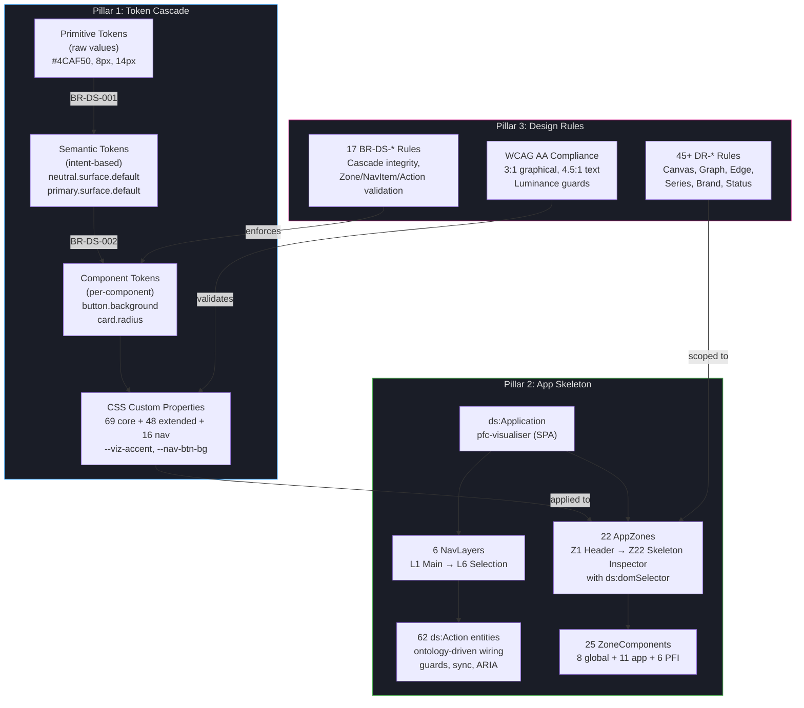
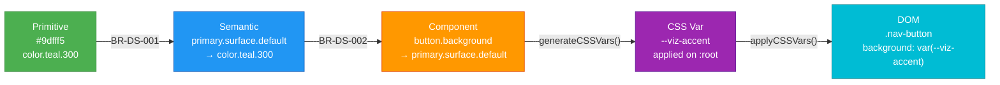
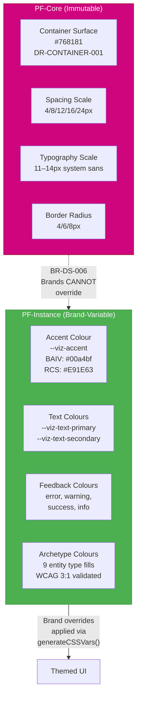
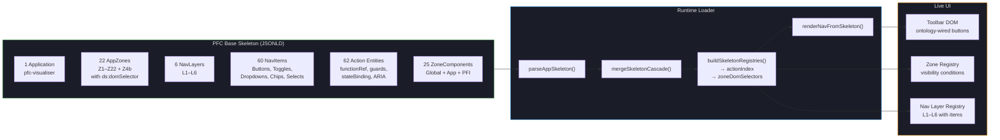
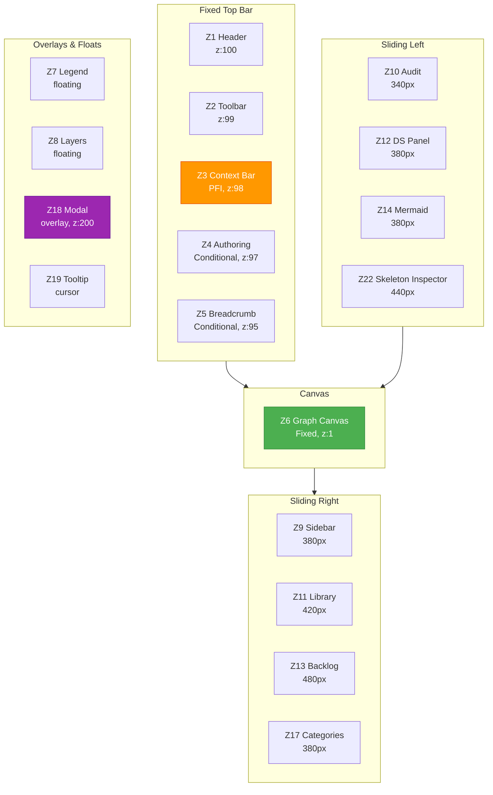
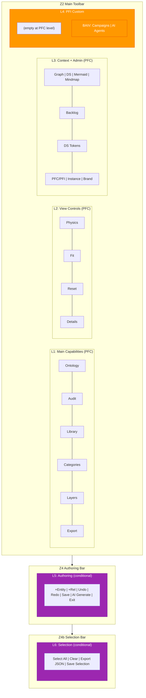
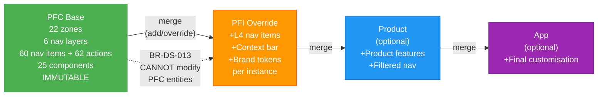
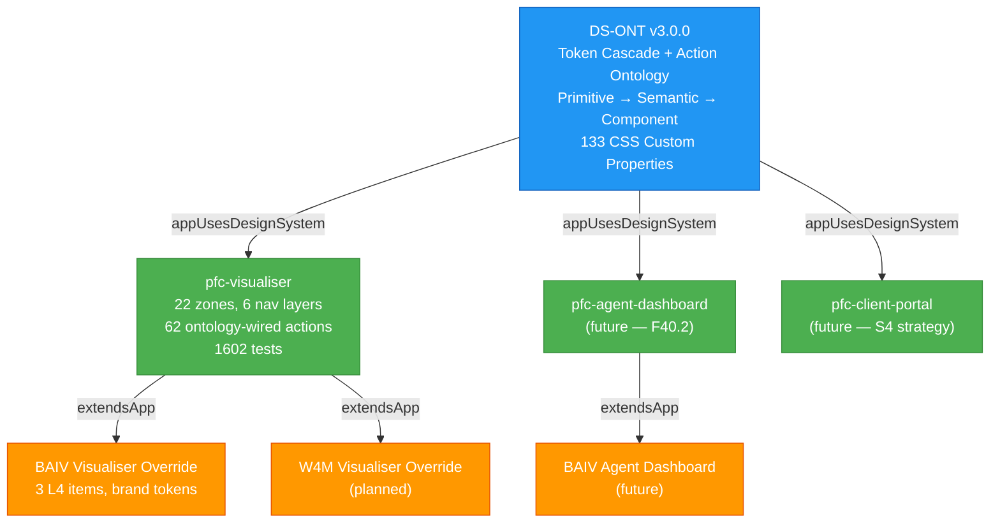
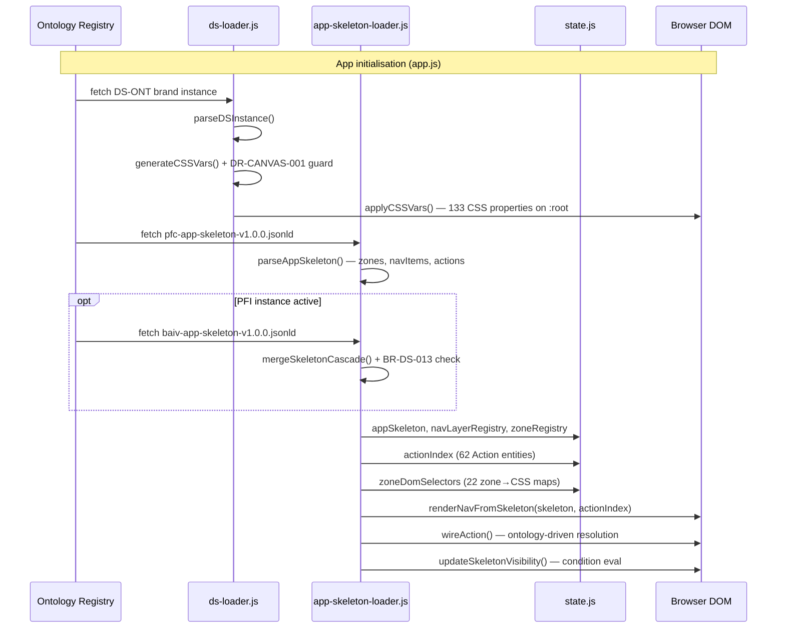

> **Read-only copy** distributed from [PF-Core source repo](https://github.com/ajrmooreuk/Azlan-EA-AAA). Do not edit directly — changes will be overwritten on next PFC release.

---

# PF-Core Unified Design System — Executive Overview

**Version:** 1.2.0
**Date:** 2026-02-24
**DS-ONT:** v3.0.0 | **EMC-ONT:** v4.0.0
**Epic:** 40 (Graphing Workbench Evolution) / F40.20
**Audience:** Full team — engineering, design, PFI instance owners, AI agents

---

## 1. What This Is

The PF-Core Unified Design System is a **graph-first, ontology-governed** design architecture that controls every visual surface of the platform — from raw colour values through to the application's zone layout and navigation structure. It is not a static style guide. It is a runtime system encoded as OAA-compliant ontology instance data (JSONLD) that the application reads via `fetch()` and uses to dynamically construct its UI.

Three pillars make up the system: the **Token Cascade** (how colours and styles flow from primitives to CSS), the **Application Skeleton** (how zones, navigation, and components are structured), and the **Design Rules** (normative constraints that govern rendering, accessibility, and brand safety). Each pillar is documented in detail in its own specification — this overview connects them for the full team.

---

## 2. The Three-Pillar Architecture

The design system operates across three interconnected layers, each governed by DS-ONT v3.0.0 and enforced at runtime.

The token cascade (blue) feeds computed CSS values into the skeleton's zones and components (green), while design rules (pink) constrain what brands can override and enforce WCAG compliance at every level. Nothing in the UI is arbitrary — every colour, every layout decision, every navigation item traces back to ontology data.

**Full details:** [DESIGN-SYSTEM-SPEC.md](./DESIGN-SYSTEM-SPEC.md) (Sections 2–4) | [DESIGN-TOKEN-MAP.md](./DESIGN-TOKEN-MAP.md) (Section 1)

---

## 3. Token Cascade — From Primitives to Pixels

Every colour and style value in the platform follows a strict three-tier cascade. Primitive tokens hold raw values (`#4CAF50`). Semantic tokens assign intent (`primary.surface.default`). CSS custom properties apply the resolved value to the DOM (`--viz-accent`). This chain is enforced by DS-ONT business rules — semantic tokens MUST reference a primitive (BR-DS-001), component tokens MUST reference a semantic (BR-DS-002).

The visualiser now has **133 CSS custom properties** — 69 core vars (surfaces, text, accents, archetypes, edges), 48 extended vars from v2.0.0 (status badges, priority badges, series indicators, authoring/selection toolbars, diff/revision, cross-references), and 16 nav component tokens from v3.0.0 (`--nav-btn-*`, `--nav-toggle-*`, `--nav-chip-*`, `--nav-dropdown-*`, `--nav-select-*`, `--nav-sep-*`). This achieves **100% tokenisation** — zero hardcoded colour values remain in the CSS.

**Full details:** [DESIGN-TOKEN-MAP.md](./DESIGN-TOKEN-MAP.md) (Sections 1–4) | [DESIGN-SYSTEM-SPEC.md](./DESIGN-SYSTEM-SPEC.md) (Sections 2.1–2.4, 3.1–3.7)

---

## 4. Mutability Model — What Brands Can and Cannot Touch

The design system divides every token into two tiers: **PF-Core** (structurally immutable — spacing, radius, typography scale, container surfaces) and **PF-Instance** (brand-variable — colours, font families, semantic values). This separation ensures that PFI brands can theme the application without breaking layout integrity or WCAG compliance.

When a PFI instance is selected, the DS loader resolves the correct brand through a three-tier cascade: `designSystemConfig.brand` → `designSystemConfig.fallback` → `brands[0]` (DR-PFI-001). Brand archetype and edge colour overrides are validated against the canvas at a 3:1 minimum contrast ratio before being applied (DR-SEMANTIC-005, DR-SEMANTIC-006).

**Full details:** [DESIGN-SYSTEM-SPEC.md](./DESIGN-SYSTEM-SPEC.md) (Sections 2.2, 7.2–7.3, 4.1–4.2) | [DESIGN-TOKEN-MAP.md](./DESIGN-TOKEN-MAP.md) (Section 1)

---

## 5. Application Skeleton — Data-Driven UI

The application skeleton replaces hardcoded HTML with structured JSONLD instance data. Instead of editing HTML to add a toolbar button, you add a `ds:NavItem` to the skeleton file and the runtime loader builds the DOM dynamically. This enables PFI instances to inject custom navigation (L4) and brand-specific components without touching the PFC codebase.

The skeleton is backward-compatible — if the JSONLD fails to load, the existing static HTML remains. The loader is non-blocking and wired into both the multi-ontology and single-ontology init flows in `app.js`. Since DS-ONT v3.0.0, every nav action is a first-class `ds:Action` ontology entity — adding a new toolbar button requires only JSONLD data and a `window` function export, zero registry edits.

**Full details:** [APP-SKELETON-GUIDE.md](./APP-SKELETON-GUIDE.md) (Sections 2–7) | [DESIGN-SYSTEM-SPEC.md](./DESIGN-SYSTEM-SPEC.md) (Section 18)

---

## 6. Zone Layout — 22 Spatial Regions

The workbench UI is divided into 22 named zones. Each zone has a defined type (Fixed, Floating, Sliding, Overlay, Conditional), a position, default visibility, and optional state-dependent visibility conditions. Zones are the bridge between the abstract token cascade and the concrete DOM — each zone consumes specific CSS custom properties and hosts specific components.

Three zones are always visible (Z1 Header, Z2 Toolbar, Z6 Canvas). The remainder are toggled by toolbar buttons, state conditions, or user actions. Orange zone Z3 (Context Identity Bar) only appears when a PFI instance is active — it's the visual signal that you've left PF-Core defaults. All 22 zones, their types, visibility rules, `ds:domSelector` CSS bindings, and component placements are encoded in `pfc-app-skeleton-v1.0.0.jsonld`.

**Full details:** [APP-SKELETON-GUIDE.md](./APP-SKELETON-GUIDE.md) (Section 4) | [DESIGN-TOKEN-MAP.md](./DESIGN-TOKEN-MAP.md) (Section 2)

---

## 7. Navigation Architecture — L1 to L4

Navigation is organised into six layers across Z2 (main toolbar), Z4 (authoring bar), and Z4b (selection bar). Layers L1–L3 are PF-Core — immutable across all instances. L4 is reserved for PFI-specific features. L5 (authoring) and L6 (selection) are conditional bars that appear in specific modes. When a PFI instance is activated, the skeleton cascade merges the instance's L4 items into the toolbar alongside the PFC base navigation.

Each nav item carries a `ds:executesAction` (reference to a `ds:Action` entity with `functionRef`, guard conditions, and sync flags), a `ds:itemType` (Button, Toggle, Dropdown, Select, Chip, Separator), an optional `ds:visibilityCondition` (evaluated against app state at runtime), a `ds:stateBinding` (for data-driven toggle/chip/disabled sync), and a `ds:renderOrder` (controls position within the layer). Action wiring is fully ontology-driven — the runtime resolves `ds:Action` entities via `state.actionIndex`, checks guard conditions before execution, and auto-syncs UI state when `triggersSyncAfter` is set. PFI items use visibility conditions to show only when their instance is active — multiple PFI overrides can coexist without collision.

**Full details:** [APP-SKELETON-GUIDE.md](./APP-SKELETON-GUIDE.md) (Sections 5.1–5.4) | [DESIGN-SYSTEM-SPEC.md](./DESIGN-SYSTEM-SPEC.md) (Section 18.6)

---

## 8. EMC 4-Tier Cascade — PFC to App

The skeleton follows the same EMC cascade pattern as all ontology data in the platform. PF-Core defines the immutable baseline. Each higher tier can add new items, override non-PFC items by matching `@id`, or hide items. PFC-tier entities are protected by **BR-DS-013 CascadeImmutability** — any attempt by a higher tier to modify a PFC entity is silently blocked.

This cascade enables the **multi-app model** — `ds:Application` is a class, not a singleton. Multiple applications (visualiser, agent dashboard, client portal) can branch from the same DS-ONT token system, each with its own skeleton. PFI instances extend whichever app they target via `ds:extendsApp`. No version bump is needed to add a new app — just create a new skeleton JSONLD.

**Full details:** [APP-SKELETON-GUIDE.md](./APP-SKELETON-GUIDE.md) (Sections 2.1–2.2, 8.3–8.4) | [DESIGN-SYSTEM-SPEC.md](./DESIGN-SYSTEM-SPEC.md) (Section 18.3)

---

## 9. Multi-App Branching

DS-ONT v3.0.0 is designed from the start to support multiple applications sharing the same token cascade. The visualiser is the first app — but agent dashboards, client portals, and SaaS products all consume the same design system with their own zone layouts and navigation trees.

Each app inherits the full token system — 117 CSS variables, WCAG validation, brand resolution, luminance guards — without duplicating any DS logic. The `appSkeletonConfig` on EMC-ONT `InstanceConfiguration` tells the loader which base skeleton and PFI overrides to fetch for any given instance.

**Full details:** [APP-SKELETON-GUIDE.md](./APP-SKELETON-GUIDE.md) (Sections 2.1, 8.4) | [DESIGN-SYSTEM-SPEC.md](./DESIGN-SYSTEM-SPEC.md) (Section 18.1)

---

## 10. Design Rules at a Glance

The system enforces **45+ normative design rules** (DR-*) and **17 business rules** (BR-DS-*) that govern every visual decision. Rules are not guidelines — they are enforced in code via `generateCSSVars()`, `applyCSSVars()`, `mergeSkeletonCascade()`, and the OAA validation gates.

| Category | Key Rules | Enforcement |
|----------|-----------|-------------|
| **Canvas** | DR-CANVAS-001 luminance guard | `generateCSSVars()` rejects mid-range surfaces |
| **Graph nodes** | DR-GRAPH-001/002/003 contrast | 3:1 minimum vs canvas, Material 700–900 on light |
| **Edges** | DR-EDGE-001–008 semantic encoding | 5 categories, width hierarchy, dash semantics |
| **Brand safety** | DR-SEMANTIC-005/006 override validation | 3:1 contrast check on archetype/edge overrides |
| **Skeleton** | BR-DS-013 cascade immutability | PFC entities locked from higher-tier modification |
| **WCAG** | AA across all surfaces | 4.5:1 text, 3:1 graphical, luminance-aware derivation |

**Full details:** [DESIGN-SYSTEM-SPEC.md](./DESIGN-SYSTEM-SPEC.md) (Sections 4–16, Rule Index)

---

## 11. Component Tree

Components connect zones to the token cascade. Three groups serve different cascade tiers:

| Group | Count | Cascade | Examples |
|-------|-------|---------|----------|
| **Global** | 8 | PFC | Header, Toolbar, Canvas, Legend, Modal, Tooltip, Drop Zone |
| **App (Visualiser)** | 11 | PFC | Sidebar, Audit, Library, DS Panel, Backlog, Mermaid, Mindmap, Category, Layer, Token Map, Skeleton Inspector |
| **PFI** | 6 | PFI | Context Bar, Context Drawer, Authoring, Selection, Lifecycle, Snapshots |

PFI components carry optional `tokenOverrides` — CSS variable mappings that inject brand-specific values (e.g. `--viz-accent: var(--viz-baiv-accent, #4CAF50)`) scoped to their zone placement.

**Full details:** [APP-SKELETON-GUIDE.md](./APP-SKELETON-GUIDE.md) (Section 6) | [DESIGN-TOKEN-MAP.md](./DESIGN-TOKEN-MAP.md) (Section 3)

---

## 12. Runtime Data Flow

Two parallel loading paths execute during app init: the DS token loader applies CSS custom properties to `:root`, while the skeleton loader builds the navigation DOM and zone registries. Both are non-blocking — failures fall back to static defaults. Since v3.0.0, action wiring is fully ontology-driven — `wireAction()` resolves `ds:Action` entities from `state.actionIndex`, evaluates guard conditions, and auto-syncs UI state via `ds:stateBinding` data attributes.

**Full details:** [APP-SKELETON-GUIDE.md](./APP-SKELETON-GUIDE.md) (Section 2.3, 7) | [DESIGN-SYSTEM-SPEC.md](./DESIGN-SYSTEM-SPEC.md) (Section 2.3)

---

## 13. Key Numbers

| Metric | Value |
|--------|-------|
| CSS custom properties | **133** (69 core + 48 extended + 16 nav component) |
| Tokenisation coverage | **100%** (zero hardcoded colours) |
| App zones | **22** (Z1–Z20 + Z4b + Z22, each with `ds:domSelector`) |
| Nav layers | **6** (L1–L3 split, L4 PFI, L5 authoring, L6 selection) |
| Nav items | **60** (PFC base, + 13 export sub-items = 73 clickable) |
| Action entities | **62** (ontology-driven, zero manual registry) |
| Zone components | **25** (8 global + 11 app + 6 PFI) |
| Design rules (DR-*) | **45+** normative |
| Business rules (BR-DS-*) | **17** (15 original + BR-DS-016/017 for actions) |
| DS-ONT entities | **20** (14 original + 5 skeleton + Action) |
| DS-ONT relationships | **28** (15 original + 10 skeleton + 3 action/zone) |
| Vitest suite | **1602/1602** pass |
| Build step required | **None** (pure ES modules) |

---

## 14. Sub-Document Reference

| Document | Scope | Key Sections |
|----------|-------|-------------|
| [DESIGN-SYSTEM-SPEC.md](./DESIGN-SYSTEM-SPEC.md) | Complete DS specification — all DR-* rules, token tables, theme guidance, brand integration, WCAG targets | Sections 2–18, Rule Index (Section 16) |
| [DESIGN-TOKEN-MAP.md](./DESIGN-TOKEN-MAP.md) | Every CSS custom property mapped to its UI zone, DS-ONT token source, and live panel reference | Sections 1–4, Zone Map (Section 2), Token Tables (Section 3) |
| [APP-SKELETON-GUIDE.md](./APP-SKELETON-GUIDE.md) | Skeleton architecture, zone layout, navigation management, PFI override creation, migration guide | Sections 2–10, How-Tos (Section 8), Troubleshooting (Section 11) |
| [ARCHITECTURE.md](../TOOLS/ontology-visualiser/ARCHITECTURE.md) | Full visualiser architecture — 27 ES modules, graph rendering, DS integration | DS integration section |
| [OPERATING-GUIDE.md](../TOOLS/ontology-visualiser/OPERATING-GUIDE.md) | User workflows — brand switching (Workflow 18), PFI selection, DS panel usage | Workflow 18 |

---

## 15. Cross-Reference Map

| If you need to... | Start here |
|-------------------|-----------|
| Add a new CSS token | [DESIGN-TOKEN-MAP.md](./DESIGN-TOKEN-MAP.md) Section 3 → add to viewer.css `:root`, update generateCSSVars() |
| Add a new toolbar button | [APP-SKELETON-GUIDE.md](./APP-SKELETON-GUIDE.md) Section 8.2 → add NavItem to skeleton JSONLD |
| Add a new UI zone | [APP-SKELETON-GUIDE.md](./APP-SKELETON-GUIDE.md) Section 8.1 → add AppZone + ZoneComponent |
| Create a PFI override | [APP-SKELETON-GUIDE.md](./APP-SKELETON-GUIDE.md) Section 8.3 → create override JSONLD + EMC config |
| Create a new app | [APP-SKELETON-GUIDE.md](./APP-SKELETON-GUIDE.md) Section 8.4 → new skeleton JSONLD with own zones/nav |
| Add a new brand | [DESIGN-SYSTEM-SPEC.md](./DESIGN-SYSTEM-SPEC.md) Section 8.1 → create DS instance JSONLD, validate luminance |
| Check WCAG compliance | [DESIGN-SYSTEM-SPEC.md](./DESIGN-SYSTEM-SPEC.md) Section 14 → contrast ratios, luminance guards |
| Understand a DR-* rule | [DESIGN-SYSTEM-SPEC.md](./DESIGN-SYSTEM-SPEC.md) Section 16 → Rule Index with all 45+ rules |
| Understand zone layout | [DESIGN-TOKEN-MAP.md](./DESIGN-TOKEN-MAP.md) Section 2 (ASCII map) or [APP-SKELETON-GUIDE.md](./APP-SKELETON-GUIDE.md) Section 4 (Mermaid) |
| Debug brand not applying | [DESIGN-SYSTEM-SPEC.md](./DESIGN-SYSTEM-SPEC.md) Section 13 → Troubleshooting table |
| Reorder nav items or components | [APP-SKELETON-GUIDE.md](./APP-SKELETON-GUIDE.md) Section 8.7 → Skeleton Editor, or Section 8.5 Option B |
| Debug skeleton not loading | [APP-SKELETON-GUIDE.md](./APP-SKELETON-GUIDE.md) Section 11 → Troubleshooting table |

---

<!-- PF-Core Unified Design System Executive Overview v1.2.0 — DS-ONT v3.0.0 -->
