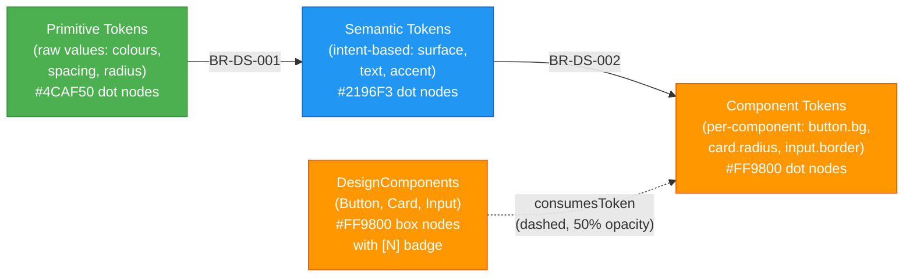
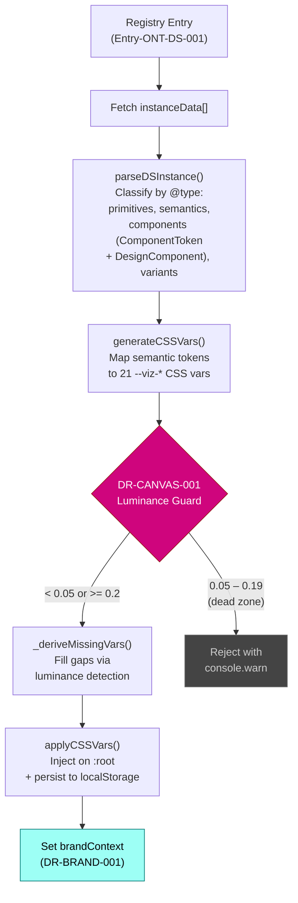
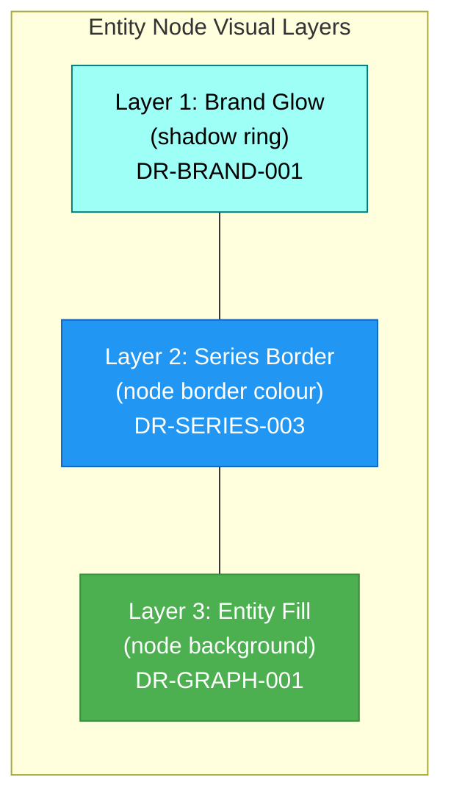
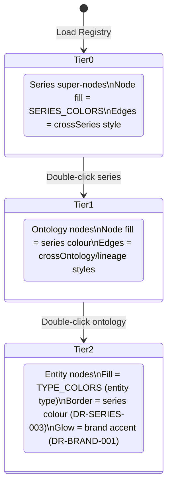
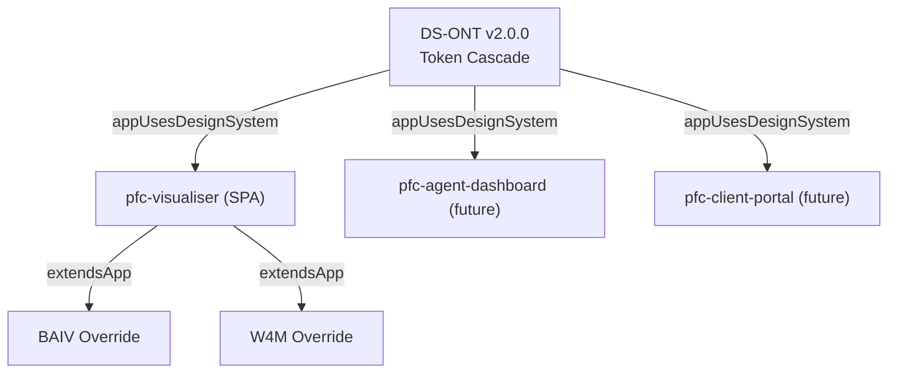
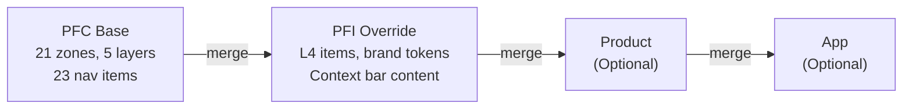

> **Read-only copy** distributed from [PF-Core source repo](https://github.com/ajrmooreuk/Azlan-EA-AAA). Do not edit directly — changes will be overwritten on next PFC release.

---

# OAA Design System Specification

**Version:** 2.3.0
**Date:** 2026-02-21
**Epic:** 7 (DS Authoring) / 8 (Design-Director) / 40 (Graphing Workbench Evolution)
**Audience:** Design Directors, brand owners, engineering, PFI instance owners, and AI agents contributing to the visualiser

---

## 1. Purpose

This specification is the single authoritative reference for the OAA Ontology Visualiser's design system. It combines:

- **Design rules** — normative DR-* rules governing colour, graph rendering, theme modes, and accessibility
- **Design Director guidance** — how DS-ONT tokens are consumed, enforced, and rendered
- **Brand integration** — how PF-Instance brands supply tokens and what they can/cannot override
- **DS-ONT design rule entities** — planned ontology extension for codifying design rules within DS-ONT instances

This document supersedes the previously separate `DESIGN-RULES.md` and `DESIGN-DIRECTOR-DS-GUIDE.md`.

---

## 2. Design System Architecture

### 2.1 Token Taxonomy (Three-Tier Cascade)

The design system uses a three-tier token cascade defined by DS-ONT:



**Business rules enforce the cascade:**

| Rule | Enforcement |
| ---- | ----------- |
| BR-DS-001 | Semantic tokens MUST reference a primitive |
| BR-DS-002 | Component tokens MUST reference a semantic token |
| BR-DS-003 | Overridable components MUST have at least one token binding (enforced by `validateComponentBindings()`) |
| BR-DS-004 | Theme-mode enabled systems MUST have light and dark values |
| BR-DS-005 | Figma sync older than 7 days triggers a warning |
| BR-DS-006 | Brand overrides MUST target PF-Instance tokens only |

### 2.2 Mutability Model (PF-Core vs PF-Instance)

Every token carries a `mutabilityTier` classification:

| Tier | Scope | What It Governs | Brand Can Override? |
| ---- | ----- | --------------- | ------------------- |
| **PF-Core** | Structurally immutable | Spacing, radius, typography scale, component dimensions, **structural colour tokens** (e.g. container surfaces) | No |
| **PF-Instance** | Brand-variable | Colours, font families, semantic colour values | Yes |

**Key rule (BR-DS-006):** If a `BrandVariant.tokenOverrides` contains a token, that token's `mutabilityTier` MUST equal `PF-Instance`. PF-Core tokens are structurally immutable across all brands to preserve layout integrity.

> **v1.4.0 Mutability Extension:** The Design Director may now classify **semantic colour tokens** as PF-Core when they serve a structural purpose. The first instance is `container.surface.default` — the background colour for graph node group boundaries. This establishes the precedent that not all semantic colours are PF-Instance; structural decisions by the Design Director override brand autonomy. See DR-CONTAINER-001.
>
> **Follow-up when revisiting DS-ONT design:** The mutability model should be reviewed for additional structural colour candidates (e.g. container borders, region separators, canvas grid lines). Each PF-Core colour promotion requires a corresponding DR-* rule and Design Director sign-off.
>
> **F8.4 — `configuredByInstance` Bridge Now Implemented:** The DS-ONT `ds:configuredByInstance` relationship (ds:DesignSystem → emc:InstanceConfiguration) is now operationalised at the application layer via `resolveDSBrandForPFI()` in `ds-loader.js`. EMC-ONT v3.0.0 adds `designSystemConfig` to InstanceConfiguration with `brand`, `fallback`, and `configVersion` fields. The DS-ONT business rule `ds:rule-instance-must-specify-brand` (severity: warning) is satisfied — null brand with a fallback is a valid softer contract for placeholder instances (e.g. PFI-W4M). DR-PFI-001 codifies the three-tier resolution cascade. The Design Director should review whether additional PFI-scoped design rules are needed as more instances are onboarded (e.g. minimum token count, required semantic categories, brand-specific WCAG overrides).

### 2.3 Token-to-CSS Mapping Pipeline

When a DS brand is loaded via the registry, the following pipeline executes:



### 2.4 Theme Mode Architecture

The visualiser uses a CSS custom property system with 21 `--viz-*` variables in `:root`. DS-ONT semantic tokens map to these properties via `generateCSSVars()`. Missing values are auto-derived using luminance detection (`_deriveMissingVars()`).

**Luminance detection:** Relative luminance of `--viz-surface-default` determines mode:
- **Dark mode:** luminance < 0.2 (default: `#0f1117` = 0.013)
- **Light mode:** luminance >= 0.2

---

## 3. CSS Custom Properties Reference

The visualiser defines 21 `--viz-*` CSS custom properties plus 14 `--viz-archetype-*` and `--viz-edge-*` semantic coherence properties in `:root`. These are the tokens that brands can influence:

### 3.1 Surface Properties

| Property | Dark Default | Light Target | DS Token Source | Mutability |
| -------- | ------------ | ------------ | --------------- | ---------- |
| `--viz-surface-default` | `#9BA7A8` | `#9BA7A8` | `neutral.surface.default` | **PF-Core** (DR-CANVAS-001) |
| `--viz-surface-elevated` | `#1a1d27` | Derived | Auto-derived from surface-default | Derived |
| `--viz-surface-card` | `#22252f` | Derived | Auto-derived from surface-default | Derived |
| `--viz-surface-subtle` | `#2a2d37` | Derived | `neutral.surface.subtle` | PF-Instance |
| `--viz-container-surface` | `#768181` | `#768181` | `container.surface.default` | **PF-Core** (DR-CONTAINER-001) |

### 3.2 Text Properties

| Property | Dark Default | DS Token Source | Mutability |
| -------- | ------------ | --------------- | ---------- |
| `--viz-text-primary` | `#e0e0e0` | `neutral.text.title` | PF-Instance |
| `--viz-text-secondary` | `#888` | `neutral.text.body` | PF-Instance |
| `--viz-text-muted` | `#666` | `neutral.text.caption` | PF-Instance |

### 3.3 Accent Properties

| Property | Dark Default | DS Token Source | Mutability |
| -------- | ------------ | --------------- | ---------- |
| `--viz-accent` | `#9dfff5` | `primary.surface.default` | PF-Instance |
| `--viz-accent-active` | `#017c75` | `primary.surface.darker` / derived | PF-Instance |
| `--viz-accent-subtle` | `rgba(157,255,245,0.05)` | Derived (accent at 8% opacity) | Derived |
| `--viz-accent-border` | `#017c75` | `primary.border.default` / derived | PF-Instance |

### 3.4 Border Properties

| Property | Dark Default | DS Token Source | Mutability |
| -------- | ------------ | --------------- | ---------- |
| `--viz-border-default` | `#2a2d37` | `neutral.border.default` | PF-Instance |
| `--viz-border-subtle` | `#3a3d47` | Derived (lighter/darker than border) | Derived |

### 3.5 Feedback Properties

| Property | Dark Default | DS Token Source | Mutability |
| -------- | ------------ | --------------- | ---------- |
| `--viz-error` | `#cf057d` | `error.surface.default` | PF-Instance |
| `--viz-warning` | `#FF9800` | `warning.surface.default` | PF-Instance |
| `--viz-success` | `#4CAF50` | `success.surface.default` | PF-Instance |
| `--viz-info` | `#2196F3` | `information.surface.default` | PF-Instance |

### 3.6 Archetype Properties (Semantic Coherence — F8.6)

| Property | Dark Default | DS Token Source | Mutability |
| -------- | ------------ | --------------- | ---------- |
| `--viz-archetype-class` | `#4CAF50` | `archetype.class.surface` | PF-Instance (DR-SEMANTIC-005) |
| `--viz-archetype-core` | `#4CAF50` | `archetype.core.surface` | PF-Instance (DR-SEMANTIC-005) |
| `--viz-archetype-framework` | `#2196F3` | `archetype.framework.surface` | PF-Instance (DR-SEMANTIC-005) |
| `--viz-archetype-supporting` | `#FF9800` | `archetype.supporting.surface` | PF-Instance (DR-SEMANTIC-005) |
| `--viz-archetype-agent` | `#E91E63` | `archetype.agent.surface` | PF-Instance (DR-SEMANTIC-005) |
| `--viz-archetype-external` | `#9E9E9E` | `archetype.external.surface` | PF-Instance (DR-SEMANTIC-005) |
| `--viz-archetype-layer` | `#00BCD4` | `archetype.layer.surface` | PF-Instance (DR-SEMANTIC-005) |
| `--viz-archetype-concept` | `#AB47BC` | `archetype.concept.surface` | PF-Instance (DR-SEMANTIC-005) |
| `--viz-archetype-default` | `#017c75` | `archetype.default.surface` | PF-Instance (DR-SEMANTIC-005) |

### 3.7 Edge Semantic Properties (Semantic Coherence — F8.6)

| Property | Dark Default | DS Token Source | Mutability |
| -------- | ------------ | --------------- | ---------- |
| `--viz-edge-structural` | `#7E57C2` | `edge.structural.color` | PF-Instance (DR-SEMANTIC-006) |
| `--viz-edge-taxonomy` | `#888` | `edge.taxonomy.color` | PF-Instance (DR-SEMANTIC-006) |
| `--viz-edge-dependency` | `#EF5350` | `edge.dependency.color` | PF-Instance (DR-SEMANTIC-006) |
| `--viz-edge-informational` | `#42A5F5` | `edge.informational.color` | PF-Instance (DR-SEMANTIC-006) |
| `--viz-edge-operational` | `#66BB6A` | `edge.operational.color` | PF-Instance (DR-SEMANTIC-006) |

---

## 4. Design Rules (Normative)

All DR-* rules are normative. Implementations MUST comply.

### 4.1 Canvas Background Immutability (DR-CANVAS-001)

The canvas background is the foundation of the entire WCAG contrast system. Every node, edge, and text colour ratio is calculated against it.

**Rule:** `--viz-surface-default` MUST have WCAG relative luminance < 0.05 (dark-safe) or >= 0.2 (light-safe).

| Luminance Range | Classification | Accepted | Rationale |
| --------------- | -------------- | -------- | --------- |
| < 0.05 | Dark-safe | Yes | All dark-theme WCAG ratios hold (validated against `#0f1117`, lum 0.013) |
| 0.05 – 0.19 | Dead zone | **No** | Insufficient contrast for bright node fills; too dark for darkened alternatives |
| >= 0.2 | Light-safe | Yes | Light-theme Material 700-900 alternatives provide sufficient contrast |

**Enforcement:** `generateCSSVars()` in `ds-loader.js` computes WCAG 2.1 relative luminance (IEC 61966-2-1 sRGB linearisation). Values outside the safe ranges are silently rejected with a `console.warn`.

**For brand owners:** When providing a `neutral.surface.default` value, ensure it falls within the safe ranges. Mid-range values (e.g. `#1a3a2f`, `#2d2d3f`) will be silently rejected.

### 4.2 Graph Canvas Tint (DR-CONTAINER-001, revised F8.15)

The graph canvas tint is a structural decision made by the Design Director. It defines the background colour of the `#graph-container` element and must remain consistent across all brands to preserve graph readability and series-colour contrast.

**Rule DR-CONTAINER-001 (revised):** `container.surface.default` MUST have `mutabilityTier = PF-Core`. Brands MUST NOT override this token. The token is applied as `#graph-container { background: var(--viz-container-surface) }` — a flat canvas tint, not as boundary box rectangles.

| Property | Value |
| -------- | ----- |
| Rule ID | DR-CONTAINER-001 |
| Category | Container |
| Scope | GlobalSystem |
| Severity | error |
| Priority | 1 |
| Mutability | PF-Core |
| CSS Variable | `--viz-container-surface` |
| Token Name | `container.surface.default` |
| Current Value | `#768181` (Design Director accepted, iteration 3) |

**This is a PF-Core semantic colour token.** It establishes the precedent that the Design Director can classify semantic colours as structural — all semantic colour tokens default to PF-Instance (brand-variable), but the Design Director may promote structural tokens to PF-Core.

**Enforcement:** `generateCSSVars()` in `ds-loader.js` maps `container.surface.default` to `--viz-container-surface`. BR-DS-006 prevents brand override of PF-Core tokens.

**UI chrome surface:** `--viz-surface-default` is set to `#9BA7A8` for all UI chrome (header, nav, panels, breadcrumb). The graph canvas (`#768181`) is slightly darker, providing visual depth separation between the graph workspace and surrounding UI.

**History (F8.15):** Container boundary box rectangles (DR-CONTAINER-002 through DR-CONTAINER-006) were removed in F8.15. The `beforeDrawing` handler, `_parseContainerHex`, `_roundedRect`, `_computeBoundingBox`, `_buildTier1ContainerGroups`, `_buildSubSeriesContainerGroups`, and `_attachContainerSurfaceHandler` functions were deleted from `graph-renderer.js`. The token is now used exclusively as a flat canvas background.

### 4.3 Node Colour Rules

| Entity Type | Hex | WCAG on Dark (`#0f1117`) | WCAG on Light (`#f5f5f5`) | Rule |
|-------------|-----|--------------------------|---------------------------|------|
| Core / Class | `#4CAF50` | 4.8:1 PASS (AA) | 2.3:1 FAIL | Darken to `#2E7D32` on light |
| Framework | `#2196F3` | 4.6:1 PASS (AA) | 2.5:1 FAIL | Darken to `#1565C0` on light |
| Supporting | `#FF9800` | 6.4:1 PASS (AAA) | 2.6:1 FAIL | Darken to `#E65100` on light |
| Agent | `#E91E63` | 4.2:1 PASS (AA) | 3.1:1 FAIL | Darken to `#AD1457` on light |
| External | `#9E9E9E` | 5.5:1 PASS (AAA) | 2.2:1 FAIL | Darken to `#616161` on light |
| Layer | `#00BCD4` | 5.8:1 PASS (AAA) | 2.4:1 FAIL | Darken to `#00838F` on light |
| Concept | `#AB47BC` | 3.9:1 PASS (AA) | 3.5:1 PASS (AA) | Material Purple 300 — WCAG-compliant on both themes |
| Default | `#017c75` | 3.8:1 PARTIAL | 4.1:1 PASS (AA) | Lighten to `#4DB6AC` on dark |

**Rule DR-GRAPH-001:** On dark backgrounds (luminance < 0.2), node fill colours MUST have contrast ratio >= 3:1 against the canvas. Bright, saturated mid-tones work best (Material 500 range).

**Rule DR-GRAPH-002:** On light backgrounds (luminance >= 0.2), node fill colours MUST be darkened to the 700-900 Material range or use outline-only style with coloured borders.

**Rule DR-GRAPH-003:** Node font colour MUST be `--viz-text-primary` (`#e0e0e0` dark / `#212121` light), never the node fill colour.

### 4.4 Edge Colour & Semantic Rules

| Edge Type | Hex | Width | Dark Visibility | Light Visibility | Rule |
|-----------|-----|-------|-----------------|------------------|------|
| Relationship | `#4CAF50` | 1px | Good | Poor | Use `#2E7D32` on light |
| Binding | `#FF9800` | 1px | Good | Poor | Use `#E65100` on light |
| Value Chain | `#2196F3` | 1px | Good | Poor | Use `#1565C0` on light |
| Inheritance | `#888` | 1px dashed | Moderate | Good | Keep as-is |
| Default | `#555` | 1px | Poor | Good | Lighten to `#999` on dark |
| Cross-ontology | `#eab839` | 2px | Good | Poor | Use `#B8860B` on light |
| Highlight | `#9dfff5` | 2px | Excellent | FAIL | Use `#017c75` on light |

**Rule DR-EDGE-001:** Edge colours on dark theme MUST have luminance > 0.15 (avoid dark greys). Minimum 1px stroke width.

**Rule DR-EDGE-002:** Edge colours on light theme MUST have luminance < 0.5 (avoid bright pastels). Prefer 700-900 Material range.

**Rule DR-EDGE-003:** The highlight colour (`--viz-accent`) MUST swap: bright cyan `#9dfff5` on dark, deep teal `#017c75` on light.

**Rule DR-EDGE-004:** Cross-ontology bridge edges MUST remain visually distinct from intra-ontology edges. Use 2px width + dashed pattern on bridges.

**Rule DR-EDGE-005 (Width Hierarchy):** Edge width encodes semantic importance via a priority 0–5 scale. Priority 1 (1–1.5px) for taxonomy edges (inheritance, subClassOf, default). Priority 2 (1.5px) for intra-ontology relationships. Priority 3 (2–2.5px) for bindings, value chains, and partial-series matches. Priority 4 (2–2.5px) for cross-ontology and cross-series edges. Priority 5 (3.5–4px) for lineage chain edges (VE, PE, convergence). Multi-mode internal edges scale to 80% width to reduce visual clutter.

**Rule DR-EDGE-006 (Dash Semantics):** Dash patterns encode boundary semantics. Solid = intra-ontology same-level edges. `[5,5]` short-dash = taxonomy/inheritance edges. `[6,3]` medium-dash = partial series highlight. `[8,4]` long-dash = cross-boundary edges (cross-ontology, cross-series, dimmed non-matching). Rendering functions MUST NOT invent ad-hoc dash patterns — use `EDGE_STYLES` constants exclusively.

**Rule DR-EDGE-007 (Arrow Semantics):** All edges use directional `to` arrows. Connection map edges use scaled arrows (`scaleFactor: 0.5`) to avoid visual dominance on weighted edges. Lineage chain arrows retain default scale for directionality emphasis.

**Rule DR-EDGE-008 (Label Readability):** Edge label font colour MUST be `--viz-text-secondary` (`#888`) for standard edges or the edge's own colour for lineage/cross-ontology edges. All labels MUST have a semi-transparent background box (`rgba(15,17,23,0.85)`) instead of text stroke, ensuring readability over crossing edges without halo artifacts. `strokeWidth` MUST be `0`. Font size ranges: 9px for lineage and cross-ontology labels, 10px for standard intra-ontology labels, 11px for tier-0 cross-series labels.

### 4.5 Series & Brand Rules

**Rule DR-SERIES-001:** Series colours are optimised for dark theme. Light theme MUST use the 700-900 Material alternative column.

**Rule DR-SERIES-002:** The convergence colour (VE+PE overlap) MUST remain distinct from both VE gold and PE copper — use orange-red in both modes.

**Rule DR-SERIES-003 (Series Border Persistence):** When drilling from Tier 1 to Tier 2, entity node borders MUST use the parent series colour for visual continuity. Silo nodes and component-coloured nodes take priority over series border. Highlight border remains `#017c75`.

**Rule DR-SERIES-004 (Series Provenance Legend):** Tier 2 graph legend MUST include a series provenance indicator when the graph was reached via series drill-through.

**Rule DR-BRAND-001 (Brand Key Node Outline):** When a DS brand is active (`state.brandContext` is set), all Tier 2 graph nodes MUST show a shadow glow in the brand's accent colour. Three-layer visual hierarchy: glow (brand) → border (series) → fill (entity type).

### 4.6 DS Token Cascade Rules

| Token Tier | Background | Border | Node Shape | Rule |
|------------|------------|--------|------------|------|
| Primitive | `#4CAF50` | `#388E3C` | Box | Green = base layer, raw values |
| Semantic | `#2196F3` | `#1565C0` | Rounded box | Blue = intent mapping |
| Component (token) | `#FF9800` | `#E65100` | Diamond | Orange = consumption layer |
| DesignComponent | `#FF9800` | `#E65100` | Box | Orange = component entity with `[N]` badge |
| Category | `#9C27B0` | `#6A1B9A` | Ellipse | Purple = grouping |
| System | `#00BCD4` | `#00838F` | Hexagon | Cyan = system-level |

**Rule DR-DS-001:** Token cascade nodes use the same colour scheme as entity types (Primitive=Core green, Semantic=Framework blue, Component=Supporting orange) to maintain visual consistency across the app.

**Rule DR-DS-002:** Token cascade edges MUST use directional arrows (Primitive → Semantic → Component) with 50% opacity of the target tier colour.

**Rule DR-DS-003:** DesignComponent nodes MUST render as box shapes (distinct from token dot nodes) and display a `[N]` badge suffix showing the number of ComponentToken bindings. Components with zero bindings show no badge.

**Rule DR-DS-004:** consumesToken edges (DesignComponent → ComponentToken) MUST use dashed stroke `[4,2]`, 50% opacity of `#FF9800`, and width 1.5px. These edges are visually subordinate to the primary cascade edges.

### 4.7 Context Node Rules

Context nodes (faded series super-nodes, sub-series parent nodes, and diff removed ghost nodes) provide navigational and comparative context without competing with primary content.

**Rule DR-CONTEXT-001 (Opacity):** Context/ghost node opacity MUST be `0.55`. This provides clear visual subordination while remaining legible on the dark canvas (`#0f1117`). The previous value of `0.3` was too faint for usability.

**Rule DR-CONTEXT-002 (Size):** Context node size MUST be 60–70% of primary node size. Series context nodes use `size: 25` (vs primary `size: 30–35`). Composition ghost nodes use `nodeSize * 0.7`.

**Rule DR-CONTEXT-003 (Border):** Context node border MUST be `1px` with colour `#333` or `#555`, distinguishing them from primary nodes which use `2–3px` borders. Composition ghost nodes use dashed borders `[6,3]`.

| Property | Context Node | Primary Node | Ratio |
| -------- | ------------ | ------------ | ----- |
| Opacity | 0.55 | 1.0 | 55% |
| Size | 20–25 | 30–35 | 60–70% |
| Border width | 1px | 2–3px | 33–50% |
| Font colour | `#666` | `#e0e0e0` | Dimmed |
| Font size | 11–12px | 13–14px | ~85% |

### 4.8 Node Label Rules

**Rule DR-NODE-LABEL-001 (Abbreviated Code):** Tier 0 series nodes, Tier 1 ontology nodes, and Tier 1 sub-series grouping nodes MUST display an abbreviated code on the first line of a multi-line label for rapid identification.

| Node Type | Code Source | Example Label |
| --------- | ----------- | ------------- |
| Tier 0 series | Series key minus `-Series` suffix | `VE` / `VE-Series` / `11 ontologies` |
| Tier 1 ontology | Namespace prefix | `bsc:` / `BSC` |
| Tier 1 sub-series | Last segment of sub-series key | `SA` / `VSOM-SA` / `5 ontologies` |
| Tier 1 sub-series ontology | Namespace prefix | `ind:` / `INDUSTRY` |

### 4.9 Typography & Status Rules

| Element | Font | Size | Weight | Colour |
|---------|------|------|--------|--------|
| Graph node label | System sans-serif | 12px | Normal | `--viz-text-primary` |
| Graph edge label | System sans-serif | 10px | Normal | `--viz-text-secondary` |
| Panel headings | System sans-serif | 14px | 600 | `--viz-text-primary` |
| Panel body text | System sans-serif | 13px | Normal | `--viz-text-primary` |
| Monospace (IDs, code) | System monospace | 12px | Normal | `--viz-accent` |
| Badge text | System sans-serif | 11px | 600 | Per status rule |

**Rule DR-FONT-001:** Graph node labels MUST be `--viz-text-primary`, never the node fill colour, to guarantee readability.

**Rule DR-FONT-002:** Edge labels MUST be `--viz-text-secondary` with a semi-transparent background matching `--viz-surface-default` at 80% opacity.

| Status | Dark Mode | Light Mode | Text Colour |
|--------|-----------|------------|-------------|
| Pass/Success | `#86efac` bg, `#166534` text | `#dcfce7` bg, `#166534` text | Always dark |
| Fail/Error | `#fca5a5` bg, `#991b1b` text | `#fee2e2` bg, `#991b1b` text | Always dark |
| Warning | `#ffb48e` bg, `#7c2d12` text | `#ffedd5` bg, `#7c2d12` text | Always dark |
| Info | `#93c5fd` bg, `#1e3a5f` text | `#dbeafe` bg, `#1e3a5f` text | Always dark |

**Rule DR-STATUS-001:** Status badge text colour MUST be dark (700-900 range) regardless of theme mode. Background shifts to pastel on light, vivid on dark.

### 4.10 Semantic Coherence Rules (F8.6)

Semantic coherence formalises the visual encoding system so that every colour, shape, edge style, and legend element maps to a documented archetype or relationship category. Brand overrides are validated against WCAG contrast requirements.

**Rule DR-SEMANTIC-001 (Archetype Colour via CSS Vars):** Node fill colours MUST be read from `--viz-archetype-{type}` CSS custom properties, falling back to `TYPE_COLORS` when no CSS var is set. A `refreshArchetypeCache()` call at the start of each render cycle caches all CSS var values to avoid per-node `getComputedStyle()` overhead.

| Archetype | CSS Variable | Default | Shape | Size |
| --------- | ------------ | ------- | ----- | ---- |
| Core | `--viz-archetype-core` | `#4CAF50` | Hexagon | 30 |
| Class | `--viz-archetype-class` | `#4CAF50` | Dot | 20 |
| Framework | `--viz-archetype-framework` | `#2196F3` | Box | 22 |
| Supporting | `--viz-archetype-supporting` | `#FF9800` | Triangle | 18 |
| Agent | `--viz-archetype-agent` | `#E91E63` | Star | 25 |
| External | `--viz-archetype-external` | `#9E9E9E` | Diamond | 16 |
| Layer | `--viz-archetype-layer` | `#00BCD4` | Square | 22 |
| Concept | `--viz-archetype-concept` | `#AB47BC` | Ellipse | 18 |
| Default | `--viz-archetype-default` | `#017c75` | Dot | 20 |

**Rule DR-SEMANTIC-002 (Edge Label Semantic Categories):** Edge styling MUST resolve from the edge's relationship label via `EDGE_LABEL_CATEGORIES` before falling back to `EDGE_STYLES[edgeType]`. Five semantic categories encode relationship intent:

| Category | Colour | Width | Dash | Example Labels |
| -------- | ------ | ----- | ---- | -------------- |
| Structural | `#7E57C2` (purple) | 2.5px | Solid | `contains`, `composedOf`, `hasScope`, `belongsToCategory` |
| Taxonomy | `#888` (grey) | 1.5px | `[5,5]` | `subClassOf`, `extends` |
| Dependency | `#EF5350` (red) | 2px | Solid | `dependsOn`, `requires` |
| Informational | `#42A5F5` (blue) | 1.5px | `[3,3,8,3]` dot-dash | `informs`, `defines`, `measuredBy`, `setBy` |
| Operational | `#66BB6A` (green) | 1.5px | Solid | `produces`, `supports`, `enables`, `realizes` |

Unmapped labels fall through to the existing `EDGE_STYLES` type-based resolution — zero regression for existing edges.

**Rule DR-SEMANTIC-003 (Archetype Shape Encoding):** Each entity archetype MUST map to a distinct vis-network shape via `ARCHETYPE_SHAPES`. Auto-sizing shapes (`box`, `hexagon`, `ellipse`, `square`) use `widthConstraint: { minimum: 60, maximum: 120 }` and skip the `size` property. Point shapes (`dot`, `star`, `triangle`, `diamond`) use `ARCHETYPE_SIZES` for pixel size.

**Rule DR-SEMANTIC-004 (Interactive Legend):** The graph legend MUST be interactive with three behaviours:

1. **Hover** — dims non-matching nodes/edges to 15% opacity (100ms debounce). Clearing hover restores opacity.
2. **Click** — toggles a persistent filter that dims non-matching items. Active filter items show `.active` CSS class; dimmed items show `.dimmed` class.
3. **Reset** — a "Reset" button clears all active filters and restores all opacities.

The legend MUST include:

- **Node section:** One row per archetype with CSS-rendered shape indicator, colour swatch, label, and count
- **Edge section:** One row per semantic category with line-style sample, colour, label, and count

**Rule DR-SEMANTIC-005 (Brand Archetype Override Validation):** When DS-ONT brand tokens include `archetype.{type}.surface` values, `generateCSSVars()` maps them to `--viz-archetype-{type}` CSS variables. `applyCSSVars()` MUST validate each brand archetype colour against the canvas background (`--viz-surface-default`) at a 3:1 minimum contrast ratio. Failing colours are reverted to defaults with a `console.warn`.

**Rule DR-SEMANTIC-006 (Brand Edge Override Validation):** When DS-ONT brand tokens include `edge.{category}.color` values, `generateCSSVars()` maps them to `--viz-edge-{category}` CSS variables. The same 3:1 contrast validation applies as DR-SEMANTIC-005. Edge category colours read from CSS vars via `getEdgeSemanticColor(category)`.

### 4.11 Multilayer Semantic Filtering Rules (F8.7)

**Rule DR-LAYER-001 (Semantic Layer Model):** The visualiser defines 6 semantic layers mapped to OAA series metadata via `SEMANTIC_LAYERS` constant in `state.js`. Each layer has a name, associated series array, and colour. The Cross-Ref layer is edge-based (nodes involved in cross-ontology edges). Layers: Strategic (VE-Series), Operational (PE-Series), Compliance (RCSG-Series), Foundation, Orchestration, Cross-Ref (edge-based).

**Rule DR-LAYER-002 (Compound Filtering with Depth-of-Field):** Layer filtering supports two modes via `layerMode` state:

- **OR mode (default):** Node is visible if it belongs to ANY active layer
- **AND mode:** Node is visible if it belongs to ALL active layers (Cross-Ref treated as overlay)

Non-active-layer nodes are dimmed to 15% opacity (not hidden), preserving spatial context. Implementation via `computeLayerFilter()` in `layer-filter.js` with batch `nodes.update()` for performance.

**Rule DR-LAYER-003 (URL Hash Persistence):** Active layer state (layers, mode, preset) is serialised to the URL hash via `serializeLayerState()` and restored on page load via `deserializeLayerState()`. Format: `#layers=strategic,compliance&mode=and&preset=complianceAudit`. Hash updates use `history.replaceState()` to avoid polluting browser history.

**Rule DR-LAYER-004 (Layer Presets):** Four one-click preset layer views are defined in `LAYER_PRESETS`:

| Preset | Layers | Mode | Use Case |
| ------ | ------ | ---- | -------- |
| Strategic Overview | strategic, foundation | OR | Vision/strategy focus |
| Compliance Audit | compliance, foundation, crossRef | OR | Governance review |
| Cross-Ref Only | crossRef | OR | Integration analysis |
| Full Mesh | all 6 layers | OR | Complete view |

---

## 5. Graph Colour Palette

### 5.1 Series Colours

| Series | Hex | Light Alternative | Purpose |
| ------ | --- | ----------------- | ------- |
| VE-Series | `#cec528` (gold) | `#9E9D24` | Value Engineering chain |
| PE-Series | `#b87333` (copper) | `#8D5524` | Product Engineering chain |
| Foundation | `#FF9800` (orange) | `#E65100` | Foundation ontologies |
| RCSG-Series | `#9C27B0` (purple) | Keep | Regulatory/Compliance/Security/Governance |
| Orchestration | `#00BCD4` (cyan) | `#00838F` | Orchestration (EMC) |
| Convergence | `#FF6B35` (orange-red) | `#BF360C` | VE+PE overlap point |

### 5.2 Edge Styles (EDGE_STYLES — Centralised in `state.js`)

All edge styling is governed by the `EDGE_STYLES` constant and resolved via `getEdgeStyle()` in `graph-renderer.js`.

| Edge Type | Hex | Width | Dash | Priority | Context |
| --------- | --- | ----- | ---- | -------- | ------- |
| Relationship | `#4CAF50` | 1.5px | Solid | 2 | Intra-ontology |
| Binding | `#FF9800` | 2.5px | Solid | 3 | Intra-ontology |
| Value Chain | `#2196F3` | 2px | Solid | 3 | Intra-ontology |
| Inheritance | `#888` | 1.5px | `[5,5]` | 1 | Taxonomy |
| subClassOf | `#888` | 1.5px | `[5,5]` | 1 | Taxonomy |
| Default | `#555` | 1.5px | Solid | 1 | Fallback |
| Cross-ontology | `#eab839` | 2.5px | `[8,4]` | 4 | Multi mode |
| Cross-series | `#eab839` | 2px | `[8,4]` | 4 | Tier 0 |
| Lineage VE | `#cec528` | 3.5px | Solid | 5 | VE chain |
| Lineage PE | `#b87333` | 3.5px | Solid | 5 | PE chain |
| Convergence | `#FF6B35` | 4px | Solid | 5 | VE+PE overlap |
| Series Full | dynamic | 3px | Solid | 4 | Both in series |
| Series Partial | dynamic | 2px | `[6,3]` | 3 | One in series |
| consumesToken | `#FF9800` | 1.5px | `[4,2]` | 2 | DesignComponent → ComponentToken (50% opacity) |
| Dimmed | `#444` | 1px | `[8,4]` | 0 | Non-matching |

---

## 6. Graph Organisation Principles

These design principles (DP-*) govern how ontologies are grouped into series and sub-series across the library. Unlike DR-* rules (which are normative for rendering), DP-* principles guide curation decisions.

**DP-SERIES-001 (Exclusive Membership):** Every ontology MUST belong to exactly one series. An ontology cannot appear in multiple series — cross-series relationships are expressed via edges, not dual membership.

**DP-SERIES-002 (Cognitive Load Threshold):** Series with more than 6 direct ontologies SHOULD use sub-series grouping to reduce cognitive load at Tier 1. This is a guideline, not a hard rule — domain coherence takes priority over count.

**DP-SERIES-003 (Spine Anchor):** Sub-series MUST have a parent/spine ontology that provides the drill-through anchor node at the parent tier. The spine ontology sits outside the sub-series in the parent series view and connects to the sub-series grouping node via a `subSeriesLink` edge.

**DP-SERIES-004 (Visual Hierarchy):** Series grouping MUST reduce cognitive load through visual hierarchy — node size, opacity, and containment distinguish primary content from navigational context (see DR-CONTEXT-001/002/003 and DR-NODE-LABEL-001).

**DP-SERIES-005 (Domain Coherence):** Series and sub-series grouping is a curation decision based on domain coherence, not arbitrary count. Ontologies that share a conceptual spine (e.g. VSOM for strategy analysis, ORG for organisational context) belong together regardless of whether the threshold in DP-SERIES-002 is met.

### 6.1 Current Applicability

| Series | Ontologies | Sub-Series | Status |
| ------ | ---------- | ---------- | ------ |
| VE-Series | 6 + 9 in sub-series | VSOM-SA (5), VSOM-SC (4) | Implemented |
| Foundation | 3 + 2 in sub-series | ORG-CTX (2) | Implemented (F8.12) |
| PE-Series | 8 | None yet | Candidate — execution (PPM/PE/EFS) vs architecture (EA/EA-CORE/EA-TOGAF/EA-MSFT/DS) |
| RCSG-Series | 7 | None yet | Candidate if >8 ontologies |
| Orchestration | 1 | N/A | Too small for sub-series |

---

## 7. Dark/Light Theme Transition

### 6.1 What Works on Dark, Breaks on Light

| Element | Dark Appearance | Light Problem | Fix |
|---------|-----------------|---------------|-----|
| Bright accent `#9dfff5` | Vivid, eye-catching | Invisible against white | Swap to `#017c75` |
| Gold series `#cec528` | Warm, readable | Washed out, low contrast | Darken to `#9E9D24` |
| Cyan orchestration `#00BCD4` | Cool, distinct | Fades into light blue bg | Darken to `#00838F` |
| Default edge `#555` | Subtle but visible | — | Actually works better on light |
| Cross-ref gold border `#eab839` | Distinctive glow | Garish | Use `#B8860B` |
| Orange supporting `#FF9800` | Warm, clear | Merges with warm bg | Use `#E65100` |

### 6.2 What Works on Light, Breaks on Dark

| Element | Light Appearance | Dark Problem | Fix |
|---------|-----------------|--------------|-----|
| Purple concept `#9C27B0` | Good contrast | Too dark, hard to see | Lighten to `#CE93D8` |
| Default teal `#017c75` | Clean, professional | Low luminance, muddy | Lighten to `#4DB6AC` |
| Inheritance dash `#888` | Clean, subtle | Gets lost against dark grey | Keep |

### 6.3 Universal (Works on Both)

| Element | Hex | Why |
|---------|-----|-----|
| Node border | `#222` (dark) / `#ccc` (light) | Contextual, always contrasts canvas |
| Error `#cf057d` | Deep pink | High saturation, mid-luminance |
| Component colours (ColorBrewer Set2) | Mixed palette | Designed for perceptual distinction |

---

## 8. Brand Integration Guide

### 7.1 Supplying a New Brand

To add a new DS brand that themes the visualiser:

1. **Create a DS instance JSONLD file** following the DS-ONT schema (see `baiv-ds-instance-v1.0.0.jsonld` as reference)
2. **Include semantic tokens** with `ds:tokenName` matching the expected names:
   - `neutral.surface.default` — canvas background (DR-CANVAS-001 guarded)
   - `neutral.surface.subtle` — subtle backgrounds
   - `neutral.text.title` — primary text
   - `neutral.text.body` — secondary text
   - `neutral.text.caption` — muted text
   - `neutral.border.default` — borders
   - `primary.surface.default` — accent colour
   - `primary.surface.darker` — active accent
   - `primary.border.default` — accent border
   - `container.surface.default` — container surface background (**PF-Core** — brands cannot override, see DR-CONTAINER-001)
   - `error.surface.default`, `warning.surface.default`, `success.surface.default`, `information.surface.default` — feedback colours
3. **Validate luminance** on `neutral.surface.default`:
   - Dark brand: luminance must be < 0.05 (e.g. `#0a0b0f` = 0.008, `#0f1117` = 0.013)
   - Light brand: luminance must be >= 0.2 (e.g. `#f5f5f5` = 0.913, `#e8e8e8` = 0.787)
   - Calculate: use the WCAG formula `L = 0.2126*R + 0.7152*G + 0.0722*B` with sRGB linearisation
4. **Respect mutability tiers** — only override PF-Instance tokens (BR-DS-006)
5. **Register** the instance in `artifacts.instanceData[]` of Entry-ONT-DS-001.json

### 7.2 What Brands Cannot Change

| Element | Why |
| ------- | --- |
| Node type colours (TYPE_COLORS defaults) | Defaults are semantic; brands CAN override via `archetype.{type}.surface` tokens but overrides are WCAG-validated (DR-SEMANTIC-005) |
| Edge semantic styles (EDGE_STYLES/EDGE_SEMANTIC_STYLES defaults) | Defaults are semantic; brands CAN override via `edge.{category}.color` tokens but overrides are WCAG-validated (DR-SEMANTIC-006) |
| Series colours (SERIES_COLORS) | Hardcoded in `state.js` for cross-ontology identity |
| Lineage colours (LINEAGE_COLORS) | Gold/Copper/Orange-red for VE/PE/convergence chains |
| Brand glow ring (DR-BRAND-001) | Shadow effect controlled by `brandContext`, not by tokens |
| Series border persistence (DR-SERIES-003) | Border colour from drill-through, not overridable |
| Graph layout algorithms | vis-network physics options |
| Token cascade graph colours | Tier = colour (green/blue/orange) for visual consistency (DR-DS-001) |
| DesignComponent node shape & badge | Box shape + `[N]` badge for visual distinction (DR-DS-003) |
| consumesToken edge style | Dashed orange at 50% opacity (DR-DS-004) |
| Container surface colour | PF-Core structural token — Design Director only (DR-CONTAINER-001) |

### 7.2.1 PFI → DS Brand Resolution (F8.4)

When a PFI (Platform Foundation Instance) is selected, the visualiser auto-resolves a DS-ONT brand using a three-tier cascade defined in `resolveDSBrandForPFI()` (ds-loader.js):

| Tier | Source | Example |
|------|--------|---------|
| 1 | `designSystemConfig.brand` | PFI-BAIV → `"baiv"` |
| 2 | `designSystemConfig.fallback` | PFI-W4M → `"pfc"` (brand is null) |
| 3 | `brands[0].toLowerCase()` | PFI-PAND → `"pand"` (no designSystemConfig) |

**Schema** (`designSystemConfig` on InstanceConfiguration in EMC-ONT v3.0.0):
```json
{
  "brand": "baiv",      // DS-ONT brand key, or null for PF-Core defaults
  "fallback": "pfc",    // Tried when brand is null or not in dsInstances
  "configVersion": "1.0.0"
}
```

**Brand mapping (current PFI instances):**

| PFI Instance | DS Brand | Source | Effect |
|-------------|----------|--------|--------|
| PFI-BAIV | `baiv` | designSystemConfig | BAIV teal accent (#00a4bf) |
| PFI-RCS | `rcs` | designSystemConfig | RCS brand tokens |
| PFI-W4M | `pfc` (fallback) | designSystemConfig.fallback | PF-Core defaults |

**Flow:** `selectPFIInstance(id)` → `resolveDSBrandForPFI(config)` → `switchDSBrand(brand)` → `generateCSSVars()` → `applyCSSVars()`

**Rule DR-PFI-001:** When a PFI instance is selected, the DS brand MUST be auto-resolved using the three-tier cascade. Manual brand selection via the DS dropdown MUST remain functional as an override.

### 7.2.2 Context Switch UI (F8.8)

The context switch UI surfaces the active PFI/PF-Core context through four visual channels:

**Rule DR-CTX-SWITCH-001 (Identity Bar):** A persistent context identity bar MUST appear between the toolbar and graph container when PFI instances are loaded. The bar MUST show the active PFI instance ID (or "PF-Core"), the resolved DS brand, and a 4px left accent strip matching `brandContext.accentColor`. Clicking the bar MUST open the quick-switch drawer.

**Rule DR-CTX-SWITCH-002 (Graph Border Glow):** When a DS brand context is active, `#graph-container` MUST display an inset box-shadow glow (`inset 0 0 12px 2px`) coloured by `brandContext.accentColor`. The glow MUST be removed when context is reset to PF-Core. Transition MUST be smooth (0.4s ease).

**Rule DR-CTX-SWITCH-003 (Title & Favicon):** `document.title` MUST reflect the active PFI instance (`"PFI-BAIV — OAA Visualiser"`) or default (`"OAA Ontology Visualiser"`). A dynamic 16x16 favicon MUST be generated with the brand accent colour as a centred dot on dark background.

**Rule DR-CTX-SWITCH-004 (Switch Confirmation):** When switching FROM one PFI instance TO another (not initial selection, not clearing to PF-Core), a confirmation modal MUST be shown. The modal MUST state the source and target instance. Escape key MUST dismiss the modal (cancel action).

### 7.3 What Brands Can Change

| Element | Via Token | Effect |
| ------- | --------- | ------ |
| Canvas background | `neutral.surface.default` | Entire app background (guarded) |
| Panel/sidebar surfaces | Derived from surface-default | Header, toolbar, sidebar backgrounds |
| Text colours | `neutral.text.*` | All UI text (not graph node labels*) |
| Accent colour | `primary.surface.default` | Links, active states, highlights |
| Border colours | `neutral.border.default` | Panel borders, dividers |
| Feedback colours | `error/warning/success/information.surface.default` | Status badges, alerts |

*Graph node labels always use `--viz-text-primary` per DR-FONT-001.

---

## 9. Three-Layer Visual Hierarchy (F8.10)

At Tier 2 (entity graph), nodes can display up to three simultaneous visual layers:



| Layer | Visual | Controlled By | When Active |
| ----- | ------ | ------------- | ----------- |
| Brand glow | Shadow ring around node | `state.brandContext.accentColor` | DS brand is applied |
| Series border | Node `color.border` | `seriesContext.seriesColor` | Drilled from Tier 1 to Tier 2 |
| Entity fill | Node `color.background` | `TYPE_COLORS[entityType]` | Always |

**Priority rules:** Silo nodes (orange `#FF9800` dashed border) override series border. Component-coloured nodes override series border. Highlight border (`#017c75`) overrides on selection. Brand glow is always the outermost layer.

---

## 10. Drill-Through Colour Flow

Series colour persists as visual context through navigation tiers:



---

## 11. DesignComponent Authoring (S7.6.4)

### 10.1 Token Graph Representation

DesignComponents appear in the token cascade graph as **box-shaped nodes** (distinct from the dot-shaped token nodes). Each box displays the component name and a binding count badge:

| Element | Shape | Colour | Badge | Example |
| ------- | ----- | ------ | ----- | ------- |
| DesignComponent (with bindings) | Box | `#FF9800` (orange) | `[N]` suffix | `Button [2]` |
| DesignComponent (no bindings) | Box | `#FF9800` (orange) | None | `Card` |
| ComponentToken | Dot | `#FF9800` (orange) | N/A | `button.background` |

Each DesignComponent is connected to its ComponentTokens via **consumesToken** edges (dashed `[4,2]`, 50% opacity orange).

### 10.2 Business Rule Validation

When saving a DesignComponent via the authoring panel, `validateComponentBindings()` enforces:

| Rule | Check | Error |
| ---- | ----- | ----- |
| BR-DS-002 | Every binding must reference a semantic token | `Binding "X" has no semantic token selected` |
| ds:rule-component-tokens-exist | Referenced semantic token must exist in the loaded DS instance | `Binding "X" references unknown token` |
| BR-DS-003 | Overridable components must have >= 1 binding | `Overridable components must have at least one token binding` |

Non-overridable components with zero bindings are valid (they may be purely structural).

### 10.3 Sidebar Details Panel

When a DesignComponent node is selected in the token graph, the sidebar Details tab shows:

- **Token Bindings (N)** header with the binding count
- Each binding listed as `part/state → semantic token name` with a remove button
- "No token bindings defined" message when zero bindings
- **Edit Component** button to reopen the authoring editor with pre-populated bindings

### 10.4 Edit Mode

Clicking "Edit Component" on an existing DesignComponent:

1. Opens the component editor pre-populated with the component's name, category, and existing bindings
2. Each binding row shows the part/state name and the currently-selected semantic token
3. On save, the old DesignComponent and its ComponentTokens are removed, then re-added with updated values
4. All business rules are re-validated before save completes

---

## 12. DS-ONT Design Rule Extension (Implemented — v1.3.0+)

### 11.1 Gap Analysis

DS-ONT v1.2.0 has **9 business rules** governing token cascade integrity (BR-DS-001 through BR-DS-006 + 3 others). However, it has **zero entities** for codifying design rules that govern component rendering, styling constraints, or per-instance visual behaviour.

Currently missing from the DS-ONT schema:

| Capability | Current State | Needed |
| ---------- | ------------- | ------ |
| Design rule entity (`ds:DesignRule`) | Not present | For codifying DR-* rules within ontology instances |
| Component-scoped rules | Token overrides only | Rules bound to specific DesignComponents |
| Instance-scoped rules | No mechanism | Rules that apply per PF-Instance / per BrandVariant |
| Rule condition model | No condition logic | Condition → action → severity pattern |
| Rule scope classification | Not present | ComponentDefinition / ComponentInstance / BrandVariant / Global |

### 11.2 Proposed Entity: `ds:DesignRule`

```json
{
  "@id": "ds:DesignRule",
  "@type": "rdfs:Class",
  "rdfs:label": "DesignRule",
  "rdfs:comment": "A design rule governing visual rendering, styling constraints, or WCAG compliance for DS entities. Rules can target components, tokens, or the system globally.",
  "oaa:properties": [
    { "name": "ruleId", "type": "xsd:string", "description": "Unique rule identifier (e.g. DR-GRAPH-001, DR-COMP-BUTTON-001)" },
    { "name": "ruleName", "type": "xsd:string", "description": "Human-readable rule name" },
    { "name": "ruleCategory", "type": "ds:RuleCategory", "description": "Category: Graph, Edge, Series, Brand, DS, Font, Status, Canvas, Component" },
    { "name": "scope", "type": "ds:RuleScope", "description": "Where the rule applies" },
    { "name": "condition", "type": "xsd:string", "description": "When the rule is evaluated (e.g. 'IF luminance < 0.05')" },
    { "name": "requirement", "type": "xsd:string", "description": "What the rule enforces (normative MUST/SHOULD)" },
    { "name": "severity", "type": "oaa:RuleSeverity", "description": "error | warning | info" },
    { "name": "priority", "type": "xsd:integer", "description": "Evaluation priority (1 = highest)" },
    { "name": "wcagLevel", "type": "xsd:string", "description": "WCAG conformance level (A, AA, AAA) if applicable" },
    { "name": "mutabilityTier", "type": "ds:MutabilityTier", "description": "PF-Core (immutable) or PF-Instance (brand-overridable)" },
    { "name": "description", "type": "xsd:string" }
  ]
}
```

### 11.3 Proposed Entity: `ds:ComponentDesignRule`

A subclass of `ds:DesignRule` scoped to a specific DesignComponent or component category:

```json
{
  "@id": "ds:ComponentDesignRule",
  "@type": "rdfs:Class",
  "rdfs:subClassOf": "ds:DesignRule",
  "rdfs:comment": "A design rule scoped to a specific DesignComponent or component category. Used to codify per-component rendering constraints.",
  "oaa:properties": [
    { "name": "targetComponent", "type": "@id", "description": "The DesignComponent this rule applies to (or null for category-level)" },
    { "name": "targetCategory", "type": "ds:AtomicDesignLevel", "description": "Atom | Molecule | Organism | Template | Page — applies to all components at this level" },
    { "name": "constraintType", "type": "ds:ConstraintType", "description": "MinValue | MaxValue | AllowedValues | Immutable | DependsOn | ContrastRatio" },
    { "name": "constraintTarget", "type": "xsd:string", "description": "The property or token being constrained (e.g. 'ds:tokenName', 'min-width', 'contrast-ratio')" },
    { "name": "constraintValue", "type": "xsd:string", "description": "The constraint threshold or set of allowed values" }
  ]
}
```

### 11.4 Proposed Relationships

| Relationship | Domain | Range | Cardinality | Description |
| ------------ | ------ | ----- | ----------- | ----------- |
| `ds:hasDesignRule` | `ds:DesignSystem` | `ds:DesignRule` | 0..* | System-level rules |
| `ds:hasComponentRule` | `ds:DesignComponent` | `ds:ComponentDesignRule` | 0..* | Component-scoped rules |
| `ds:constrainsToken` | `ds:DesignRule` | `ds:SemanticToken` / `ds:ComponentToken` | 0..* | Token targeted by a rule |
| `ds:overriddenByBrand` | `ds:DesignRule` | `ds:BrandVariant` | 0..* | Brands that override (PF-Instance rules only) |

### 11.5 Proposed Enumerations

**`ds:RuleScope`** — where the rule applies:
- `GlobalSystem` — applies to all DS instances
- `ComponentDefinition` — applies to a DesignComponent's definition-time rules
- `ComponentInstance` — applies to runtime/page-level component instances
- `BrandVariant` — applies only within a specific brand variant
- `TokenTier` — applies to all tokens at a specific tier (Primitive, Semantic, Component)

**`ds:RuleCategory`** — matches the DR-* prefix categories:
- `Graph`, `Edge`, `Series`, `Brand`, `DS`, `Font`, `Status`, `Canvas`, `Container`, `Component`, `WCAG`

**`ds:ConstraintType`** — the type of constraint:
- `MinValue`, `MaxValue`, `AllowedValues`, `Immutable`, `DependsOn`, `ContrastRatio`, `LuminanceRange`, `MustReference`

### 11.6 Example: Codifying DR-CANVAS-001 in DS-ONT

```json
{
  "@type": "ds:DesignRule",
  "@id": "ds:rule-canvas-001",
  "ds:ruleId": "DR-CANVAS-001",
  "ds:ruleName": "Canvas Background Immutability",
  "ds:ruleCategory": "Canvas",
  "ds:scope": "GlobalSystem",
  "ds:condition": "IF neutral.surface.default is set by brand",
  "ds:requirement": "THEN luminance MUST be < 0.05 (dark-safe) OR >= 0.2 (light-safe)",
  "ds:severity": "error",
  "ds:priority": 1,
  "ds:wcagLevel": "AA",
  "ds:mutabilityTier": "PF-Core",
  "ds:description": "Canvas background is the WCAG contrast foundation. Mid-range luminance (0.05-0.19) breaks all contrast ratios."
}
```

### 11.7 Example: Component-Specific Rule for Button

```json
{
  "@type": "ds:ComponentDesignRule",
  "@id": "baiv-ds:rule-comp-button-contrast",
  "ds:ruleId": "DR-COMP-BUTTON-001",
  "ds:ruleName": "Button Background Contrast",
  "ds:targetComponent": { "@id": "baiv-ds:comp-button" },
  "ds:constraintType": "ContrastRatio",
  "ds:constraintTarget": "background",
  "ds:constraintValue": "4.5",
  "ds:scope": "ComponentDefinition",
  "ds:severity": "error",
  "ds:wcagLevel": "AA",
  "ds:mutabilityTier": "PF-Instance",
  "ds:description": "Button background must maintain 4.5:1 contrast against text for WCAG AA."
}
```

### 11.8 Instance-Version Design Rules

PF-Instance brands can carry version-specific design rules:

```json
{
  "@type": "ds:ComponentDesignRule",
  "@id": "baiv-ds:rule-v1.0-card-radius",
  "ds:ruleId": "DR-BAIV-CARD-001",
  "ds:ruleName": "Card Border Radius v1.0",
  "ds:targetComponent": { "@id": "baiv-ds:comp-card" },
  "ds:constraintType": "AllowedValues",
  "ds:constraintTarget": "border-radius",
  "ds:constraintValue": "8px,12px,16px",
  "ds:scope": "BrandVariant",
  "ds:severity": "warning",
  "ds:mutabilityTier": "PF-Instance",
  "ds:overriddenByBrand": { "@id": "baiv-ds:brand-baiv" },
  "ds:description": "BAIV v1.0 cards use 8/12/16px radius only."
}
```

---

## 13. Troubleshooting

| Symptom | Cause | Resolution |
| ------- | ----- | ---------- |
| Brand theme not applying to canvas | DR-CANVAS-001 rejected the surface colour | Check console for `[DS-Loader] DR-CANVAS-001` — adjust luminance to < 0.05 or >= 0.2 |
| Nodes invisible against background | Brand surface in dead zone (0.05-0.19) | Use a darker or lighter surface value |
| Brand accent colour not showing | Missing `primary.surface.default` token | Add the token to the instance JSONLD |
| Theme reverts on reload | localStorage cleared or brand not persisted | Ensure `applyCSSVars()` is called after brand selection |
| Derived vars look wrong | `_deriveMissingVars()` computed from unexpected base | Check that `neutral.surface.default` is the intended value |
| DesignComponent not showing in graph | Component has `@type` other than `ds:DesignComponent` | Ensure JSONLD uses `ds:DesignComponent` — `parseDSInstance()` classifies it |
| Token binding count badge shows `[0]` | No ComponentTokens match the component's `ds:componentName` | Add ComponentToken entries with matching `ds:componentName` |
| Validation rejects save (BR-DS-003) | Overridable component with no bindings | Add at least one semantic token binding before saving |

---

## 14. WCAG Compliance Targets

| Element | Minimum Ratio | Standard |
| ------- | ------------- | -------- |
| Body text on surfaces | 4.5:1 | WCAG AA |
| Large text (>18px) | 3:1 | WCAG AA |
| Node fills on canvas | 3:1 | WCAG AA (graphical object) |
| Edge strokes on canvas | 3:1 | WCAG AA (graphical object) |
| Interactive elements (focus rings) | 3:1 | WCAG AA |
| Status badge text | 4.5:1 | WCAG AA |

---

## 15. Implementation Checklist

When implementing light theme support (Epic 8 / Feature 8.3):

- [ ] Add `data-theme="light"` attribute to `<html>` element
- [ ] Define `:root[data-theme="light"]` CSS block with light defaults
- [ ] Update `_deriveMissingVars()` to swap accent direction based on luminance
- [ ] Add light-mode alternative colours to `SERIES_HIGHLIGHT_COLORS` in state.js
- [ ] Add light-mode alternative colours to `TYPE_COLORS` in state.js
- [ ] Add `getThemeAwareColor(baseColor, isDark)` utility to graph-renderer.js
- [ ] Test all graph node types at Tier 0, 1, and 2 on both themes
- [ ] Test all edge types on both themes
- [ ] Test DS token cascade graph on both themes
- [ ] Validate WCAG contrast ratios using browser DevTools audit

---

## 16. Rule Index

| Rule ID | Category | Summary |
|---------|----------|---------|
| DR-GRAPH-001 | Node colours | >= 3:1 contrast on dark canvas |
| DR-GRAPH-002 | Node colours | Darken to 700-900 range on light |
| DR-GRAPH-003 | Node fonts | Always use `--viz-text-primary` |
| DR-EDGE-001 | Edge colours | Luminance > 0.15 on dark |
| DR-EDGE-002 | Edge colours | Luminance < 0.5 on light |
| DR-EDGE-003 | Highlight | Swap `#9dfff5` ↔ `#017c75` per theme |
| DR-EDGE-004 | Bridge edges | 2px + dash, visually distinct |
| DR-EDGE-005 | Width hierarchy | Priority 0–5 scale, wider = more dominant |
| DR-EDGE-006 | Dash semantics | Solid/short/medium/long-dash boundary encoding |
| DR-EDGE-007 | Arrow semantics | Directional `to`, scaled on connection maps |
| DR-EDGE-008 | Label readability | Text-secondary + background box, size per tier |
| DR-SERIES-001 | Series colours | Use 700-900 alternatives on light |
| DR-SERIES-002 | Convergence | Distinct from VE gold and PE copper |
| DR-SERIES-003 | Series border | Tier 2 node borders use parent series colour |
| DR-SERIES-004 | Series legend | Tier 2 legend shows series provenance indicator |
| DR-BRAND-001 | Brand key | Shadow glow in brand accent, three-layer hierarchy |
| DR-DS-001 | Token cascade | Match entity type colour scheme |
| DR-DS-002 | Token edges | Directional arrows, 50% target opacity |
| DR-DS-003 | DesignComponent nodes | Box shape + `[N]` binding count badge |
| DR-DS-004 | consumesToken edges | Dashed `[4,2]`, 50% opacity orange |
| DR-STATUS-001 | Status badges | Dark text always, bg shifts by theme |
| DR-FONT-001 | Node labels | Use `--viz-text-primary` |
| DR-FONT-002 | Edge labels | Use `--viz-text-secondary` with bg |
| DR-CANVAS-001 | Canvas background | Luminance < 0.05 (dark) or >= 0.2 (light); reject mid-range |
| DR-CONTAINER-001 | Graph canvas tint | PF-Core `#768181` — applied as `#graph-container` background; boundary boxes removed (F8.15) |
| DR-CONTEXT-001 | Context nodes | Opacity MUST be 0.55 |
| DR-CONTEXT-002 | Context nodes | Size MUST be 60–70% of primary |
| DR-CONTEXT-003 | Context nodes | Border MUST be 1px (#333 or #555) |
| DR-NODE-LABEL-001 | Node labels | Abbreviated code on first line of multi-line label |
| DP-SERIES-001 | Graph org | Every ontology belongs to exactly one series |
| DP-SERIES-002 | Graph org | >6 ontologies SHOULD use sub-series |
| DP-SERIES-003 | Graph org | Sub-series MUST have spine anchor ontology |
| DP-SERIES-004 | Graph org | Visual hierarchy via size, opacity, containment |
| DP-SERIES-005 | Graph org | Group by domain coherence, not count |
| DR-PFI-001 | PFI brand resolution | Three-tier cascade: designSystemConfig.brand → fallback → brands[0] |
| DR-CTX-SWITCH-001 | Context identity bar | Persistent bar with PFI name, DS brand, accent strip |
| DR-CTX-SWITCH-002 | Graph border glow | Inset glow on graph container matching brand accent |
| DR-CTX-SWITCH-003 | Title & favicon | Dynamic document.title and canvas favicon from accent |
| DR-CTX-SWITCH-004 | Switch confirmation | Modal when switching between PFI instances |
| DR-SEMANTIC-001 | Archetype colours | Node colours via `--viz-archetype-{type}` CSS vars, cached per render |
| DR-SEMANTIC-002 | Edge semantics | Label→category mapping (5 categories) before type-based fallback |
| DR-SEMANTIC-003 | Archetype shapes | Each archetype maps to a distinct vis-network shape |
| DR-SEMANTIC-004 | Interactive legend | Hover-highlight, click-filter, reset; node + edge sections |
| DR-SEMANTIC-005 | Brand archetype override | `archetype.{type}.surface` tokens validated at 3:1 against canvas |
| DR-SEMANTIC-006 | Brand edge override | `edge.{category}.color` tokens validated at 3:1 against canvas |
| DR-LAYER-001 | Semantic layer model | 6 layers mapped to OAA series via `SEMANTIC_LAYERS` constant |
| DR-LAYER-002 | Compound filtering | OR/AND modes with depth-of-field dimming at 15% opacity |
| DR-LAYER-003 | URL hash persistence | Layer state serialised to `#layers=...&mode=...&preset=...` |
| DR-LAYER-004 | Layer presets | 4 one-click views: Strategic Overview, Compliance Audit, Cross-Ref Only, Full Mesh |
| BR-DS-013 | Cascade immutability | PFC-tier entities cannot be modified by higher tiers |
| BR-DS-014 | Zone validation | AppZone MUST have zoneType and defaultVisible |
| BR-DS-015 | NavItem validation | NavItem MUST have non-empty action function name |

---

## 17. Design Change Log

| Date       | Change ID | What Changed                           | From                        | To                          | Reason                                                                                                              | Files Affected                                                                    |
| ---------- | --------- | -------------------------------------- | --------------------------- | --------------------------- | ------------------------------------------------------------------------------------------------------------------- | --------------------------------------------------------------------------------- |
| 2026-02-13 | DCL-001   | Container surface introduced           | n/a                         | `#9BA7A8`                   | DR-CONTAINER-001 initial implementation                                                                             | viewer.css, graph-renderer.js                                                     |
| 2026-02-13 | DCL-002   | Container alpha increased              | `fill 0.08 / stroke 0.25`  | `fill 0.18 / stroke 0.40`  | Near-invisible on dark canvas                                                                                       | graph-renderer.js                                                                 |
| 2026-02-18 | DCL-003   | Container surface colour (ERROR)       | `#9BA7A8`                   | `#eab839`                   | Misapplied — `#eab839` was intended for edge connectors, not container surface                                      | viewer.css, graph-renderer.js, DESIGN-SYSTEM-SPEC.md                              |
| 2026-02-18 | DCL-004   | **CORRECTION**: Container reverted     | `#eab839`                   | `#9BA7A8`                   | Reverting DCL-003 error                                                                                             | viewer.css, graph-renderer.js, DESIGN-SYSTEM-SPEC.md                              |
| 2026-02-18 | DCL-005   | **CORRECTION**: Gold edges updated     | `#FFD700`                   | `#eab839`                   | Design Director intended `#eab839` for cross-ontology/cross-series edge connectors, bridge nodes, and cross-ref UI  | state.js, graph-renderer.js, app.js, ui-panels.js, viewer.css, ARCHITECTURE.md    |
| 2026-02-18 | DCL-006   | F8.15: Graph canvas tint + remove boundary boxes | Boundary box rectangles (`#9BA7A8`) | Graph canvas tint `#768181`, UI chrome `#9BA7A8`, boundary boxes removed | Design Director: boundary boxes too visually busy at entity level; flat canvas tint preferred. DR-CONTAINER-002 to 006 retired | viewer.css, graph-renderer.js, container-surface.test.js, DESIGN-SYSTEM-SPEC.md, 5x DS-ONT brand .jsonld |

---

## 18. Application Skeleton Architecture (DS-ONT v2.0.0)

DS-ONT v2.0.0 extends the token cascade with an **Application Skeleton** — JSONLD instance data encoding the app's zone layout, navigation hierarchy, and component placements. The app reads this at runtime via `fetch()` and dynamically constructs its UI.

### 18.1 Multi-App Model

`ds:Application` is a class, not a singleton. Multiple apps branch from the same DS-ONT token system:



Each app defines its own skeleton JSONLD with zones, nav layers, and components — all consuming the same token cascade. PFI instances extend whichever app they target via `ds:extendsApp`.

### 18.2 5 New Entities

| Entity | Purpose |
| ------ | ------- |
| `ds:Application` | Root container — app ID, name, version, type (SPA/MPA/Hybrid), cascade tier |
| `ds:AppZone` | Spatial UI region — zone ID (Z1–Z20+), type (Fixed/Floating/Sliding/Overlay/Conditional) |
| `ds:NavLayer` | Navigation capability group — L1 Main, L2 View, L3 Context/Admin, L4 PFI Custom |
| `ds:NavItem` | Individual nav action — button/toggle/dropdown/select/separator/chip |
| `ds:ZoneComponent` | Component placement — places a DesignComponent into an AppZone slot |

### 18.3 EMC 4-Tier Cascade

The skeleton follows the EMC cascade: PFC → PFI → Product → App. PF-Core is the immutable baseline; any PFI instance can extend it.



**BR-DS-013 CascadeImmutability:** PFC-tier entities cannot be modified by higher tiers. The merge function silently blocks violations with a `console.warn`.

### 18.4 Skeleton Business Rules

| Rule | Condition | Action | Severity |
| ---- | --------- | ------ | -------- |
| BR-DS-013 | Higher tier overrides PFC entity | Block modification, log warning | error |
| BR-DS-014 | AppZone exists | `zoneType` and `defaultVisible` MUST be set | error |
| BR-DS-015 | NavItem exists | `action` function name MUST be non-empty | error |

### 18.5 Zone Layout Summary

21 zones (Z1–Z20 + Z4b) define the spatial structure. Key zones:

| Zone | Name | Type | Default Visible | Cascade |
| ---- | ---- | ---- | --------------- | ------- |
| Z1 | Header | Fixed | true | PFC |
| Z2 | Toolbar | Fixed | true | PFC |
| Z3 | Context Identity Bar | Conditional | false (PFI mode) | PFI |
| Z6 | Graph Canvas | Fixed | true | PFC |
| Z9 | Sidebar Details | Sliding | false | PFC |
| Z18 | Modal/Dialog | Overlay | false | PFC |

### 18.6 Navigation Layer Hierarchy

5 nav layers hosted in Z2 (Toolbar), with 23 nav items:

| Layer | Name | Items | Cascade |
| ----- | ---- | ----- | ------- |
| L1 | Main Capabilities | 6 (Ontology, Audit, Library, Categories, Layers, Export) | PFC |
| L2 | View Controls | 4 (Physics, Fit, Reset, Details) | PFC |
| L3 | Context/Mode | 7 (view chips, Backlog, Mermaid Edit) | PFC |
| L3 | Admin/Config | 6 (DS Tokens, Token Map, PFC/PFI, Instance, Brand) | PFC |
| L4 | PFI Custom | 0 at PFC level — PFI instances inject items here | PFI |

### 18.7 Runtime Integration

The skeleton loads non-blocking after registry initialisation. If the JSONLD fails to load, the existing static HTML toolbar remains (backward compatible).

| Module | Purpose |
| ------ | ------- |
| `app-skeleton-loader.js` | Parse, merge, resolve, render skeleton data |
| `state.js` | `appSkeleton`, `navLayerRegistry`, `zoneRegistry` state properties |
| `app.js` | `loadAppSkeleton()` wired into both init flows |

**Full architecture and management guide:** See [APP-SKELETON-GUIDE.md](./APP-SKELETON-GUIDE.md).

---

## 19. Related Documentation

| Document | Purpose |
| -------- | ------- |
| [ARCHITECTURE.md](../TOOLS/ontology-visualiser/ARCHITECTURE.md) | Full visualiser architecture including DS integration section |
| [OPERATING-GUIDE.md](../TOOLS/ontology-visualiser/OPERATING-GUIDE.md) | User workflows including Workflow 18 (brand switching) |
| [DEPLOYMENT.md](../TOOLS/ontology-visualiser/DEPLOYMENT.md) | Deployment checklist with DR-CANVAS-001 validation step |
| [APP-SKELETON-GUIDE.md](./APP-SKELETON-GUIDE.md) | Application skeleton architecture, zone layout, navigation management, PFI override creation |
| DS-ONT v2.0.0 source | Ontology schema — 5 skeleton entities (Application, AppZone, NavLayer, NavItem, ZoneComponent), mutabilityTier model, DesignRule + ComponentDesignRule entities |
| [Series/Sub-Series Design Strategy Briefing](../TOOLS/ontology-visualiser/BRIEFING-Series-SubSeries-Design-Strategy.md) | Design-Director tier model, sub-series pattern, DP-SERIES principles, DR-CONTEXT/DR-NODE-LABEL rules |
| [VSOM-SA Strategy Analysis Briefing](../ONTOLOGIES/ontology-library/VE-Series/VSOM-SA/BRIEFING-VSOM-Strategy-Analysis.md) | 5-layer SA architecture, AI agent 10-step traversal, cross-ontology bridges |
| [VSOM-SC Strategy Communication Briefing](../ONTOLOGIES/ontology-library/VE-Series/VSOM-SC/BRIEFING-VSOM-Strategy-Communication.md) | SC architectural patterns, communication patterns, templates/decks, SA+SC patterns map |
| [BUSINESS-RULES-SPEC.md](../ONTOLOGIES/ontology-library/BUSINESS-RULES-SPEC.md) | BR-* business rules and AR-* application rules across all ontologies — the BR/AR equivalent of this document |

---

<!-- OAA Design System Specification v2.3.0 — DS-ONT v2.0.0 Application Skeleton — Ontology Visualiser & Workbench -->
